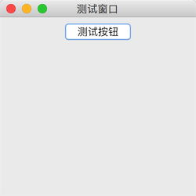

		Java Swing GUI 图形界面窗口开发基础教程，本教程将系统性地详细介绍 Java Swing 开发中常用的一些组件、布局管理器等相关知识技术，并且每章节都将通过代码实例展示实际应用。

教程总目录: [Java-Swing 图形界面开发（目录）](../README.md)

## 1. Swing 简介

Swing 是 Java 为图形界面应用开发提供的一组工具包，是 Java 基础类的一部分。

Swing 包含了构建图形界面（GUI）的各种组件，如: 窗口、标签、按钮、文本框等。

Swing 提供了许多比 AWT 更好的屏幕显示元素，使用纯 Java 实现，能够更好的兼容跨平台运行。

为了和 AWT 组件区分，Swing 组件在`javax.swing.*`包下，类名均以 J 开头，例如: `JFrame`、`JLabel`、`JButton`等。

## 2. Swing组件

一个 Java 的图形界面，由各种不同类型的“元素”组成，例如: 窗口、菜单栏、对话框、标签、按钮、文本框等等，这些“元素”统一被称为 **组件**（`Component`）。

组件按照不同的功能，可分为 **顶层容器**、**中间容器**、**基本组件**。一个简单窗口的组成，如下层级结构所示:

* 顶层容器
  * 菜单栏
  * 中间容器
    * 基本组件
    * 基本组件

组件类型的继承关系:

* 顶层容器 属于窗口类组件，继承自`java.awt.Window`；
* 中间容器 和 基本组件 继承自`javax.swing.JComponent`。

### 2.1 顶层容器

顶层容器属于窗口类组件，可以独立显示，一个图形界面至少需要一个窗口，例如:

| 组件                                         | 描述                                                         |
| -------------------------------------------- | ------------------------------------------------------------ |
| [JFrame](../Java-Swing_5/Java-Swing_5.1.md)  | 一个普通的窗口（绝大多数 Swing 图形界面程序使用 JFrame 作为顶层容器） |
| [JDialog](../Java-Swing_5/Java-Swing_5.2.md) | 对话框                                                       |

### 2.2 中间容器

中间容器充当基本组件的载体，不可独立显示。中间容器可以添加若干基本组件（也可以嵌套添加中间容器），对容器内的组件进行管理，类似于给各种复杂的组件进行分组管理。最顶层的一个中间容器必须依托在顶层容器（窗口）内。

| 组件                                              | 描述                                     |
| ------------------------------------------------- | ---------------------------------------- |
| [JPanel](../Java-Swing_4/Java-Swing_4.1.md)       | 一般轻量级面板容器组件                   |
| [JScrollPane](../Java-Swing_4/Java-Swing_4.2.md)  | 带滚动条的，可以水平和垂直滚动的面板组件 |
| [JSplitPane](../Java-Swing_4/Java-Swing_4.3.md)   | 分隔面板                                 |
| [JTabbedPane](../Java-Swing_4/Java-Swing_4.4.md)  | 选项卡面板                               |
| [JLayeredPane](../Java-Swing_4/Java-Swing_4.5.md) | 层级面板                                 |

特殊的中间容器:

| 组件                                                 | 描述     |
| ---------------------------------------------------- | -------- |
| [JMenuBar](../Java-Swing_5/Java-Swing_5.5.md)        | 菜单栏   |
| [JToolBar](../Java-Swing_5/Java-Swing_5.6.md)        | 工具栏   |
| [JPopupMenu](../Java-Swing_5/Java-Swing_5.7.md)      | 弹出菜单 |
| [JInternalFrame](../Java-Swing_5/Java-Swing_5.10.md) | 内部窗口 |

### 2.3 基本组件

基本组件是直接实现人机交互的组件。

常用的简单的基本组件:

| 组件                                                | 描述       |
| --------------------------------------------------- | ---------- |
| [JLabel](../Java-Swing_3/Java-Swing_3.1.md)         | 标签       |
| [JButton](../Java-Swing_3/Java-Swing_3.2.md)        | 按钮       |
| [JRadioButton](../Java-Swing_3/Java-Swing_3.3.md)   | 单选按钮   |
| [JCheckBox](../Java-Swing_3/Java-Swing_3.4.md)      | 复选框     |
| [JToggleButton](../Java-Swing_3/Java-Swing_3.5.md)  | 开关按钮   |
| [JTextField](../Java-Swing_3/Java-Swing_3.6.md)     | 文本框     |
| [JPasswordField](../Java-Swing_3/Java-Swing_3.7.md) | 密码框     |
| [JTextArea](../Java-Swing_3/Java-Swing_3.8.md)      | 文本区域   |
| [JComboBox](../Java-Swing_3/Java-Swing_3.9.md)      | 下拉列表框 |
| [JList](../Java-Swing_3/Java-Swing_3.10.md)         | 列表       |
| [JProgressBar](../Java-Swing_3/Java-Swing_3.11.md)  | 进度条     |
| [JSlider](../Java-Swing_3/Java-Swing_3.12.md)       | 滑块       |

选取器组件:

| 组件                                               | 描述       |
| -------------------------------------------------- | ---------- |
| [JFileChooser](../Java-Swing_5/Java-Swing_5.3.md)  | 文件选取器 |
| [JColorChooser](../Java-Swing_5/Java-Swing_5.4.md) | 颜色选取器 |

其他较为复杂的基本组件:

| 组件                                        | 描述 |
| ------------------------------------------- | ---- |
| [JTable](../Java-Swing_5/Java-Swing_5.8.md) | 表格 |
| [JTree](../Java-Swing_5/Java-Swing_5.9.md)  | 树   |

## 3. 布局管理器

把 `Swing` 的各种组件(`JComponent`)添加到面板容器中(`JPanel`)，需要给面板容器指定布局管理器(`LayoutManager`)，明确容器(`Container`)内的各个组件之间的排列布局方式。

常用的布局管理器:

| 组件                                               | 描述                                                         |
| -------------------------------------------------- | ------------------------------------------------------------ |
| [FlowLayout](../Java-Swing_2/Java-Swing_2.1.md)    | *流式布局*，按组件加入的顺序，按水平方向排列，排满一行换下一行继续排列。 |
| [ GridLayout](../Java-Swing_2/Java-Swing_2.2.md)   | *网格布局*，把`Container`按指定行列数分隔出若干网格，每一个网格按顺序放置一个控件。 |
| [GridBagLayout](../Java-Swing_2/Java-Swing_2.3.md) | *网格袋布局*，按网格划分`Container`，每个组件可占用一个或多个网格，可将组件垂直、水平或沿它们的基线对齐。 |
| [BoxLayout](../Java-Swing_2/Java-Swing_2.4.md)     | *箱式布局*，将`Container`中的多个组件按 水平 或 垂直 的方式排列。 |
| [GroupLayout](../Java-Swing_2/Java-Swing_2.5.md)   | *分组布局*，将组件按层次分组（串行 或 并行），分别确定 组件组 在 水平 和 垂直 方向上的位置。 |
| [CardLayout](../Java-Swing_2/Java-Swing_2.6.md)    | *卡片布局*，将`Container`中的每个组件看作一张卡片，一次只能显示一张卡片，默认显示第一张卡片。 |
| [BorderLayout](../Java-Swing_2/Java-Swing_2.7.md)  | *边界布局*，把`Container`按方位分为 5 个区域（东、西、南、北、中），每个区域放置一个组件。 |
| [SpringLayout](../Java-Swing_2/Java-Swing_2.8.md)  | *弹性布局*，通过定义组件四条边的坐标位置来实现布局。         |
| [null](../Java-Swing_2/Java-Swing_2.9.md)          | *绝对布局*，通过设置组件在`Container`中的**坐标位置**来放置组件。 |

## 4. 代码示例：一个简单的窗口程序

```java
package com.xiets.swing;

import javax.swing.*;

public class Main {

    public static void main(String[] args) {
        // 1. 创建一个顶层容器（窗口）
        JFrame jf = new JFrame("测试窗口");          // 创建窗口
        jf.setSize(250, 250);                       // 设置窗口大小
        jf.setLocationRelativeTo(null);             // 把窗口位置设置到屏幕中心
        jf.setDefaultCloseOperation(WindowConstants.EXIT_ON_CLOSE); // 当点击窗口的关闭按钮时退出程序（没有这一句，程序不会退出）

        // 2. 创建中间容器（面板容器）
        JPanel panel = new JPanel();                // 创建面板容器，使用默认的布局管理器

        // 3. 创建一个基本组件（按钮），并添加到 面板容器 中
        JButton btn = new JButton("测试按钮");
        panel.add(btn);

        // 4. 把 面板容器 作为窗口的内容面板 设置到 窗口
        jf.setContentPane(panel);

        // 5. 显示窗口，前面创建的信息都在内存中，通过 jf.setVisible(true) 把内存中的窗口显示在屏幕上。
        jf.setVisible(true);
    }

}
```

结果展示：

