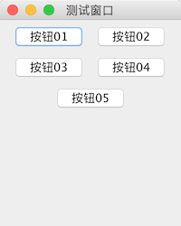

# FlowLayout（流式布局）

教程总目录: [Java-Swing 图形界面开发（目录）](../README.md)

## 1. 概述

官方JavaDocsApi: [java.awt.FlowLayout](https://docs.oracle.com/javase/8/docs/api/java/awt/FlowLayout.html)

`FlowLayout`，流式布局管理器。按水平方向依次排列放置组件，排满一行，换下一行继续排列。排列方向（左到右 或 右到左）取决于容器的`componentOrientation`属性（该属性属于`Component`），它可能的值如下:

* `ComponentOrientation.LEFT_TO_RIGHT`（默认）

* `ComponentOrientation.RIGHT_TO_LEFT`

同一行（水平方向）的组件的对齐方式由 FlowLayout 的`align`属性确定，它可能的值如下:

* `FlowLayout.LEFT` : 左对齐

* `FlowLayout.CENTER` : 居中对齐（默认）

* `FlowLayout.RIGHT` : 右对齐

* `FlowLayout.LEADING` : 与容器方向的开始边对齐，例如，对于从左到右的方向，则与左边对齐

* `FlowLayout.TRAILING` : 与容器方向的结束边对齐，例如，对于从左到右的方向，则与右边对齐。

`FlowLayout`的 **构造方法**:

```java
// 默认 居中对齐的，水平和垂直间隙是 5 个单位
FlowLayout()

// 指定对齐方式，默认的水平和垂直间隙是 5 个单位
FlowLayout(int align)

// 指定对其方式，水平 和 竖直 间隙
FlowLayout(int align, int hgap, int vgap)
```

## 2. 代码示例

```java
package com.xiets.swing;

import javax.swing.*;
import java.awt.*;

public class Main {

    public static void main(String[] args) {
        JFrame jf = new JFrame("测试窗口");
        jf.setSize(200, 250);
        jf.setDefaultCloseOperation(WindowConstants.EXIT_ON_CLOSE);
        jf.setLocationRelativeTo(null);

        // 创建内容面板，指定使用 流式布局
        JPanel panel = new JPanel(new FlowLayout());

        JButton btn01 = new JButton("按钮01");
        JButton btn02 = new JButton("按钮02");
        JButton btn03 = new JButton("按钮03");
        JButton btn04 = new JButton("按钮04");
        JButton btn05 = new JButton("按钮05");

        panel.add(btn01);
        panel.add(btn02);
        panel.add(btn03);
        panel.add(btn04);
        panel.add(btn05);

        jf.setContentPane(panel);
        jf.setVisible(true);        // PS: 最后再设置为可显示(绘制), 所有添加的组件才会显示
    }

}
```

结果展示：

