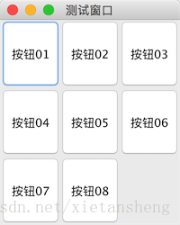

# GridLayout（网格布局）

教程总目录: [Java-Swing 图形界面开发（目录）](../README.md)

## 1. 概述

官方JavaDocsApi: java.awt.GridLayout

GridLayout，网格布局管理器。它以矩形网格形式对容器的组件进行布置，把容器按行列分成大小相等的矩形网格，一个网格中放置一个组件，组件宽高自动撑满网格。

以行数和总数优先: 通过构造方法或 setRows 和 setColumns 方法将行数和列数都设置为非零值时，指定的列数将被忽略。列数通过指定的行数和布局中的组件总数来确定。因此，例如，如果指定了三行和两列，在布局中添加了九个组件，则它们将显示为三行三列。仅当将行数设置为零时，指定列数才对布局有效。

GridLayout构造方法:

```java
// 默认构造, 每个组件占据一行一列
GridLayout() 

// 指定 行数 和 列数 的网格布局
GridLayout(int rows, int cols)

// 指定 行数 和 列数 的网格布局, 并指定 水平 和 竖直 网格间隙
GridLayout(int rows, int cols, int hgap, int vgap)
```

## 2. 代码演示

```java
package com.xiets.swing;

import javax.swing.*;
import java.awt.*;

public class Main {

    public static void main(String[] args) {
        JFrame jf = new JFrame("测试窗口");
        jf.setSize(200, 250);
        jf.setDefaultCloseOperation(WindowConstants.EXIT_ON_CLOSE);
        jf.setLocationRelativeTo(null);

        // 创建 3 行 3 列 的网格布局
        GridLayout layout = new GridLayout(3, 3);
        
        // 设置 水平 和 竖直 间隙
        // layout.setHgap(10);
        // layout.setVgap(10);
        
        JPanel panel = new JPanel(layout);

        JButton btn01 = new JButton("按钮01");
        JButton btn02 = new JButton("按钮02");
        JButton btn03 = new JButton("按钮03");
        JButton btn04 = new JButton("按钮04");
        JButton btn05 = new JButton("按钮05");
        JButton btn06 = new JButton("按钮06");
        JButton btn07 = new JButton("按钮07");
        JButton btn08 = new JButton("按钮08");

        panel.add(btn01);
        panel.add(btn02);
        panel.add(btn03);
        panel.add(btn04);
        panel.add(btn05);
        panel.add(btn06);
        panel.add(btn07);
        panel.add(btn08);

        jf.setContentPane(panel);
        jf.setVisible(true);
    }

}
```

结果展示：

