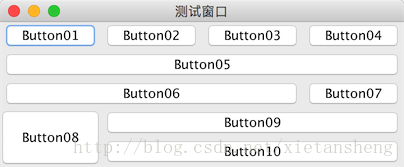

# GridBagLayout（网格袋布局）

教程总目录: [Java-Swing 图形界面开发（目录）](../README.md)

## 1. 布局: GridBagLayout

官方JavaDocsApi: [java.awt.GridBagLayout](https://docs.oracle.com/javase/8/docs/api/java/awt/GridBagLayout.html)

GridBagLayout，网格袋布局管理器。它不要求组件的大小相同便可以将组件垂直、水平或沿它们的基线对齐。每个 GridBagLayout 对象维持一个动态的矩形单元格（动态计算出单个单元格的大小），每个组件占用一个或多个的单元格，该单元格被称为 显示区域。每个组件显示区域按 从左到右，从上到下，依次排列。

## 2. 约束: GridBagConstraints

`GridBagConstraints`，封装了若干对组件的约束属性，每个由 `GridBagLayout` 管理的 组件都关联一个该约束实例，以指定 组件所在显示区域 的具体放置位置，以及 组件在其显示区域中 的对齐方式。

给组件添加约束: `GridBagLayout.setConstraints(Component comp, GridBagConstraints c)`

PS: 要理解 组件（所在）显示区域（一个或多个单元格组成） 和 组件在其显示区域中的对齐方式 这两个不同的概念

## 3. 属性: GridBagConstraints 的属性

下面属性描述中的`相关大写字母常量`均定义在`GridBagConstraints`类中。

### 3.1 显示区域 约束属性

组件的显示区域相关约束属性，直接作用在组件所在显示区域上。

**（1）**`gridx`, `gridy`

*组件显示区域* **开始显示的位置（单元格坐标）**，容器左上角第一个单元格位置为 (0, 0)，默认值为`RELATIVE`，表示放置在 “上一个组件”（所在行列最后添加的一个组件）的 “后面”。

**（2）**`gridwidth`, `gridheight`

*组件显示区域* 水平/竖直方向 **所占单元格的个数**，默认值为 1，如要占多行/列，需整体结果有足够的行/列。有如下两个常量特殊值可选:

* `REMAINDER`: 占完所在行/列余下所有单元格（该值可实现 **换行** 作用）；

* `RELATIVE`: 占到所在行/列余下的倒数第二个单元格（使用该值，所在行/列的最后一个单元格需要“合理”安排组件，并手动换行）。

设置该值不能导致 “前面” 或 “后面” 单元格有留空白，否则可能无效。

**（3）**`weightx`, `weighty`

如何 分布额外空间（单元格区域外，容器边缘内 的间隔），当指定行/列中的其中 任意一个 组件的权重（大于0），则该行/列将（和其他行/列按权重比例）分配额外的水平/竖直空间。当权重为 0（默认值）时，则 整个单元格区域 居中于容器中心。

PS: 如果调用了`java.awt.Window.pack()`方法，该值无效，因为 pack 后已无额外的空间。

### 3.2 组件 约束属性

组件相关约束属性，直接作用在组件上。

**（1）**`fill`

当 *显示区域* 大小大于 *组件* 所需要的大小时，*组件* 在其 *显示区域内* 的填充方式。可能的值如下:

* `NONE`: （默认）不调整组件大小；

* `HORIZONTAL`: 加宽组件，使它在水平方向上填满其显示区域，但是不改变高度

* `VERTICAL`: 加高组件，使它在垂直方向上填满其显示区域，但是不改变宽度；

* `BOTH`: 使组件完全填满其显示区域。

**（2）**`anchor`

*组件* 在 *显示区域内* 的位置（对齐方式），可能有如下三种值:

| 绝对值           | **相对于方向的值** | **相对于基线的值**      |
| ---------------- | ------------------ | ----------------------- |
| NORTH            | PAGE_START         | BASELINE                |
| SOUTH            | PAGE_START         | BASELINE_LEADING        |
| WEST             | PAGE_START         | BASELINE_TRAILING       |
| EAST             | LINE_END           | ABOVE_BASELINE          |
| NORTHWEST        | FIRST_LINE_START   | ABOVE_BASELINE_LEADING  |
| NORTHEAST        | FIRST_LINE_END     | ABOVE_BASELINE_TRAILING |
| SOUTHWEST        | LAST_LINE_START    | BELOW_BASELINE          |
| SOUTHEAST        | LAST_LINE_END      | BELOW_BASELINE_LEADING  |
| CENTER（默认值） |                    | BELOW_BASELINE_TRAILING |

**（3）**`ipadx`, `ipady`

组件的内部填充（可看做是 **组件的内边距**），即对组件最小大小的添加量。组件的宽度至少为其最小宽度/高度加上 ipadx/ipady 像素。

**（4）**`insets`

组件的外部填充（可看做是 **组件的外边距**，也可看做是 *显示区域* 的内边距），即 *组件* 与其 *显示区域边缘* 之间间距的最小量。

**PS**: 上面各属性值之间，以及其他因素，有可能存在冲突或不兼容，不一定设置了即有效，建议多做实验，多写测试Demo去尝试。

## 4. 案例：GridBagLayout使用实例

先展示效果，如下图所示:



各按钮约束参数:

* Button01, Button02, Button03：默认
* Button04：gridwidth = REMAINDER、fill = BOTH
* Button05：gridwidth = REMAINDER、fill = BOTH
* Button06：gridwidth = RELATIVE、fill = BOTH
* Button07：gridwidth = REMAINDER
* Button08：gridheight = 2、fill = BOTH
* Button09：gridwidth = REMAINDER、fill = BOTH
* Button10：gridwidth = REMAINDER、fill = BOTH

代码实现:

```java
package com.xiets.swing;

import javax.swing.*;
import java.awt.*;

public class Main {

    public static void main(String[] args) {
        JFrame jf = new JFrame("测试窗口");
        jf.setDefaultCloseOperation(WindowConstants.EXIT_ON_CLOSE);

        GridBagLayout gridBag = new GridBagLayout();    // 布局管理器
        GridBagConstraints c = null;                    // 约束

        JPanel panel = new JPanel(gridBag);

        JButton btn01 = new JButton("Button01");
        JButton btn02 = new JButton("Button02");
        JButton btn03 = new JButton("Button03");
        JButton btn04 = new JButton("Button04");
        JButton btn05 = new JButton("Button05");
        JButton btn06 = new JButton("Button06");
        JButton btn07 = new JButton("Button07");
        JButton btn08 = new JButton("Button08");
        JButton btn09 = new JButton("Button09");
        JButton btn10 = new JButton("Button10");

        /* 添加 组件 和 约束 到 布局管理器 */
        // Button01
        c = new GridBagConstraints();
        gridBag.addLayoutComponent(btn01, c); // 内部使用的仅是 c 的副本

        // Button02
        c = new GridBagConstraints();
        gridBag.addLayoutComponent(btn02, c);

        // Button03
        c = new GridBagConstraints();
        gridBag.addLayoutComponent(btn03, c);

        // Button04 显示区域占满当前行剩余空间（换行），组件填充显示区域
        c = new GridBagConstraints();
        c.gridwidth = GridBagConstraints.REMAINDER;
        c.fill = GridBagConstraints.BOTH;
        gridBag.addLayoutComponent(btn04, c);

        // Button05 显示区域独占一行（换行），组件填充显示区域
        c = new GridBagConstraints();
        c.gridwidth = GridBagConstraints.REMAINDER;
        c.fill = GridBagConstraints.BOTH;
        gridBag.addLayoutComponent(btn05, c);

        // Button06 显示区域占到当前尾倒车第二个单元格（下一个组件后需要手动换行），组件填充显示区域
        c = new GridBagConstraints();
        c.gridwidth = GridBagConstraints.RELATIVE;
        c.fill = GridBagConstraints.BOTH;
        gridBag.addLayoutComponent(btn06, c);

        // Button07 放置在当前行最后一个单元格（换行）
        c = new GridBagConstraints();
        c.gridwidth = GridBagConstraints.REMAINDER;
        gridBag.addLayoutComponent(btn07, c);

        // Button08 显示区域占两列，组件填充显示区域
        c = new GridBagConstraints();
        c.gridheight = 2;
        c.fill = GridBagConstraints.BOTH;
        gridBag.addLayoutComponent(btn08, c);

        // Button09 显示区域占满当前行剩余空间（换行），组件填充显示区域
        c = new GridBagConstraints();
        c.gridwidth = GridBagConstraints.REMAINDER;
        c.fill = GridBagConstraints.BOTH;
        gridBag.addLayoutComponent(btn09, c);

        // Button10 显示区域占满当前行剩余空间（换行），组件填充显示区域
        c = new GridBagConstraints();
        c.gridwidth = GridBagConstraints.REMAINDER;
        c.fill = GridBagConstraints.BOTH;
        gridBag.addLayoutComponent(btn10, c);

        /* 添加 组件 到 内容面板 */
        panel.add(btn01);
        panel.add(btn02);
        panel.add(btn03);
        panel.add(btn04);
        panel.add(btn05);
        panel.add(btn06);
        panel.add(btn07);
        panel.add(btn08);
        panel.add(btn09);
        panel.add(btn10);

        jf.setContentPane(panel);
        jf.pack();
        jf.setLocationRelativeTo(null);
        jf.setVisible(true);
    }

}
```

