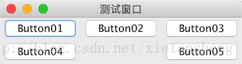

# BoxLayout（箱式布局）

教程总目录: [Java-Swing 图形界面开发（目录）](../README.md)

## 1. 概述

官方JavaDocsApi: [javax.swing.BoxLayout](https://docs.oracle.com/javase/8/docs/api/javax/swing/BoxLayout.html)，[javax.swing.Box](https://docs.oracle.com/javase/8/docs/api/javax/swing/Box.html)

`BoxLayout`，箱式布局管理器。它把若干组件按水平或垂直方向依次排列放置。Swing 提供了一个实现了 BoxLayout 的容器组件Box。使用 Box 提供的静态方法，可快速创建水平/垂直箱容器(Box)，以及填充组件之间空隙的不可见组件。用水平箱和垂直箱的组合嵌套可实现类似于 GridBagLayout 的效果，但没那么复杂。

创建水平/垂直箱容器（Box）:

```java
// 创建一个水平箱容器
Box hBox = Box.createHorizontalBox();
    
// 创建一个垂直箱容器
Box vBox = Box.createVerticalBox();
```

Box 内的组件之间默认没有空隙并居中，如果想在组件之间（或头部/尾部）添加空隙，可以在其中添加一个影响布局的不可见组件。Box 提供了三种用于填充空隙的不可见组件：glue、struts 和 rigidAreas。

创建 胶状（宽/高可伸缩）的不可见组件（glue）:

```java
// 创建一个 水平方向胶状 的不可见组件，用于撑满水平方向剩余的空间（如果有多个该组件，则平分剩余空间）
Component hGlue = Box.createHorizontalGlue();

// 创建一个 垂直方向胶状 的不可见组件，用于撑满垂直方向剩余的空间（如果有多个该组件，则平分剩余空间）
Component vGlue = Box.createVerticalGlue();

// 创建一个 水平和垂直方向胶状 的不可见组件，用于撑满水平和垂直方向剩余的空间（如果有多个该组件，则平分剩余空间）
Component glue = Box.createGlue();
```

创建 固定宽度或高度 的不可见组件（struts）:

```java
// 创建一个 固定宽度 的不可见组件（用于水平箱）
Component hStrut = Box.createHorizontalStrut(int width);

// 创建一个 固定高度 的不可见组件（用于垂直箱）
Component vStrut = Box.createVerticalStrut(int height);
```

创建 固定宽高 的不可见组件（rigidAreas）:

```java
// 创建 固定宽高 的不可见组件
Component rigidArea = Box.createRigidArea(new Dimension(int width, int height));
```

## 2. 代码示例

```java
package com.xiets.swing;

import javax.swing.*;

public class Main {

    public static void main(String[] args) {
        JFrame jf = new JFrame("测试窗口");
        jf.setDefaultCloseOperation(WindowConstants.EXIT_ON_CLOSE);

        JButton btn01 = new JButton("Button01");
        JButton btn02 = new JButton("Button02");
        JButton btn03 = new JButton("Button03");
        JButton btn04 = new JButton("Button04");
        JButton btn05 = new JButton("Button05");

        // 创建第一个水平箱容器
        Box hBox01 = Box.createHorizontalBox();
        hBox01.add(btn01);
        hBox01.add(btn02);
        hBox01.add(btn03);

        // 创建第二水平箱容器
        Box hBox02 = Box.createHorizontalBox();
        hBox02.add(btn04);
        hBox02.add(Box.createHorizontalGlue()); // 添加一个水平方向胶状的不可见组件，撑满剩余水平空间
        hBox02.add(btn05);

        // 创建一个垂直箱容器，放置上面两个水平箱（Box组合嵌套）
        Box vBox = Box.createVerticalBox();
        vBox.add(hBox01);
        vBox.add(hBox02);

        // 把垂直箱容器作为内容面板设置到窗口
        jf.setContentPane(vBox);

        jf.pack();
        jf.setLocationRelativeTo(null);
        jf.setVisible(true);
    }

}
```

结果展示:

