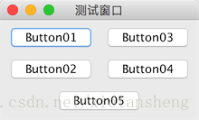

# GroupLayout（分组布局）

教程总目录: [Java-Swing 图形界面开发（目录）](../README.md)

## 1. 概述

官方JavaDocsApi: javax.swing.GroupLayout

GroupLayout，分组布局管理器。它将组建按层次分组，以决定它们在 Container 中的位置。GroupLayout 主要供生成器使用（生成 并行组 和 串行组）。分组由GroupLayout.Group类的实例来完成，每个组可以包含任意数量的元素（Group、Component 或 Gap）。

GroupLayout支持两种组:

* 串行组 (sequential group)：按顺序沿指定方向（水平/垂直）逐个放置元素。
* 并行组 (parallel group)：沿指定方向（水平/垂直）并行排列元素，能够以四种不同方式对齐其子元素。

**PS**: 串行和并行根据不同的方向（水平/垂直方向），元素的排列方式也不同（从上到下 或 从左到右）。

`Group`的创建以及元素的添加:

```java
// 先创建分组布局，并关联容器
GroupLayout layout = new GroupLayout(panel);

// 创建 串行组
GroupLayout.SequentialGroup seqGroup = layout.createSequentialGroup();
// 添加 组元素
seqGroup.addGroup(group);
// 添加 组件元素
seqGroup.addComponent(component);
// 添加 间隙
seqGroup.addGap(size);

// 创建 并行组
GroupLayout.ParallelGroup paralGroup = layout.createParallelGroup();
// 添加 组元素（可指定对齐方式）
paralGroup.addGroup([alignment,] group);
// 添加 组件元素（可指定对齐方式）
paralGroup.addComponent(component, [alignment]);
// 添加 间隙
paralGroup.addGap(size);
```

GroupLayout **对 X轴（水平方向）和 Y轴（竖直方向）单独对待**，因此需要给 GroupLayout **在 水平 和 竖直 方向上分别指定一个组**，来分别确定组件在 水平方向 和 竖直方向 上的位置。

设置 GroupLayout 两个方向上的组:

```java
// 指定布局的水平组（确定组件在 X轴 方向上的位置）
GroupLayout.setHorizontalGroup(GroupLayout.Group group);

// 指定布局的垂直组（确定组件在 Y轴 方向上的位置）
GroupLayout.setVerticalGroup(GroupLayout.Group group);
```

## 2. 代码实例

```java
package com.xiets.swing;

import javax.swing.*;

public class Main {

    public static void main(String[] args) {
        JFrame jf = new JFrame("测试窗口");
        jf.setDefaultCloseOperation(WindowConstants.EXIT_ON_CLOSE);

        // 创建内容面板容器
        JPanel panel = new JPanel();
        // 创建分组布局，并关联容器
        GroupLayout layout = new GroupLayout(panel);
        // 设置容器的布局
        panel.setLayout(layout);

        // 创建组件
        JButton btn01 = new JButton("Button01");
        JButton btn02 = new JButton("Button02");
        JButton btn03 = new JButton("Button03");
        JButton btn04 = new JButton("Button04");
        JButton btn05 = new JButton("Button05");

        // 自动创建组件之间的间隙
        layout.setAutoCreateGaps(true);
        // 自动创建容器与触到容器边框的组件之间的间隙
        layout.setAutoCreateContainerGaps(true);

        /*
         * 水平组（仅确定 X 轴方向的坐标/排列方式）
         *
         * 水平串行: 水平排列（左右排列）
         * 水平并行: 垂直排列（上下排列）
         */
        // 水平并行（上下） btn01 和 btn02
        GroupLayout.ParallelGroup hParalGroup01 = layout.createParallelGroup().addComponent(btn01).addComponent(btn02);

        // 水平并行（上下）btn03 和 btn04
        GroupLayout.ParallelGroup hParalGroup02 = layout.createParallelGroup().addComponent(btn03).addComponent(btn04);

        // 水平串行（左右）hParalGroup01 和 hParalGroup02
        GroupLayout.SequentialGroup hSeqGroup = layout.createSequentialGroup().addGroup(hParalGroup01).addGroup(hParalGroup02);

        // 水平并行（上下）hSeqGroup 和 btn05
        GroupLayout.ParallelGroup hParalGroup = layout.createParallelGroup().addGroup(hSeqGroup).addComponent(btn05, GroupLayout.Alignment.CENTER);

        layout.setHorizontalGroup(hParalGroup);  // 指定布局的 水平组（水平坐标）

        /*
         * 垂直组（仅确定 Y 轴方向的坐标/排列方式）
         *
         * 垂直串行: 垂直排列（上下排列）
         * 垂直并行: 水平排列（左右排列）
         */
        // 垂直并行（左右）btn01 和 btn03
        GroupLayout.ParallelGroup vParalGroup01 = layout.createParallelGroup().addComponent(btn01).addComponent(btn03);

        // 垂直并行（左右）btn02 和 btn04
        GroupLayout.ParallelGroup vParalGroup02 = layout.createParallelGroup().addComponent(btn02).addComponent(btn04);

        // 垂直串行（上下）vParalGroup01, vParalGroup02 和 btn05
        GroupLayout.SequentialGroup vSeqGroup = layout.createSequentialGroup().addGroup(vParalGroup01).addGroup(vParalGroup02).addComponent(btn05);

        layout.setVerticalGroup(vSeqGroup);    // 指定布局的 垂直组（垂直坐标）

        jf.setContentPane(panel);
        jf.pack();
        jf.setLocationRelativeTo(null);
        jf.setVisible(true);
    }

}
```

结果展示：



5 个 Button 的排列说明:

**沿 X轴 方向（水平方向）**:

1. Button01 和 Button02 并行 成 Group01
2. Button03 和 Button04 并行 成 Group02
3. 将 Group01 和 Group02 串行 成 Group03
4. 将 Group03 和 Butotn05 并行

**沿 Y轴 方向（竖直方向）**:

1. Button01 和 Button03 并行 成 Group01
2. Button02 和 Button04 并行 成 Group02
3. 将 Group01、Group02 和 Button05 串行