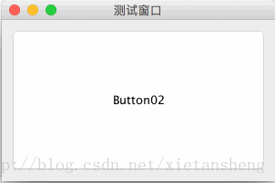

# CardLayout（卡片布局）

教程总目录: [Java-Swing 图形界面开发（目录）](../README.md)

## 1. 概述

官方JavaDocsApi: [javax.swing.CardLayout](https://docs.oracle.com/javase/8/docs/api/java/awt/CardLayout.html)

`CardLayout`，卡片布局管理器。它将容器中的每个组件看作一张卡片，一次只能看到一张卡片，容器则充当卡片的堆栈，默认显示第一张卡片。

CardLayout 构造方法:

```java
// 创建一个间距大小为 0 的卡片布局
CardLayout()

// 创建一个指定水平/垂直间距大小的卡片布局。
CardLayout(int hgap, int vgap) 
```

CardLayout 常用方法:

```java
// 显示第一张卡片
void first(Container parent);

// 显示最后一张卡片
void last(Container parent);

// 显示下一张卡片（自动循环显示）
void next(Container parent);

// 显示上一张卡片（自动循环显示）
void previous(Container parent);

// 显示指定名称的组件（添加组件到容器时，可同时添加组件的名称）
void show(Container parent, String name);
```

## 2. 代码示例

```java
package com.xiets.swing;

import javax.swing.*;
import java.awt.*;
import java.awt.event.ActionEvent;
import java.awt.event.ActionListener;

public class Main {

    public static void main(String[] args) {
        JFrame jf = new JFrame("测试窗口");
        jf.setDefaultCloseOperation(WindowConstants.EXIT_ON_CLOSE);
        jf.setSize(300, 200);

        // 创建卡片布局，卡片间水平和竖直间隔为 10
        final CardLayout layout = new CardLayout(10, 10);

        // 创建内容面板容器，指定布局管理器
        final JPanel panel = new JPanel(layout);

        JButton btn01 = new JButton("Button01");
        JButton btn02 = new JButton("Button02");
        JButton btn03 = new JButton("Button03");

        panel.add(btn01, "btn01");
        panel.add(btn02, "btn02");
        panel.add(btn03, "btn03");

        // 先显示第二个
        layout.show(panel, "btn02");

        jf.setContentPane(panel);
        jf.setLocationRelativeTo(null);
        jf.setVisible(true);

        // 每间隔2秒切换显示下一个
        new Timer(2000, new ActionListener() {
            @Override
            public void actionPerformed(ActionEvent e) {
                layout.next(panel);
            }
        }).start();
    }

}
```

结果展示：

