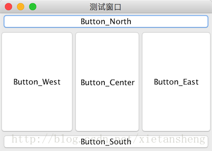

# BorderLayout（边界布局）

教程总目录: [Java-Swing 图形界面开发（目录）](../README.md)

## 1. 概述

官方JavaDocsApi: [java.awt.BorderLayout](https://docs.oracle.com/javase/8/docs/api/java/awt/BorderLayout.html)

`BorderLayout`，边界布局管理器。它把 Container 按方位分为 5 个区域（东、西、南、北、中），每个区域放置一个组件。

BorderLayout 构造方法:

```java
// 构造一个组件之间没有间距的新边框布局
BorderLayout() 

// 构造一个具有指定组件间距的边框布局
BorderLayout(int hgap, int vgap) 
```

BorderLayout 表示方位的 5 个常量:

```java
BorderLayout.NORTH      // 容器的北边
BorderLayout.SOUTH      // 容器的南边
BorderLayout.WEST       // 容器的西边
BorderLayout.EAST       // 容器的东边
BorderLayout.CENTER     // 容器的中心
```

## 2. 代码示例

```java
package com.xiets.swing;

import javax.swing.*;
import java.awt.*;

public class Main {

    public static void main(String[] args) {
        JFrame jf = new JFrame("测试窗口");
        jf.setSize(350, 250);
        jf.setDefaultCloseOperation(WindowConstants.EXIT_ON_CLOSE);

        // 创建内容面包容器，指定使用 边界布局
        JPanel panel = new JPanel(new BorderLayout());

        // 创建 5 个按钮
        JButton btnN = new JButton("Button_North");
        JButton btnS = new JButton("Button_South");
        JButton btnW = new JButton("Button_West");
        JButton btnE = new JButton("Button_East");
        JButton btnC = new JButton("Button_Center");

        // 把 5 个按钮添加到容器中的 5 个方位
        panel.add(btnN, BorderLayout.NORTH);
        panel.add(btnS, BorderLayout.SOUTH);
        panel.add(btnW, BorderLayout.WEST);
        panel.add(btnE, BorderLayout.EAST);
        panel.add(btnC, BorderLayout.CENTER);

        jf.setContentPane(panel);
        jf.setLocationRelativeTo(null);
        jf.setVisible(true);
    }

}
```

结果展示：

