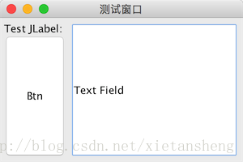

# SpringLayout（弹性布局）

教程总目录: [Java-Swing 图形界面开发（目录）](../README.md)

## 1. 概述

官方JavaDocsApi:

* [javax.swing.SpringLayout](https://docs.oracle.com/javase/8/docs/api/javax/swing/SpringLayout.html)
* [javax.swing.SpringLayout.Constraints](https://docs.oracle.com/javase/8/docs/api/javax/swing/SpringLayout.Constraints.html)
* [javax.swing.Spring](https://docs.oracle.com/javase/8/docs/api/javax/swing/Spring.html)

`SpringLayout`，弹性布局管理器。使用该布局的容器内的 每一个组件或容器都对应着一个约束，通过该约束定义组件或容器四条边的坐标位置 来实现对组件的布局。该布局主要涉及三个类: `SpringLayout`、`SpringLayout.Constraints`、`Spring`，分别表示 布局管理器、约束、坐标距离。

**（1）SpringLayout**

表示一个布局管理器，通过该布局管理器可以获取组件或容器的约束对象，如下:

```java
// 创建 弹性布局管理器 和 容器，容器 使用 弹性布局
SpringLayout layout = new SpringLayout();
JPanel panel = new JPanel(layout);

// 创建 按钮组件，并添加到 容器
JButton btn = new JButton("Button");
panel.add(btn);

// 获取 按钮组件 的 约束对象（如果没有，会自动创建）
SpringLayout.Constraints btnCons = layout.getConstraints(btn);
// 获取 容器组件 的 约束对象（如果没有，会自动创建）
SpringLayout.Constraints panelCons = layout.getConstraints(panel);
```

**（2）SpringLayout.Constraints**

表示对 **组件位置和尺寸的约束**，每个组件实例都对应着一个约束对象，通过该约束可以 *获取和设置* 组件四条边的 *坐标和宽高*，常用方法如下:

```java
/*
 * 组件左上角坐标的设置（这里 X 相当于 WEST，Y 相当于 NORTH）
 */
void    setX(Spring x)
void    setY(Spring y)
Spring  getX()
Spring  getY()

/*
 * 组件宽高的设置
 */
void    setWidth(Spring w)
void    setHeight(Spring h)
Spring  getHeight()
Spring  getWidth()

/*
 * 组件指定边的的坐标或长度设置
 * edgeName 的值为如下常量之一:
 *      SpringLayout.NORTH, SpringLayout.SOUTH, SpringLayout.EAST, SpringLayout.WEST
 *      SpringLayout.HORIZONTAL_CENTER, SpringLayout.VERTICAL_CENTER
 *      SpringLayout.BASELINE
 *      SpringLayout.WIDTH, SpringLayout.HEIGHT
 */
Spring  getConstraint(String edgeName)
void    setConstraint(String edgeName, Spring s)
```

**（3）Spring**

Spring 可以看做是在 SpringLayout 中对 **距离的度量**。一个 Spring 实例，表示一段距离或长度，并且支持简单的算术运算（通过 Spring 提供的静态方法进行计算），常用方法如下:

```java
// 创建一个指定长度的 spring
static Spring constant(int pref)

// 两个 spring 相加，得到新的一个 spring
static Spring sum(Spring s1, Spring s2)

// 计算两个 spring 之间的较大者
static Spring max(Spring s1, Spring s2)

// 对 spring 的缩放
static Spring scale(Spring s, float factor)

// 计算指定组件的宽度所表示的 spring
static Spring width(Component c)

// 计算指定组件的高度所表示的 spring
static Spring height(Component c)

// 对 spring 所表示的数值大小的获取和设置
int   getValue()
void  setValue(int value)
```

## 2. 代码示例

```java
package com.xiets.swing;

import javax.swing.*;

public class Main {

    public static void main(String[] args) {
        // 创建窗口
        JFrame jf = new JFrame("测试窗口");
        jf.setDefaultCloseOperation(WindowConstants.EXIT_ON_CLOSE);
        jf.setSize(300, 200);
        jf.setLocationRelativeTo(null);

        // 创建内容面板，使用 弹性布局
        SpringLayout layout = new SpringLayout();
        JPanel panel = new JPanel(layout);
        jf.setContentPane(panel);

        // 创建组件
        JLabel label = new JLabel("Test JLabel: ");
        JButton btn = new JButton("Btn");
        JTextField textField = new JTextField("Text Field");

        // 添加组件到内容面板
        panel.add(label);
        panel.add(btn);
        panel.add(textField);

        /*
         * 组件的约束设置（弹性布局设置的关键）
         */

        // 标签组件约束: 设置标签的左上角坐标为 (5, 5)
        SpringLayout.Constraints labelCons = layout.getConstraints(label);  // 从布局中获取指定组件的约束对象（如果没有，会自动创建）
        labelCons.setX(Spring.constant(5));
        labelCons.setY(Spring.constant(5));

        // 按钮组件约束: 设置左上角 水平坐标为5, 垂直坐标为 标签的南边坐标；设置东边坐标为 标签的东边坐标
        SpringLayout.Constraints btnCons = layout.getConstraints(btn);
        btnCons.setX(Spring.constant(5));
        btnCons.setY(labelCons.getConstraint(SpringLayout.SOUTH));
        btnCons.setConstraint(SpringLayout.EAST, labelCons.getConstraint(SpringLayout.EAST));

        // 文本框约束: 设置左上角 水平坐标为 标签的东边坐标 + 5, 垂直坐标为 5
        SpringLayout.Constraints textFieldCons = layout.getConstraints(textField);
        textFieldCons.setX(
                Spring.sum(
                        labelCons.getConstraint(SpringLayout.EAST),
                        Spring.constant(5)
                )
        );
        textFieldCons.setY(Spring.constant(5));

        /*
         * 内容面板（容器）的约束设置，即确定 组件 和 容器的右边和底边 之间的间隙大小
         */
        SpringLayout.Constraints panelCons = layout.getConstraints(panel);  // 获取容器的约束对象

        // 设置容器的 东边坐标 为 文本框的东边坐标 + 5
        panelCons.setConstraint(
                SpringLayout.EAST,
                Spring.sum(
                        textFieldCons.getConstraint(SpringLayout.EAST),
                        Spring.constant(5)
                )
        );

        // 计算出 按钮 和 文本框 的 南边坐标 的 值较大者
        Spring maxHeightSpring = Spring.max(
                btnCons.getConstraint(SpringLayout.SOUTH),
                textFieldCons.getConstraint(SpringLayout.SOUTH)
        );

        // 设置容器的 南边坐标 为 maxHeightSpring + 5
        panelCons.setConstraint(
                SpringLayout.SOUTH,
                Spring.sum(
                        maxHeightSpring,
                        Spring.constant(5)
                )
        );

        // 显示窗口
        jf.setVisible(true);
    }

}
```

结果展示：



SpringLayout 更详细具体的介绍和使用方式，详见 Java 官方文档: [How to Use SpringLayout](https://docs.oracle.com/javase/tutorial/uiswing/layout/spring.html)