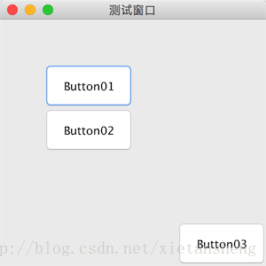

# null（绝对布局）

教程总目录: [Java-Swing 图形界面开发（目录）](../README.md)

## 1. 概述

官方JavaDocsApi: [java.awt.Component](https://docs.oracle.com/javase/8/docs/api/java/awt/Component.html)，[java.awt.Container](https://docs.oracle.com/javase/8/docs/api/java/awt/Container.html)

`null`，绝对布局。绝对布局没有特定一个布局管理器类来表示，给容器的布局管理器设置为 null，就表示使用绝对布局，即通过设置组件的坐标和宽高来布置组件。

**绝对布局需要明确指定每一个组件的坐标和宽高，否则不显示。**

对于使用其他布局时给组件设置坐标和宽高，一般会遵循以下两点:

* 使用其他布局时，如果在窗口显示之后，再添加新组件，则该组件也会被当做绝对布局对待（即需要手动指定坐标和宽高）；
* 使用其他布局时，如果在窗口显示之后，修改之前添加的组件的坐标和宽高，则该组件也会被当做绝对布局对待（即此时修改坐标和宽高会生效）。

创建一个使用绝对布局的容器:

``` java
// 创建一个容器，指定内容管理器为 null, 即使用绝对布局
JPanel panel = new JPanel(null);

或

// 创建一个容器
JPanel panel = new JPanel();
// 设置内容管理器为 null, 即使用绝对布局
panel.setLayout(null);
```

给组件设置坐标和宽高相的关方法（方法定义在`Component`组件基类中）:

```java
// 设置组件的坐标
void setLocation(int x, int y)
void setLocation(Point p)

// 设置组件的宽高
void setSize(int width, int height)
void setSize(Dimension d)

// 设置组件的界限（一次性设置组件的 坐标 和 宽高）
void setBounds(int x, int y, int width, int height)
void setBounds(Rectangle rect)
```

## 2. 代码示例

```java
package com.xiets.swing;

import javax.swing.*;

public class Main {

    public static void main(String[] args) {
        JFrame jf = new JFrame("测试窗口");
        jf.setSize(300, 300);
        jf.setLocationRelativeTo(null);
        jf.setDefaultCloseOperation(WindowConstants.EXIT_ON_CLOSE);

        // 创建内容面板，指定布局为 null，则使用绝对布局
        JPanel panel = new JPanel(null);

        // 创建按钮
        JButton btn01 = new JButton("Button01");
        // 设置按钮的坐标
        btn01.setLocation(50, 50);
        // 设置按钮的宽高
        btn01.setSize(100, 50);
        panel.add(btn01);

        // 创建按钮
        JButton btn02 = new JButton("Button02");
        // 设置按钮的界限(坐标和宽高)，设置按钮的坐标为(50, 100)，宽高为 100, 50
        btn02.setBounds(50, 100, 100, 50);
        panel.add(btn02);

        // 显示窗口
        jf.setContentPane(panel);
        jf.setVisible(true);

        /*
         * 也可以在 jf.setVisible(true) 之后添加按钮
         *
         * PS_01: jf.setVisible(true) 之后，内容面板才有宽高;
         * PS_02: 使用其他布局时, jf.setVisible(true) 之后添加的组件, 也会被当做是绝对布局来布置该组件（即需要手动指定坐标和宽高）;
         * PS_03: 使用其他布局时, jf.setVisible(true) 之前添加的组件, 如果在 jf.setVisible(true) 之后手动设置该组件的坐标和宽高,
         *        会将该组件当做绝对布局来对待（即设置坐标和宽高会生效）。
         */
        JButton btn03 = new JButton("Button03");
        // 把按钮位置设置在内容面板右下角, 并且设置按钮宽高为 100, 50
        btn03.setBounds(panel.getWidth() - 100, panel.getHeight() - 50, 100, 50);
        panel.add(btn03);
    }

}
```

结果展示；

