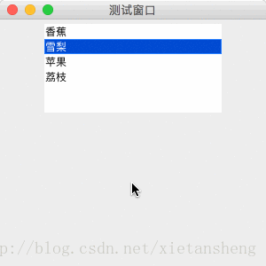

# JList（列表框）

教程总目录: [Java-Swing 图形界面开发（目录）](../README.md)

## 1. 概述

官方JavaDocsApi: [javax.swing.JList](https://docs.oracle.com/javase/8/docs/api/javax/swing/JList.html)

`JList`，列表框。JList 以列表的形式展示多个选项，允许用户选择一个或多个选项。其中的选项内容由一个 ListModel 实例来维护。JList 不实现直接滚动，需要滚动显示，可以结合 JScrollPane 实现滚动效果。

**JList 常用构造方法**:

```java
/**
 * 一个 JList 实例维护这一个 ListModel 实例。
 * ListModel 实例可以直接创建，也可以通过把 数组 或 集合 传递到 JList 中间接创建。
 */
JList()

JList(ListModel dataModel)

JList(Object[] listData)

JList(Vector<?> listData)
```

**JList 选项数据 相关方法**:

```java
// 以数组形式设置选项数据，内部将自动封装成 ListModel
void setListData(Object[] listData)

// 以集合形式设置选项数据，内部将自动封装成 ListModel
void setListData(Vector<?> listData)

// 直接设置选项数据的 ListModel
void setModel(ListModel<?> model)

// 获取维护选项数据的 ListModel。
// 再通过 listModel.getElementAt(int index) 和 listModel.getSize() 
// 可分别 获取指定索引的选项数据 和 选项数量。
ListModel<?> getModel()
```

**JList 选项选中索引 相关方法**:

```java
// 设置选择模式，有三个模式: 只能单选、可间隔多选、可连续多选
void setSelectionMode(int selectionMode)

// 设置某个选项选中
void setSelectedIndex(int index)

// 设置某一些选项选中
void setSelectedIndices(int[] indices)

// 获取第一个选中的选项索引
int getSelectedIndex()

// 获取所有选中的选项索引
int[] getSelectedIndices()
```

**JList 字体和颜色 相关方法**:

```java
// 设置字体
void setFont(Font font)

// 设置字体颜色（未选中时）
void setForeground(Color fg)

// 设置选中选项的字体颜色
void setSelectionForeground(Color selectionForeground)

// 设置选中条的颜色
void setSelectionBackground(Color selectionBackground)
```

**JList 监听器 相关方法**:

```java
// 添加选项选中状态被改变的监听器
void addListSelectionListener(ListSelectionListener listener)
```

## 2. 代码示例

```java
package com.xiets.swing;

import javax.swing.*;
import javax.swing.event.ListSelectionEvent;
import javax.swing.event.ListSelectionListener;
import java.awt.*;

public class Main {

    public static void main(String[] args) {
        JFrame jf = new JFrame("测试窗口");
        jf.setSize(300, 300);
        jf.setLocationRelativeTo(null);
        jf.setDefaultCloseOperation(WindowConstants.EXIT_ON_CLOSE);

        JPanel panel = new JPanel();

        // 创建一个 JList 实例
        final JList<String> list = new JList<String>();

        // 设置一下首选大小
        list.setPreferredSize(new Dimension(200, 100));

        // 允许可间断的多选
        list.setSelectionMode(ListSelectionModel.MULTIPLE_INTERVAL_SELECTION);

        // 设置选项数据（内部将自动封装成 ListModel ）
        list.setListData(new String[]{"香蕉", "雪梨", "苹果", "荔枝"});

        // 添加选项选中状态被改变的监听器
        list.addListSelectionListener(new ListSelectionListener() {
            @Override
            public void valueChanged(ListSelectionEvent e) {
                // 获取所有被选中的选项索引
                int[] indices = list.getSelectedIndices();
                // 获取选项数据的 ListModel
                ListModel<String> listModel = list.getModel();
                // 输出选中的选项
                for (int index : indices) {
                    System.out.println("选中: " + index + " = " + listModel.getElementAt(index));
                }
                System.out.println();
            }
        });
        
        // 设置默认选中项
        list.setSelectedIndex(1);

        // 添加到内容面板容器
        panel.add(list);

        jf.setContentPane(panel);
        jf.setVisible(true);
    }

}
```

结果展示：



点击选项（按住 Ctrl 键可多选），查看控制台输出。