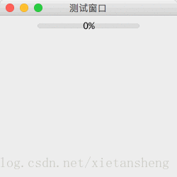

# JProgressBar（进度条）

教程总目录: [Java-Swing 图形界面开发（目录）](../README.md)

## 1. 概述

官方JavaDocsApi: [javax.swing.JProgressBar](https://docs.oracle.com/javase/8/docs/api/javax/swing/JProgressBar.html)

`JProgressBar`，进度条。

以可视化形式显示某些任务进度的组件。

进度条中心可显示进度百分比的文本表示形式。

当一个任务的进度长度未知时，可将进度条设置为不确定模式。不确定模式的进度条持续地显示动画来表示正进行的操作。当可以确定任务长度和进度量时，则可设置进度条的最大最小值，以及更新进度条的进度值，将其切换回确定模式。

**JProgressBar 常用构造方法**:

```java
/**
 * 构造方法中的参数含义:
 *     orient: 进度条的方向，SwingConstants.VERTICAL 或 SwingConstants.HORIZONTAL，默认为水平方向
 *     min: 最小进度值
 *     max: 最大进度值
 */
JProgressBar()

JProgressBar(int orient)

JProgressBar(int min, int max)

JProgressBar(int orient, int min, int max)
```

**JProgressBar 常用方法**:

```java
// 设置 最小进度值、最大进度值、当前进度值
void setMinimum(int min)
void setMaximum(int max)
void setValue(int n)

// 获取当前进度值
int getValue()

// 获取当前进度的百分比
double getPercentComplete()

// 是否绘制百分比文本（进度条中间显示的百分数）
void setStringPainted(boolean b)

// 设置进度条进度是否为不确定模式
void setIndeterminate(boolean newValue)

// 设置进度条的方向，SwingConstants.VERTICAL 或 SwingConstants.HORIZONTAL
void setOrientation(int newOrientation)

// 添加进度条的进度改变监听器
void addChangeListener(ChangeListener l)
```

## 2. 代码示例

```java
package com.xiets.swing;

import javax.swing.*;
import javax.swing.event.ChangeEvent;
import javax.swing.event.ChangeListener;
import java.awt.event.ActionEvent;
import java.awt.event.ActionListener;

public class Main {

    private static final int MIN_PROGRESS = 0;
    private static final int MAX_PROGRESS = 100;

    private static int currentProgress = MIN_PROGRESS;

    public static void main(String[] args) {
        JFrame jf = new JFrame("测试窗口");
        jf.setSize(250, 250);
        jf.setLocationRelativeTo(null);
        jf.setDefaultCloseOperation(WindowConstants.EXIT_ON_CLOSE);

        JPanel panel = new JPanel();

        // 创建一个进度条
        final JProgressBar progressBar = new JProgressBar();

        // 设置进度的 最小值 和 最大值
        progressBar.setMinimum(MIN_PROGRESS);
        progressBar.setMaximum(MAX_PROGRESS);

        // 设置当前进度值
        progressBar.setValue(currentProgress);

        // 绘制百分比文本（进度条中间显示的百分数）
        progressBar.setStringPainted(true);

        // 添加进度改变通知
        progressBar.addChangeListener(new ChangeListener() {
            @Override
            public void stateChanged(ChangeEvent e) {
                System.out.println("当前进度值: " + progressBar.getValue() + "; " +
                        "进度百分比: " + progressBar.getPercentComplete());
            }
        });

        // 添加到内容面板
        panel.add(progressBar);

        jf.setContentPane(panel);
        jf.setVisible(true);

        // 模拟延时操作进度, 每隔 0.5 秒更新进度
        new Timer(500, new ActionListener() {
            @Override
            public void actionPerformed(ActionEvent e) {
                currentProgress++;
                if (currentProgress > MAX_PROGRESS) {
                    currentProgress = MIN_PROGRESS;
                }
                progressBar.setValue(currentProgress);
            }
        }).start();
    }

}
```

结果展示：

