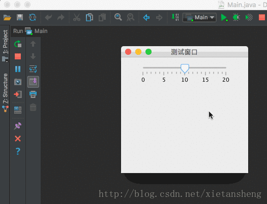
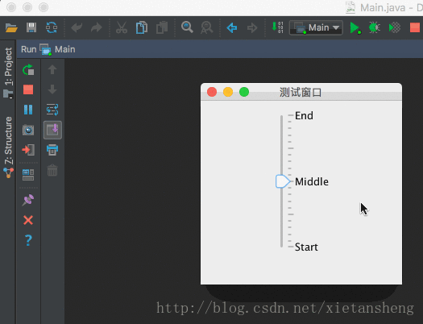

# JSlider（滑块）

教程总目录: [Java-Swing 图形界面开发（目录）](../README.md)

## 1. 概述

官方JavaDocsApi: [javax.swing.JSlider](https://docs.oracle.com/javase/8/docs/api/javax/swing/JSlider.html)

`JSlider`，滑块。

以图形方式在有界区间内通过移动滑块来选择值的组件。

滑块可以显示主刻度标记以及主刻度之间的次刻度标记。刻度标记之间的值的个数由 setMajorTickSpacing(int) 和 setMinorTickSpacing(int) 来控制。刻度标记的绘制由 setPaintTicks(boolean) 控制。

滑块也可以在固定时间间隔（或在任意位置）沿滑块刻度打印文本标签。标签的绘制由 setLabelTable(Dictionary) 和 setPaintLabels(boolean) 控制。

PS: 当滑块获得焦点后，按键盘上的 上下左右键 也可以滑动滑块。

**JSlider 常用构造方法**:

```java
/**
 * 参数说明:
 *     orientation: 滑块的方向，SwingConstants.VERTICAL 或 SwingConstants.HORIZONTAL，默认为水平方向
 *     min: 滑块的最小值
 *     max: 滑块的最大值
 *     value: 滑块的初始值（默认为 最小值 和 最大值 之间的 中间值）
 */
JSlider()

JSlider(int orientation)    // 默认的最小值、最大值、初始值值 分别为 0, 100, 50

JSlider(int min, int max)   // 默认初始值为 min 和 max 之间的 中间值

JSlider(int min, int max, int value)

JSlider(int orientation, int min, int max, int value)
```

**JSlider 常用方法**:

```java
// 设置滑块的 最小值、最大值、当前值
void setMinimum(int min)
void setMaximum(int max)
void setValue(int n)

// 获取滑块的当前值
int getValue()

// 设置 主刻度标记间隔
void setMajorTickSpacing(int n)
// 设置单个主刻度内的 次刻度标记间隔
void setMinorTickSpacing(int n)

// 设置是否绘制 刻度线
void setPaintTicks(boolean b)
// 设置是否绘制 刻度标签（刻度值文本）
void setPaintLabels(boolean b)
// 设置是否绘制 滑道
void setPaintTrack(boolean b)

// 设置滑块的方向，SwingConstants.VERTICAL 或 SwingConstants.HORIZONTAL
void setOrientation(int orientation)

// 设置是否颠倒刻度值（刻度值从大到小）
void setInverted(boolean b)

// 设置滑块是否对齐到刻度。设置为 true，则滑块最终只能在有刻度的位置取值，即滑块取值不连续。
void setSnapToTicks(boolean b)

// 用于指定将在 给定值处 绘制 对应的标签 来替代刻度数值文本的显示
void setLabelTable(Dictionary<Integer, JComponent> labels)

// 添加滑块的值改变监听器
void addChangeListener(ChangeListener l)
```

## 2. 代码示例

```java
package com.xiets.swing;

import javax.swing.*;
import javax.swing.event.ChangeEvent;
import javax.swing.event.ChangeListener;

public class Main {

    public static void main(String[] args) {
        JFrame jf = new JFrame("测试窗口");
        jf.setSize(250, 250);
        jf.setLocationRelativeTo(null);
        jf.setDefaultCloseOperation(WindowConstants.EXIT_ON_CLOSE);

        JPanel panel = new JPanel();

        // 创建一个滑块，最小值、最大值、初始值 分别为 0、20、10
        final JSlider slider = new JSlider(0, 20, 10);

        // 设置主刻度间隔
        slider.setMajorTickSpacing(5);

        // 设置次刻度间隔
        slider.setMinorTickSpacing(1);

        // 绘制 刻度 和 标签
        slider.setPaintTicks(true);
        slider.setPaintLabels(true);

        // 添加刻度改变监听器
        slider.addChangeListener(new ChangeListener() {
            @Override
            public void stateChanged(ChangeEvent e) {
                System.out.println("当前值: " + slider.getValue());
            }
        });

        // 添加滑块到内容面板
        panel.add(slider);

        jf.setContentPane(panel);
        jf.setVisible(true);

    }

}
```

结果展示：



## 3. 代码示例：自定义标签刻度值

```java
package com.xiets.swing;

import javax.swing.*;
import javax.swing.event.ChangeEvent;
import javax.swing.event.ChangeListener;
import java.util.Hashtable;

public class Main {

    public static void main(String[] args) {
        JFrame jf = new JFrame("测试窗口");
        jf.setSize(250, 250);
        jf.setLocationRelativeTo(null);
        jf.setDefaultCloseOperation(WindowConstants.EXIT_ON_CLOSE);

        JPanel panel = new JPanel();

        // 创建一个滑块，最小值、最大值、初始值 分别为 0、20、10
        final JSlider slider = new JSlider(0, 20, 10);

        // 设置主刻度间隔
        slider.setMajorTickSpacing(5);

        // 设置次刻度间隔
        slider.setMinorTickSpacing(1);

        // 绘制 刻度 和 标签
        slider.setPaintTicks(true);
        slider.setPaintLabels(true);

        /*
         * 设置滑块方向为垂直方向
         */
        slider.setOrientation(SwingConstants.VERTICAL);

        /*
         * 给指定的刻度值显示自定义标签
         */
        Hashtable<Integer, JComponent> hashtable = new Hashtable<Integer, JComponent>();
        hashtable.put(0, new JLabel("Start"));      //  0  刻度位置，显示 "Start"
        hashtable.put(10, new JLabel("Middle"));    //  10 刻度位置，显示 "Middle"
        hashtable.put(20, new JLabel("End"));       //  20 刻度位置，显示 "End"

        /*
         * 将刻度值和自定义标签的对应关系设置到滑块（设置后不再显示默认的刻度值）
         */
        slider.setLabelTable(hashtable);

        // 添加刻度改变监听器
        slider.addChangeListener(new ChangeListener() {
            @Override
            public void stateChanged(ChangeEvent e) {
                System.out.println("当前值: " + slider.getValue());
            }
        });

        // 添加滑块到内容面板
        panel.add(slider);

        jf.setContentPane(panel);
        jf.setVisible(true);

    }

}
```

结果展示：

