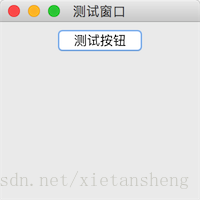
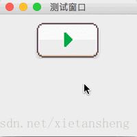

# JButton（按钮）

教程总目录: [Java-Swing 图形界面开发（目录）](../README.md)

## 1. 概述

官方JavaDocsApi: [javax.swing.JButton](https://docs.oracle.com/javase/8/docs/api/javax/swing/JButton.html)

`JButton`，按钮。

**JButton 常用构造方法**:

```java
// 创建不带有设置文本或图标的按钮
JButton()

// 创建一个带文本的按钮
JButton(String text)

// 创建一个带图标的按钮
JButton(Icon icon)
```

**JButton 常用方法**:

```java
// 设置按钮的 文本、字体 和 字体颜色
void setText(String text)
void setFont(Font font)
void setForeground(Color fg)

/* 以下方法定义在 javax.swing.AbstractButton 基类中 */

// 设置按钮是否可用
void setEnabled(boolean enable)

// 设置按钮在 默认、按下、不可用 时显示的图片
void setIcon(Icon defaultIcon)
void setPressedIcon(Icon pressedIcon)
void setDisabledIcon(Icon disabledIcon)

// 是否绘制边框（设置不绘制边框，再结合上面三个设置按钮状态图片的方法，可实现自定义按钮）
void setBorderPainted(boolean b);
```

**JButton 常用监听器**:

```java
// 添加 和 移除 按钮的点击事件
void addActionListener(ActionListener listener)
void removeActionListener(ActionListener listener)
```

## 2. 代码示例

```java
package com.xiets.swing;

import javax.swing.*;
import java.awt.event.ActionEvent;
import java.awt.event.ActionListener;

public class Main {

    public static void main(String[] args) {
        JFrame jf = new JFrame("测试窗口");
        jf.setSize(200, 200);
        jf.setLocationRelativeTo(null);
        jf.setDefaultCloseOperation(WindowConstants.EXIT_ON_CLOSE);

        JPanel panel = new JPanel();

        // 创建一个按钮
        final JButton btn = new JButton("测试按钮");

        // 添加按钮的点击事件监听器
        btn.addActionListener(new ActionListener() {
            @Override
            public void actionPerformed(ActionEvent e) {
                // 获取到的事件源就是按钮本身
                // JButton btn = (JButton) e.getSource();
                
                System.out.println("按钮被点击");
            }
        });

        panel.add(btn);

        jf.setContentPane(panel);
        jf.setVisible(true);
    }

}
```

结果展示：



点击按钮，查看控制台输出。

## 3. 代码示例：自定义图片按钮

使用以下两张图片分别表示按钮 *正常显示* 和 *被按下时* 显示 的图片:


```java
package com.xiets.swing;

import javax.swing.*;
import java.awt.*;
import java.awt.event.ActionEvent;
import java.awt.event.ActionListener;

public class Main {

    public static void main(String[] args) throws AWTException {
        JFrame jf = new JFrame("测试窗口");
        jf.setSize(200, 200);
        jf.setLocationRelativeTo(null);
        jf.setDefaultCloseOperation(WindowConstants.EXIT_ON_CLOSE);

        JPanel panel = new JPanel();

        final JButton btn = new JButton();

        // 设置按钮的默认图片
        btn.setIcon(new ImageIcon("button_normal.png"));

        // 设置按钮被点击时的图片
        btn.setPressedIcon(new ImageIcon("button_press.png"));

        // 不绘制边框
        btn.setBorderPainted(false);

        // 添加按钮点击事件监听器
        btn.addActionListener(new ActionListener() {
            @Override
            public void actionPerformed(ActionEvent e) {
                System.out.println("按钮被点击了");
            }
        });

        panel.add(btn);

        jf.setContentPane(panel);
        jf.setVisible(true);
    }

}
```

结果展示：

