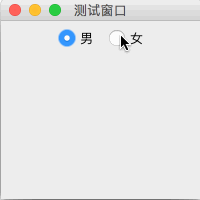

# JRadioButton（单选按钮）

教程总目录: [Java-Swing 图形界面开发（目录）](../README.md)

## 1. 概述

官方JavaDocsApi: [javax.swing.JRadioButton](https://docs.oracle.com/javase/8/docs/api/javax/swing/JRadioButton.html)

`JRadioButton`，单选按钮。

**JButton 常用构造方法**:

```java
// 无文本，未选中
JRadioButton()

// 有文本，未选中
JRadioButton(String text)

// 有文本，并指定是否选中
JRadioButton(String text, boolean selected)
```

**JRadioButton 常用方法**:

```java
// 设置单选按钮的 文本、字体 和 字体颜色
void setText(String text)
void setFont(Font font)
void setForeground(Color fg)

/* 以下方法定义在 javax.swing.AbstractButton 基类中 */

// 设置单选按钮是否选中状态
void setSelected(boolean b)

// 判断单选按钮是否选中
boolean isSelected()

// 设置单选按钮是否可用
void setEnabled(boolean enable)

// 设置单选按钮在 默认、被选中、不可用 时显示的图片
void setIcon(Icon defaultIcon)
void setPressedIcon(Icon pressedIcon)
void setDisabledIcon(Icon disabledIcon)

// 设置图片和文本的间距
void setIconTextGap(int iconTextGap)
```

**JRadioButton 常用监听器**:

```java
// 添加状态改变监听器
void addChangeListener(ChangeListener l)
```

**ButtonGroup（按钮组）**: 当有多个单选按钮时，一般只允许一个单选按钮选中，因此需要对同一类型的单选按钮进行分组，如下:

```java
// 创建一个按钮组
ButtonGroup btnGroup = new ButtonGroup();

// 添加单选按钮到按钮组
btnGroup.add(radioBtn01);
btnGroup.add(radioBtn02);
```

## 2. 代码示例

```java
package com.xiets.swing;

import javax.swing.*;
import java.awt.*;

public class Main {

    public static void main(String[] args) throws AWTException {
        JFrame jf = new JFrame("测试窗口");
        jf.setSize(200, 200);
        jf.setLocationRelativeTo(null);
        jf.setDefaultCloseOperation(WindowConstants.EXIT_ON_CLOSE);

        JPanel panel = new JPanel();

        // 创建两个单选按钮
        JRadioButton radioBtn01 = new JRadioButton("男");
        JRadioButton radioBtn02 = new JRadioButton("女");

        // 创建按钮组，把两个单选按钮添加到该组
        ButtonGroup btnGroup = new ButtonGroup();
        btnGroup.add(radioBtn01);
        btnGroup.add(radioBtn02);

        // 设置第一个单选按钮选中
        radioBtn01.setSelected(true);

        panel.add(radioBtn01);
        panel.add(radioBtn02);

        jf.setContentPane(panel);
        jf.setVisible(true);
    }

}
```

结果展示：

