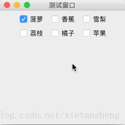

# JCheckBox（复选框）

教程总目录: [Java-Swing 图形界面开发（目录）](../README.md)

## 1. 概述

官方JavaDocsApi: [javax.swing.JCheckBox](https://docs.oracle.com/javase/8/docs/api/javax/swing/JCheckBox.html)

`JCheckBox`，复选框。

**JCheckBox 常用构造方法**:

```java
// 无文本，默认未选中
JCheckBox()

// 有文本，默认未选中
JCheckBox(String text)

// 有文本，并指定是否选中
JCheckBox(String text, boolean selected)
```

**JCheckBox 常用方法**:

```java
// 设置复选框的 文本、字体 和 字体颜色
void setText(String text)
void setFont(Font font)
void setForeground(Color fg)

/* 以下方法定义在 javax.swing.AbstractButton 基类中 */

// 设置复选框是否选中状态
void setSelected(boolean b)

// 判断复选框是否选中
boolean isSelected()

// 设置复选框是否可用
void setEnabled(boolean enable)

// 设置图片和文本的间距
void setIconTextGap(int iconTextGap)
```

**JCheckBox 常用监听器**:

```java
// 添加状态改变监听器
void addChangeListener(ChangeListener l)
```

## 2. 代码示例

```java
package com.xiets.swing;

import javax.swing.*;
import javax.swing.event.ChangeEvent;
import javax.swing.event.ChangeListener;

public class Main {

    public static void main(String[] args) {
        JFrame jf = new JFrame("测试窗口");
        jf.setSize(250, 250);
        jf.setLocationRelativeTo(null);
        jf.setDefaultCloseOperation(WindowConstants.EXIT_ON_CLOSE);

        JPanel panel = new JPanel();

        // 创建复选框
        JCheckBox checkBox01 = new JCheckBox("菠萝");
        JCheckBox checkBox02 = new JCheckBox("香蕉");
        JCheckBox checkBox03 = new JCheckBox("雪梨");
        JCheckBox checkBox04 = new JCheckBox("荔枝");
        JCheckBox checkBox05 = new JCheckBox("橘子");
        JCheckBox checkBox06 = new JCheckBox("苹果");

        // 添加第一个复选框的状态被改变的监听（其他复选框如果需要监听状态改变，则可按此方法添加监听）
        checkBox01.addChangeListener(new ChangeListener() {
            @Override
            public void stateChanged(ChangeEvent e) {
                // 获取事件源（即复选框本身）
                JCheckBox checkBox = (JCheckBox) e.getSource();
                System.out.println(checkBox.getText() + " 是否选中: " + checkBox.isSelected());
            }
        });

        // 设置默认第一个复选框选中
        checkBox01.setSelected(true);

        panel.add(checkBox01);
        panel.add(checkBox02);
        panel.add(checkBox03);
        panel.add(checkBox04);
        panel.add(checkBox05);
        panel.add(checkBox06);

        jf.setContentPane(panel);
        jf.setVisible(true);
    }

}
```

结果展示：

