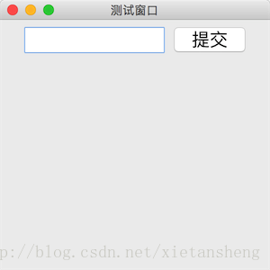

# JTextField（文本框）

教程总目录: [Java-Swing 图形界面开发（目录）](../README.md)

## 1.概述

官方JavaDocsApi: [javax.swing.JTextField](https://docs.oracle.com/javase/8/docs/api/javax/swing/JTextField.html)

`JTextField`，文本框。JTextField 用来编辑单行的文本。

**JTextField 常用构造方法**:

```java
/*
 * 参数说明:
 *     text: 默认显示的文本
 *     columns: 用来计算首选宽度的列数；如果列设置为 0，则首选宽度将是组件实现的自然结果
 */
JTextField()

JTextField(String text)

JTextField(int columns)

JTextField(String text, int columns)
```

**JTextField 常用方法**:

```java
// 获取文本框中的文本
String getText()

// 设置文本框的 文本、字体 和 字体颜色
void setText(String text)
void setFont(Font font)
void setForeground(Color fg)

// 设置颜色，分别为: 光标颜色、呈现选中部分的背景颜色、选中部分文本的颜色、不可用时文本的颜色
void setCaretColor(Color c)
void setSelectionColor(Color c)
void setSelectedTextColor(Color c)
void setDisabledTextColor(Color c)

// 设置文本内容的水平对齐方式
void setHorizontalAlignment(int alignment)

// 设置文本框是否可编辑
void setEditable(boolean b)

/* 下面方法定义在 java.awt.Component 基类中 */

// 判断组件当前是否拥有焦点
boolean isFocusOwner()

// 设置组件是否可用
void setEnabled(boolean b)
```

**JTextField 复制粘贴相关方法**:

```java
// 设置光标开始位置，selectionStart >= 0
void setSelectionStart(int selectionStart)

// 设置光标结束位置，selectionEnd >= selectionStart
void setSelectionEnd(int selectionEnd)

// 复制选中部分文本
void copy()

// 剪切选中部分文本
void cut()

// 粘贴文本到文本框
void paste()
```

**JTextField 常用监听器**:

```java
// 添加焦点事件监听器
void addFocusListener(FocusListener listener)

// 添加文本框内的 文本改变 监听器
textField.getDocument().addDocumentListener(DocumentListener listener)

// 添加按键监听器
void addKeyListener(KeyListener listener)
```

## 2. 代码示例

```java
package com.xiets.swing;

import javax.swing.*;
import java.awt.*;
import java.awt.event.ActionEvent;
import java.awt.event.ActionListener;

public class Main {

    public static void main(String[] args) throws AWTException {
        JFrame jf = new JFrame("测试窗口");
        jf.setSize(300, 300);
        jf.setLocationRelativeTo(null);
        jf.setDefaultCloseOperation(WindowConstants.EXIT_ON_CLOSE);

        JPanel panel = new JPanel();

        // 创建文本框，指定可见列数为8列
        final JTextField textField = new JTextField(8);
        textField.setFont(new Font(null, Font.PLAIN, 20));
        panel.add(textField);

        // 创建一个按钮，点击后获取文本框中的文本
        JButton btn = new JButton("提交");
        btn.setFont(new Font(null, Font.PLAIN, 20));
        btn.addActionListener(new ActionListener() {
            @Override
            public void actionPerformed(ActionEvent e) {
                System.out.println("提交: " + textField.getText());
            }
        });
        panel.add(btn);

        jf.setContentPane(panel);
        jf.setVisible(true);
    }

}
```

结果展示：

