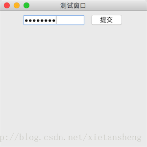

# JPasswordField（密码框）

教程总目录: [Java-Swing 图形界面开发（目录）](../README.md)

## 1. 概述

官方JavaDocsApi: [javax.swing.JPasswordField](https://docs.oracle.com/javase/8/docs/api/javax/swing/JPasswordField.html)

`JPasswordField`，密码框。JPasswordField 继承自 JTextField，只是显示输入的内容时用特定的字符替换显示（例如 * 或 ●），用法和 JTextField 基本一致。

**JPasswordField 常用构造方法**:

```java
/*
 * 参数说明:
 *     text: 默认显示的文本
 *     columns: 用来计算首选宽度的列数；如果列设置为 0，则首选宽度将是组件实现的自然结果
 */
JPasswordField()

JPasswordField(String text)

JPasswordField(int columns)

JPasswordField(String text, int columns)
```

**JPasswordField 常用方法**:

```java
// 获取密码框输入的密码
char[] getPassword()

// 设置密码框的 密码文本、字体 和 字体颜色
void setText(String text)
void setFont(Font font)
void setForeground(Color fg)

// 设置密码框输入内容的水平对齐方式
void setHorizontalAlignment(int alignment)

// 设置密码框默认显示的密码字符
void setEchoChar(char c)

// 设置密码框是否可编辑
void setEditable(boolean b)

/* 下面方法定义在 java.awt.Component 基类中 */

// 判断组件当前是否拥有焦点
boolean isFocusOwner()

// 设置组件是否可用
void setEnabled(boolean b)
```

**JPasswordField 常用监听器**:

```java
// 添加焦点事件监听器
void addFocusListener(FocusListener listener)

// 添加文本框内的 文本改变 监听器
textField.getDocument().addDocumentListener(DocumentListener listener)

// 添加按键监听器
void addKeyListener(KeyListener listener)
```

## 2. 代码示例

```java
package com.xiets.swing;

import javax.swing.*;
import java.awt.*;
import java.awt.event.ActionEvent;
import java.awt.event.ActionListener;

public class Main {

    public static void main(String[] args) throws AWTException {
        JFrame jf = new JFrame("测试窗口");
        jf.setSize(300, 300);
        jf.setLocationRelativeTo(null);
        jf.setDefaultCloseOperation(WindowConstants.EXIT_ON_CLOSE);

        JPanel panel = new JPanel();

        // 创建密码框，指定可见列数为10列
        final JPasswordField passwordField = new JPasswordField(10);
        panel.add(passwordField);

        // 创建一个按钮，点击后获取密码框中输入的密码
        JButton btn = new JButton("提交");
        btn.addActionListener(new ActionListener() {
            @Override
            public void actionPerformed(ActionEvent e) {
                System.out.println("提交，密码为: " + new String(passwordField.getPassword()));
            }
        });
        panel.add(btn);

        jf.setContentPane(panel);
        jf.setVisible(true);
    }

}
```

结果展示：

