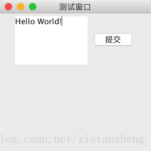

# JTextArea（文本区域）

教程总目录: [Java-Swing 图形界面开发（目录）](../README.md)

## 1. 概述

官方JavaDocsApi: [javax.swing.JTextArea](https://docs.oracle.com/javase/8/docs/api/javax/swing/JTextArea.html)

`JTextArea`，文本区域。JTextArea 用来编辑多行的文本。JTextArea 除了允许多行编辑外，其他基本用法和 JTextField 基本一致。

**JTextArea 常用构造方法**:

```java
/**
 * 参数说明:
 *      text: 默认显示的文本
 *      rows: 默认可见的行数
 *      columns: 默认可见的列数
 *      
 * 默认由 rows 和 columns 决定首选大小
 */
JTextArea()

JTextArea(String text)

JTextArea(int rows, int columns)

JTextArea(String text, int rows, int columns)
```

**JTextArea 常用方法**:

```java
// 是否自动换行，默认为 false
void setLineWrap(boolean wrap)

// 设置自动换行方式。如果为 true，则将在单词边界（空白）处换行; 如果为 false，则将在字符边界处换行。默认为 false。
void setWrapStyleWord(boolean word)

// 获取文本框中的文本
String getText()

// 追加文本到文档末尾
void append(String str)

// 替换部分文本
void replaceRange(String str, int start, int end)

// 设置文本框的 文本、字体 和 字体颜色
void setText(String text)
void setFont(Font font)
void setForeground(Color fg)

// 获取内容的行数（以换行符计算，满行自动换下一行不算增加行数）
int getLineCount()

// 获取指定行（行数从0开始）的行尾（包括换行符）在全文中的偏移量
int getLineEndOffset(int line)

// 获取指定偏移量所在的行数（行数从0开始）
int getLineOfOffset(int offset)

// 设置颜色，分别为: 光标颜色、呈现选中部分的背景颜色、选中部分文本的颜色、不可用时文本的颜色
void setCaretColor(Color c)
void setSelectionColor(Color c)
void setSelectedTextColor(Color c)
void setDisabledTextColor(Color c)

// 设置文本框是否可编辑
void setEditable(boolean b)

/* 下面方法定义在 java.awt.Component 基类中 */

// 判断组件当前是否拥有焦点
boolean isFocusOwner()

// 设置组件是否可用
void setEnabled(boolean b)
```

**JTextArea 复制粘贴相关方法**:

```java
// 设置光标开始位置，selectionStart >= 0
void setSelectionStart(int selectionStart)

// 设置光标结束位置，selectionEnd >= selectionStart
void setSelectionEnd(int selectionEnd)

// 复制选中部分文本
void copy()

// 剪切选中部分文本
void cut()

// 粘贴文本到文本框
void paste()
```

**JTextArea 常用监听器**:

```java
// 添加焦点事件监听器
void addFocusListener(FocusListener listener)

// 添加文本框内的 文本改变 监听器
textField.getDocument().addDocumentListener(DocumentListener listener)

// 添加按键监听器
void addKeyListener(KeyListener listener)
```

**PS**: JTextArea 在使用时通常把它放到 JScrollPane 容器中来使用，以此来实现内容增多时可水平/垂直滚动的效果。

## 2. 代码示例

```java
package com.xiets.swing;

import javax.swing.*;
import java.awt.event.ActionEvent;
import java.awt.event.ActionListener;

public class Main {

    public static void main(String[] args) {
        JFrame jf = new JFrame("测试窗口");
        jf.setSize(250, 250);
        jf.setLocationRelativeTo(null);
        jf.setDefaultCloseOperation(WindowConstants.EXIT_ON_CLOSE);

        JPanel panel = new JPanel();

        // 创建一个 5 行 10 列的文本区域
        final JTextArea textArea = new JTextArea(5, 10);
        // 设置自动换行
        textArea.setLineWrap(true);
        // 添加到内容面板
        panel.add(textArea);

        // 创建一个提交按钮，点击按钮获取输入文本
        JButton btn = new JButton("提交");
        btn.addActionListener(new ActionListener() {
            @Override
            public void actionPerformed(ActionEvent e) {
                System.out.println("提交: " + textArea.getText());
            }
        });
        panel.add(btn);

        jf.setContentPane(panel);
        jf.setVisible(true);
    }

}
```

结果展示：

