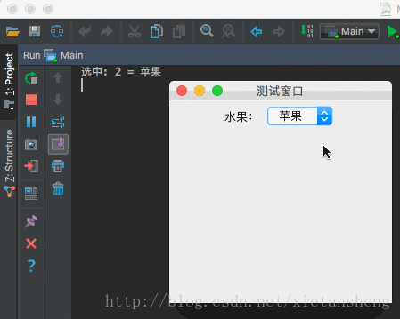

# JComboBox（下拉列表框）

教程总目录: [Java-Swing 图形界面开发（目录）](../README.md)

## 1. 概述

官方JavaDocsApi: [javax.swing.JComboBox](https://docs.oracle.com/javase/8/docs/api/javax/swing/JComboBox.html)

`JComboBox`，下拉列表框。JComboBox以下列列表的形式展示多个选项，用户可以从下拉列表中选择一个值。

其中的选项内容由一个 ComboBoxModel 实例来维护。

如果设置JComboBox为可编辑状态，除了选择指定的选项值外，还允许用户自行输入值（自行输入的值索引为-1）。

**JComboBox 常用构造方法**:

```java
/**
 * 一个 JComboBox 实例维护这一个 ComboBoxModel 实例。
 * ComboBoxModel 实例可以直接创建，也可以通过把 数组 或 集合 传递到 JComboBox 中间接创建。
 * JComboBox 内部创建的 ComboBoxModel 实例是 DefaultComboBoxModel。
 */
JComboBox()

JComboBox(ComboBoxModel model)

JComboBox(Object[] items)

JComboBox(Vector<?> items)
```

**JComboBox 常用方法**:

```java
// 设置选中的索引
void setSelectedIndex(int index)

// 获取当前选中的索引
int getSelectedIndex()

// 获取当前选中的数据项
Object getSelectedItem()

// 设置选项数据模型
void setModel(ComboBoxModel<?> model)

// 获取维护选项数据的 ComboBoxModel。
// 再通过 model.getElementAt(int index) 和 model.getSize() 
// 可分别 获取指定索引的选项数据 和 选项数量。
ComboBoxModel<?> getModel()

// 添加选项选中状态改变的监听器
void addItemListener(ItemListener listener)

// 设置下拉列表框是否可编辑，默认不可编辑。
// 如果设置为可编辑，则除了选择指定的选项值外，还允许用户自行输入值（自行输入的值索引为-1）
void setEditable(boolean flag)
```

## 2. 代码示例

```java
package com.xiets.swing;

import javax.swing.*;
import java.awt.event.ItemEvent;
import java.awt.event.ItemListener;

public class Main {

    public static void main(String[] args) {
        JFrame jf = new JFrame("测试窗口");
        jf.setSize(250, 250);
        jf.setLocationRelativeTo(null);
        jf.setDefaultCloseOperation(WindowConstants.EXIT_ON_CLOSE);

        JPanel panel = new JPanel();

        // 添加一个标签
        JLabel label = new JLabel("水果：");
        panel.add(label);

        // 需要选择的条目
        String[] listData = new String[]{"香蕉", "雪梨", "苹果", "荔枝"};

        // 创建一个下拉列表框
        final JComboBox<String> comboBox = new JComboBox<String>(listData);

        // 添加条目选中状态改变的监听器
        comboBox.addItemListener(new ItemListener() {
            @Override
            public void itemStateChanged(ItemEvent e) {
                // 只处理选中的状态
                if (e.getStateChange() == ItemEvent.SELECTED) {
                    System.out.println("选中: " + comboBox.getSelectedIndex() + " = " + comboBox.getSelectedItem());
                }
            }
        });

        // 设置默认选中的条目
        comboBox.setSelectedIndex(2);

        // 添加到内容面板
        panel.add(comboBox);

        jf.setContentPane(panel);
        jf.setVisible(true);
    }

}
```

结果展示：

