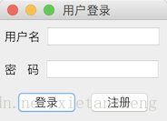

# JPanel（面板）

教程总目录: [Java-Swing 图形界面开发（目录）](../README.md)

## 1. 概述

官方JavaDocsApi: [javax.swing.JPanel](https://docs.oracle.com/javase/8/docs/api/javax/swing/JPanel.html)

`JPanel`，面板。JPanel 是在开发中使用频率非常高的一般轻量级面板容器组件。

**JPanel 常用构造方法**:

```java
// 创建默认使用流式布局的面板
JPanel()

// 创建指定布局管理器的面板
JPanel(LayoutManager layout)
```

## 2. 代码示例

```java
package com.xiets.swing;

import javax.swing.*;
import java.awt.*;

public class Main {

    public static void main(String[] args) {
        JFrame jf = new JFrame("用户登录");
        jf.setDefaultCloseOperation(WindowConstants.EXIT_ON_CLOSE);

        // 第 1 个 JPanel, 使用默认的浮动布局
        JPanel panel01 = new JPanel();
        panel01.add(new JLabel("用户名"));
        panel01.add(new JTextField(10));

        // 第 2 个 JPanel, 使用默认的浮动布局
        JPanel panel02 = new JPanel();
        panel02.add(new JLabel("密   码"));
        panel02.add(new JPasswordField(10));

        // 第 3 个 JPanel, 使用浮动布局, 并且容器内组件居中显示
        JPanel panel03 = new JPanel(new FlowLayout(FlowLayout.CENTER));
        panel03.add(new JButton("登录"));
        panel03.add(new JButton("注册"));

        // 创建一个垂直盒子容器, 把上面 3 个 JPanel 串起来作为内容面板添加到窗口
        Box vBox = Box.createVerticalBox();
        vBox.add(panel01);
        vBox.add(panel02);
        vBox.add(panel03);

        jf.setContentPane(vBox);

        jf.pack();
        jf.setLocationRelativeTo(null);
        jf.setVisible(true);
    }

}
```

结果展示：

