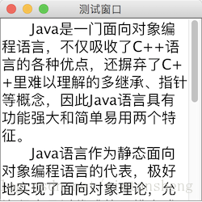

# JScrollPane（滚动面板）

教程总目录: [Java-Swing 图形界面开发（目录）](../README.md)

## 1. 概述

官方JavaDocsApi: [javax.swing.JScrollPane](https://docs.oracle.com/javase/8/docs/api/javax/swing/JScrollPane.html)

`JScrollPane`，滚动面板。JScrollPane 支持水平和垂直滚动视图。文本区域、表格等需要显示较多数据而空间又有限时，通常使用 JScrollPane 进行包裹以实现滚动显示。

JScrollPane 内包含一个视口（ViewPort），表示 JScrollPane 的显示区域。视口内包含一个需要滚动显示的组件，称为视图。

**JScrollPane 常用构造方法**:

```java
/**
 * 参数说明:
 *     view: 需要滚动显示的视图组件
 *     vsbPolicy: 垂直滚动条的显示策略
 *     hsbPolicy: 水平滚动条的显示策略
 */
JScrollPane()

JScrollPane(Component view)

JScrollPane(Component view, int vsbPolicy, int hsbPolicy)

JScrollPane(int vsbPolicy, int hsbPolicy)
```

**滚动条的显示策略的取值**:

```java
/*
 * 垂直滚动条（vsbPolicy）
 */
ScrollPaneConstants.VERTICAL_SCROLLBAR_AS_NEEDED    // 需要时显示（默认）
ScrollPaneConstants.VERTICAL_SCROLLBAR_NEVER        // 从不显示
ScrollPaneConstants.VERTICAL_SCROLLBAR_ALWAYS       // 总是显示

/*
 * 水平滚动条（hsbPolicy）
 */
ScrollPaneConstants.HORIZONTAL_SCROLLBAR_AS_NEEDED  // 需要时显示（默认）
ScrollPaneConstants.HORIZONTAL_SCROLLBAR_NEVER      // 从不显示
ScrollPaneConstants.HORIZONTAL_SCROLLBAR_ALWAYS     // 总是显示
```

**JScrollPane 常用方法**:

```java
// 设置滚动显示视图内容组件
void setViewportView(Component view)

// 设置垂直滚动条的显示策略
void setVerticalScrollBarPolicy(int policy)

// 设置水平滚动条的显示策略
void setHorizontalScrollBarPolicy(int policy)

// 是否响应鼠标滚动事件，默认响应
void setWheelScrollingEnabled(boolean handleWheel)
```

## 2. 代码示例

```java
package com.xiets.swing;

import javax.swing.*;
import java.awt.*;

public class Main {

    public static void main(String[] args) {
        JFrame jf = new JFrame("测试窗口");
        jf.setSize(250, 250);
        jf.setLocationRelativeTo(null);
        jf.setDefaultCloseOperation(WindowConstants.EXIT_ON_CLOSE);

        // 创建文本区域组件
        JTextArea textArea = new JTextArea();
        textArea.setLineWrap(true);                         // 自动换行
        textArea.setFont(new Font(null, Font.PLAIN, 18));   // 设置字体

        // 创建滚动面板, 指定滚动显示的视图组件(textArea), 垂直滚动条一直显示, 水平滚动条从不显示
        JScrollPane scrollPane = new JScrollPane(
                textArea,
                ScrollPaneConstants.VERTICAL_SCROLLBAR_ALWAYS,
                ScrollPaneConstants.HORIZONTAL_SCROLLBAR_NEVER
        );

        jf.setContentPane(scrollPane);
        jf.setVisible(true);
    }

}
```

结果展示：

