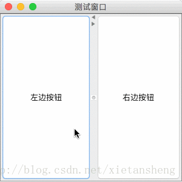

# JSplitPane（分隔面板）

教程总目录: [Java-Swing 图形界面开发（目录）](../README.md)

## 1. 概述

官方JavaDocsApi: [javax.swing.JSplitPane](https://docs.oracle.com/javase/8/docs/api/javax/swing/JSplitPane.html)

`JSplitPane`，分隔面板。JSplitPane用于分隔两个（只能两个）组件，两个组件通过水平/垂直分隔条分别 左右 或 上下 显示，并且可以拖动分隔条调整两个组件显示区域的大小。

**JSplitPane 常用构造方法**:

```java
/**
 * 参数说明:
 *     orientation: 分隔的方向，取值 JSplitPane.HORIZONTAL_SPLIT（水平左右分隔） 
 *                  或 JSplitPane.VERTICAL_SPLIT（垂直上下分隔），默认水平左右分隔。
 *                  
 *     continuousLayout: 拖动分隔条时，是否连续重绘组件，如果为flase，则拖动分隔条停止后才重绘组件。
 *     
 *     leftComponent: 左边/上面 显示的组件
 *     
 *     rightComponent: 右边/下面 显示的组件
 */
JSplitPane()

JSplitPane(int orientation)

JSplitPane(int orientation, boolean continuousLayout)

JSplitPane(int orientation, boolean continuousLayout, Component leftComponent, Component rightComponent)

JSplitPane(int orientation, Component leftComponent, Component rightComponent)
```

**JSplitPane 常用方法**:

```java
// 设置分隔的方向，水平(左右) 或 垂直(上下) 分隔
void setOrientation(int orientation)

// 设置 左边/上面 显示的组件（下面两个方法完全一致）
void setLeftComponent(Component comp)
void setTopComponent(Component comp)

// 设置 左边/下面 显示的组件（下面两个方法完全一致）
void setRightComponent(Component comp)
void setBottomComponent(Component comp)

// 设置 拖动分隔条 时是否 连续重绘 组件
void setContinuousLayout(boolean continuousLayout)

// 分隔条上是否显示快速 折叠/展开 两边组件的小按钮
void setOneTouchExpandable(boolean newValue)

// 设置分隔条的大小（宽度）
void setDividerSize(int newSize)

// 设置分隔条的位置，相对于 左边/顶部 的像素长度
void setDividerLocation(int location)

// 设置分隔条的位置，相对于 宽度/高度 的比例 [0.0 ~ 1.0]（该方法必须要先确保 JSplitPane 已经有宽高值，否则无效）
void setDividerLocation(double proportionalLocation)
```

## 2. 代码示例

```java
package com.xiets.demo;

import javax.swing.*;

public class Main {

    public static void main(String[] args) {
        JFrame jf = new JFrame("测试窗口");
        jf.setSize(300, 300);
        jf.setDefaultCloseOperation(WindowConstants.EXIT_ON_CLOSE);
        jf.setLocationRelativeTo(null);

        // 创建分隔面板
        JSplitPane splitPane = new JSplitPane();

        // 设置左右两边显示的组件
        splitPane.setLeftComponent(new JButton("左边按钮"));
        splitPane.setRightComponent(new JButton("右边按钮"));

        // 分隔条上显示快速 折叠/展开 两边组件的小按钮
        splitPane.setOneTouchExpandable(true);

        // 拖动分隔条时连续重绘组件
        splitPane.setContinuousLayout(true);

        // 设置分隔条的初始位置
        splitPane.setDividerLocation(150);

        // 把分隔面板作为内容面板添加到窗口并显示
        jf.setContentPane(splitPane);
        jf.setVisible(true);
    }

}
```

结果展示：

