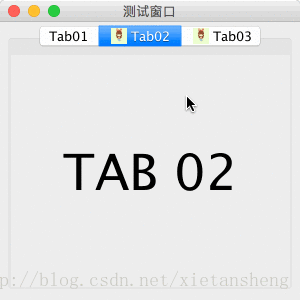

# JTabbedPane（选项卡面板）

教程总目录: [Java-Swing 图形界面开发（目录）](../README.md)

## 1. 概述

官方JavaDocsApi: [javax.swing.JTabbedPane](https://docs.oracle.com/javase/8/docs/api/javax/swing/JTabbedPane.html)

`JTabbedPane`，选项卡面板。它允许用户通过点击给定标题或图标的选项卡，在一组组件之间进行切换显示。

**常用构造方法**:

```java
/**
 * 参事说明:
 *     tabPlacement: 选项卡标题的位置, 值为 JTabbedPane.TOP、JTabbedPane.BOTTOM、
 *                   JTabbedPane.LEFT 或 JTabbedPane.RIGHT, 默认为 TOP
 *
 *     tabLayoutPolicy: 选项卡位置不能放入所有的选项卡时，放置选项卡的策略，
 *                      值为 JTabbedPane.WRAP_TAB_LAYOUT 或 JTabbedPane.SCROLL_TAB_LAYOUT
 */
JTabbedPane()

JTabbedPane(int tabPlacement)

JTabbedPane(int tabPlacement, int tabLayoutPolicy)
```

**创建选项卡**:

```java
/**
 * 参数说明:
 *     title: 选项卡的标题
 *     icon: 选项卡的图标
 *     tip: 当鼠标移到该选项卡时，悬浮提示的文本
 *     component: 选中该选项卡时显示的内容组件
 */
void addTab(String title, Component component)

void addTab(String title, Icon icon, Component component)

void addTab(String title, Icon icon, Component component, String tip)

/**
 * 在指定索引位置插入一个选项卡
 */
void insertTab(String title, Icon icon, Component component, String tip, int index)
```

**移除选项卡**:

```java
// 移除指定位置的选项（下面两个方法完全一致）
void removeTabAt(int index)
void remove(int index)

// 移除指定内容控件的选项卡
void remove(Component component)

// 移除所有选项卡
void removeAll()
```

**选项卡相关操作**:

```java
// 设置当前选中的选项卡
void setSelectedIndex(int index)

// 获取当前选中的选项卡索引
int getSelectedIndex()

// 获取当前选中的选项卡对应的内容组件
Component getSelectedComponent()

// 设置 index 位置的选项卡的标题
void setTitleAt(int index, String title)

// 设置 index 位置的选项卡的图标
void setIconAt(int index, Icon icon)

// 设置 index 位置的选项卡是否可用
void setEnabledAt(int index, boolean enabled)

// 将 index 位置的内容组件设置为 component
void setComponentAt(int index, Component component)

// 获取选项卡的数量
int getTabCount()

/**
 * 自定义选项卡标题位置的组件, 这里的 titleComponent 将放到选项卡标题位置。
 * 应用场景: 例如, 在选项卡标题位置添加一个关闭按钮, 点击按钮移除选项卡。
 */
void setTabComponentAt(int index, Component titleComponent)
```

**状态监听器**:

```java
// 添加选项卡选中状态改变的监听器
void addChangeListener(ChangeListener l)
```

## 2. 代码示例

```java
package com.xiets.demo;

import javax.swing.*;
import javax.swing.event.ChangeEvent;
import javax.swing.event.ChangeListener;
import java.awt.*;

public class Main {

    public static void main(String[] args) {
        JFrame jf = new JFrame("测试窗口");
        jf.setSize(300, 300);
        jf.setDefaultCloseOperation(WindowConstants.EXIT_ON_CLOSE);
        jf.setLocationRelativeTo(null);

        // 创建选项卡面板
        final JTabbedPane tabbedPane = new JTabbedPane();


        // 创建第 1 个选项卡（选项卡只包含 标题）
        tabbedPane.addTab("Tab01", createTextPanel("TAB 01"));

        // 创建第 2 个选项卡（选项卡包含 标题 和 图标）
        tabbedPane.addTab("Tab02", new ImageIcon("bb.jpg"), createTextPanel("TAB 02"));

        // 创建第 3 个选项卡（选项卡包含 标题、图标 和 tip提示）
        tabbedPane.addTab("Tab03", new ImageIcon("bb.jpg"), createTextPanel("TAB 03"), "This is a tab.");


        // 添加选项卡选中状态改变的监听器
        tabbedPane.addChangeListener(new ChangeListener() {
            @Override
            public void stateChanged(ChangeEvent e) {
                System.out.println("当前选中的选项卡: " + tabbedPane.getSelectedIndex());
            }
        });

        // 设置默认选中的选项卡
        tabbedPane.setSelectedIndex(1);

        jf.setContentPane(tabbedPane);
        jf.setVisible(true);
    }

    /**
     * 创建一个面板，面板中心显示一个标签，用于表示某个选项卡需要显示的内容
     */
    private static JComponent createTextPanel(String text) {
        // 创建面板, 使用一个 1 行 1 列的网格布局（为了让标签的宽高自动撑满面板）
        JPanel panel = new JPanel(new GridLayout(1, 1));

        // 创建标签
        JLabel label = new JLabel(text);
        label.setFont(new Font(null, Font.PLAIN, 50));
        label.setHorizontalAlignment(SwingConstants.CENTER);

        // 添加标签到面板
        panel.add(label);

        return panel;
    }

}
```

结果展示：



**PS**: 测试的截图是在 MAC OS X 环境下运行的截图，该组件在 Windows 环境下的显示效果可能有较大差别。