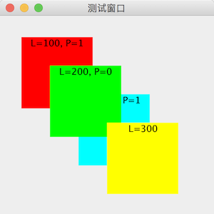

# JLayeredPane（层级面板）

教程总目录: [Java-Swing 图形界面开发（目录）](

## 1. 概述

官方JavaDocsApi: [javax.swing.JLayeredPane](https://docs.oracle.com/javase/8/docs/api/javax/swing/JLayeredPane.html)

`JLayeredPane`，层级面板。

JLayeredPane为容器添加了深度，允许组件在需要时互相重叠。

JLayeredPane将深度范围按 **层** 划分，在同一层内又对组件按位置进一步划分，将组件放入容器时需要指定组件所在的层，以及组件在该层内的 **位置**（position/index）。

层的编号越大越显示在前面；同层内位置编号越大越靠近底部（位置编号取值范围: [-1, n - 1]，n 表示层内组件数量，其中 -1 表示最底，0 表示最顶）。

通过 setLayer(Component c, int layer) 可设置组件所在的层数。

同一层内的组件，可通过调用 moveToFront(Component)、moveToBack(Component) 和 setPosition(int) 调整层内的位置。

**PS**: 添加到 JLayeredPane 内的组件需要明确指定组在位置和宽高，否则不显示（类似绝对布局）。

**JLayeredPane 构造方法**:

```java
// 创建一个层及面部
JLayeredPane()
```

**JLayeredPane 常用方法**:

```java
/**
 * 添加组件到指定的层（默认放到层内最底部），参数说明:
 *     comp: 待添加的组件
 *     layer: 所在的层, 层数是int类型, 由于该方法与另一个 add(Component, int) 方法类似, 直接使用会有冲突, 所以使
 *            用该方法传递 layer 参数时, 必须使用 Integer 类型来明确调用的是下面 add(Component, Object) 方法。
 */
void add(Component comp, Object layer)

// 添加组件到指定的层和层内的位置
void add(Component comp, Object layer, int position)

// 设置组件所在层（默认放到层内最底部）
void setLayer(Component c, int layer)

// 设置组件所在层，以及在层内的位置
void setLayer(Component c, int layer, int position)

// 移动组件到其所在层的最顶部位置
void moveToFront(Component c)

// 移动组件到其所在层的最底部位置
void moveToBack(Component c)

// 设置组件在其所在层的位置，其中 position 取值范围为: [-1, n - 1]，n 表示层内组件数量，其中 -1 表示最底，0 表示最顶
void setPosition(Component c, int position)
```

## 2. 代码示例

```java
package com.xiets.swing;

import javax.swing.*;
import java.awt.*;

public class Main {

    public static void main(String[] args) {
        JFrame jf = new JFrame("测试窗口");
        jf.setSize(300, 300);
        jf.setLocationRelativeTo(null);
        jf.setDefaultCloseOperation(WindowConstants.EXIT_ON_CLOSE);

        JLayeredPane layeredPane = new JLayeredPane();

        // 层数: 100
        JPanel panel_100_1 = createPanel(Color.RED, "L=100, P=1", 30, 30, 100, 100);
        layeredPane.add(panel_100_1, new Integer(100));

        // 层数: 200, 层内位置: 0（层内顶部）
        JPanel panel_200_0 = createPanel(Color.GREEN, "L=200, P=0", 70, 70, 100, 100);
        layeredPane.add(panel_200_0, new Integer(200), 0);

        // 层数: 200, 层内位置: 1
        JPanel panel_200_1 = createPanel(Color.CYAN, "L=200, P=1", 110, 110, 100, 100);
        layeredPane.add(panel_200_1, new Integer(200), 1);

        // 层数: 300
        JPanel panel_300 = createPanel(Color.YELLOW, "L=300", 150, 150, 100, 100);
        layeredPane.add(panel_300, new Integer(300));

        jf.setContentPane(layeredPane);
        jf.setVisible(true);
    }

    /**
     * 创建一个面板容器（容器内包含一个水平方向居中, 垂直方向顶部对其的标签）
     *
     * @param bg 容器背景
     * @param text 容器内标签显示的文本
     * @param x 容器的横轴坐标
     * @param y 容器的纵坐标
     * @param width 容器的宽度
     * @param height 容器的高度
     * @return
     */
    private static JPanel createPanel(Color bg, String text, int x, int y, int width, int height) {
        // 创建一个 JPanel, 使用 1 行 1 列的网格布局
        JPanel panel = new JPanel(new GridLayout(1, 1));

        // 设置容器的位置和宽高
        panel.setBounds(x, y, width, height);

        // 设置 panel 的背景
        panel.setOpaque(true);
        panel.setBackground(bg);

        // 创建标签并设置相应属性
        JLabel label = new JLabel(text);
        label.setHorizontalAlignment(SwingConstants.CENTER);
        label.setVerticalAlignment(SwingConstants.TOP);

        // 添加标签到容器
        panel.add(label);

        return panel;
    }

}
```

结果展示：

