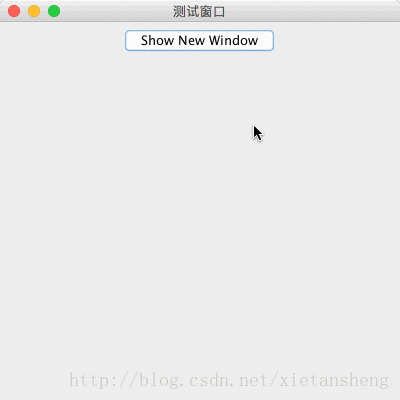

# JFrame（窗口）

教程总目录: [Java-Swing 图形界面开发（目录）](../README.md)

## 1. 概述

官方JavaDocsApi: [javax.swing.JFrame](https://docs.oracle.com/javase/8/docs/api/javax/swing/JFrame.html)

`JFrame`，窗口。JFrame 是一个可以独立显示的组件，一个窗口通常包含有标题、图标、操作按钮(关闭、最小化、最大化)，还可以为窗口添加菜单栏、工具栏等。一个进程中可以创建多个窗口，并可在适当时候进行显示、隐藏 或 销毁。

**JFrame 常用构造方法**:

```java
/**
 * 参数说明:
 *     title: 窗口标题
 */
JFrame()

JFrame(String title)
```

**JFrame 常用方法**:

```java
// 设置窗口的 标题
void setTitle(String title)

// 设置窗口的 图标
void setIconImage(Image image)

// 设置窗口的 宽高
void setSize(int width, int height)
void setSize(Dimension d)

/**
 * 设置窗口关闭按钮点击后的默认操作, 参考值:
 *     WindowConstants.DO_NOTHING_ON_CLOSE: 不执行任何操作。
 *     WindowConstants.HIDE_ON_CLOSE: 隐藏窗口（不会结束进程）, 再次调用 setVisible(true) 将再次显示。
 *     WindowConstants.DISPOSE_ON_CLOSE: 销毁窗口, 如果所有可显示的窗口都被 DISPOSE, 则可能会自动结束进程。
 *     WindowConstants.EXIT_ON_CLOSE: 退出进程。
 */
void setDefaultCloseOperation(int operation)

// 设置窗口是否可放大缩小
void setResizable(boolean resizable)

// 设置窗口的 位置（相对于屏幕左上角）
void setLocation(int x, int y)
void setLocation(Point p)

// 设置窗口的 位置 和 宽高
void setBounds(int x, int y, int width, int height)
void setBounds(Rectangle rect)

// 获取窗口的位置坐标（相对于屏幕坐标空间）
Point getLocationOnScreen()
// 获取窗口的位置坐标（相对于父级坐标空间, 窗口的父级一般就是屏幕）
Point getLocation()

/**
 * 设置窗口的相对位置。
 * 如果 comp 整个显示区域在屏幕内, 则将窗口放置到 comp 的中心;
 * 如果 comp 显示区域有部分不在屏幕内, 则将该窗口放置在最接近 comp 中心的一侧;
 * comp 为 null, 表示将窗口放置到屏幕中心。
 */
void setLocationRelativeTo(Component comp)

// 设置将窗口 置顶 显示
void setAlwaysOnTop(boolean alwaysOnTop)

// 设置窗口的内容面板
void setContentPane(Container contentPane)

// 设置窗口是否可见, 窗口对象刚创建和添加相应组件后通过 setVisible(true) 绘制窗口, 其内部组件可能要此时才有宽高值
void setVisible(boolean b)

// 判断窗口是否处于显示状态
boolean isShowing()

// 销毁窗口, 释放窗口及其所有子组件占用的资源, 之后再次调用 setVisible(true) 将会重构窗口
void dispose()

// 调整窗口的大小, 以适合其子组件的首选大小和布局。
void pack()
```

## 2. 代码示例

```java
package com.xiets.swing;

import javax.swing.*;
import java.awt.*;
import java.awt.event.ActionEvent;
import java.awt.event.ActionListener;

public class Main {

    public static void main(String[] args) {
        final JFrame jf = new JFrame("测试窗口");
        jf.setSize(400, 400);
        jf.setLocationRelativeTo(null);
        jf.setDefaultCloseOperation(WindowConstants.EXIT_ON_CLOSE);

        JPanel panel = new JPanel();

        JButton btn = new JButton("Show New Window");
        btn.addActionListener(new ActionListener() {
            @Override
            public void actionPerformed(ActionEvent e) {
                // 点击按钮, 显示新的一个窗口
                showNewWindow(jf);
            }
        });
        panel.add(btn);

        jf.setContentPane(panel);
        jf.setVisible(true);
    }

    public static void showNewWindow(JFrame relativeWindow) {
        // 创建一个新窗口
        JFrame newJFrame = new JFrame("新的窗口");

        newJFrame.setSize(250, 250);

        // 把新窗口的位置设置到 relativeWindow 窗口的中心
        newJFrame.setLocationRelativeTo(relativeWindow);

        // 点击窗口关闭按钮, 执行销毁窗口操作（如果设置为 EXIT_ON_CLOSE, 则点击新窗口关闭按钮后, 整个进程将结束）
        newJFrame.setDefaultCloseOperation(WindowConstants.DISPOSE_ON_CLOSE);

        // 窗口设置为不可改变大小
        newJFrame.setResizable(false);

        JPanel panel = new JPanel(new GridLayout(1, 1));

        // 在新窗口中显示一个标签
        JLabel label = new JLabel("这是一个窗口");
        label.setFont(new Font(null, Font.PLAIN, 25));
        label.setHorizontalAlignment(SwingConstants.CENTER);
        label.setVerticalAlignment(SwingConstants.CENTER);
        panel.add(label);

        newJFrame.setContentPane(panel);
        newJFrame.setVisible(true);
    }

}
```

结果展示：

