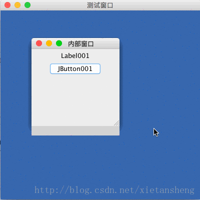

# JInternalFrame（内部窗口）

教程总目录: [Java-Swing 图形界面开发（目录）](../README.md)

## 1. 概述

官方JavaDocsApi: [javax.swing.JInternalFrame](https://docs.oracle.com/javase/8/docs/api/javax/swing/JInternalFrame.html)

`JInternalFrame`，内部窗口。

JInternalFrame 支持在 JFrame 窗口内部显示一个完整的子窗口，并提供了许多本机窗体功能的轻量级对象，包括拖动、关闭、变成图标、调整大小、标题显示和支持菜单栏等。

在实际使用中，通常将 JInternalFrame 添加到 JDesktopPane 中，由其来维护和显示 JInternalFrame。

JInternalFrame 的实例创建后，其具体使用方法和 JFrame 类似。

## 2. 代码实例

```java
package com.xiets.swing;

import javax.swing.*;
import java.beans.PropertyVetoException;

public class Main {

    public static void main(String[] args) {
        JFrame jf = new JFrame("测试窗口");
        jf.setSize(400, 400);
        jf.setLocationRelativeTo(null);
        jf.setDefaultCloseOperation(WindowConstants.EXIT_ON_CLOSE);

        // 创建 桌面面板
        JDesktopPane desktopPane = new JDesktopPane();

        // 创建 内部窗口
        JInternalFrame internalFrame = createInternalFrame();

        // 添加 内部窗口 到 桌面面板
        desktopPane.add(internalFrame);

        // 把 桌面面板 作为 内容面板 设置到窗口并显示
        jf.setContentPane(desktopPane);
        jf.setVisible(true);

        try {
            // 设置 内部窗口 被选中
            internalFrame.setSelected(true);
        } catch (PropertyVetoException e) {
            e.printStackTrace();
        }
    }

    private static JInternalFrame createInternalFrame() {
        // 创建一个内部窗口
        JInternalFrame internalFrame = new JInternalFrame(
                "内部窗口",  // title
                true,       // resizable
                true,       // closable
                true,       // maximizable
                true        // iconifiable
        );

        // 设置窗口的宽高
        internalFrame.setSize(200, 200);
        // 设置窗口的显示位置
        internalFrame.setLocation(50, 50);
        // 内部窗口的关闭按钮动作默认就是销毁窗口，所有不用设置
        // internalFrame.setDefaultCloseOperation(WindowConstants.DISPOSE_ON_CLOSE);

        // 创建内容面板
        JPanel panel = new JPanel();

        // 添加组件到面板
        panel.add(new JLabel("Label001"));
        panel.add(new JButton("JButton001"));

        // 设置内部窗口的内容面板
        internalFrame.setContentPane(panel);

        /*
         * 对于内部窗口，还可以不需要手动设置内容面板，直接把窗口当做普通面板使用，
         * 即直接设置布局，然后通过 add 添加组件，如下代码:
         *     internalFrame.setLayout(new FlowLayout());
         *     internalFrame.add(new JLabel("Label001"));
         *     internalFrame.add(new JButton("JButton001"));
         */

        // 显示内部窗口
        internalFrame.setVisible(true);

        return internalFrame;
    }

}
```

结果展示:

