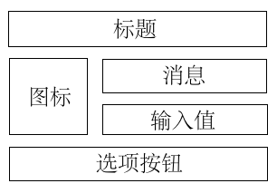
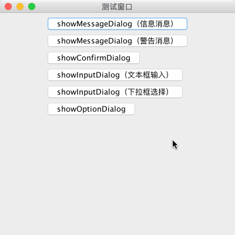
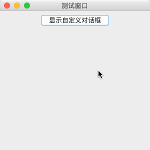

# JDialog、JOptionPane（对话框）

教程总目录: [Java-Swing 图形界面开发（目录）](../README.md)

## 1. 概述

官方JavaDocsApi:

* [javax.swing.JDialog](https://docs.oracle.com/javase/8/docs/api/javax/swing/JDialog.html)
* [javax.swing.JOptionPane](https://docs.oracle.com/javase/8/docs/api/javax/swing/JOptionPane.html)

`JDialog`，对话框。使用 JDialog 类可以创建自定义有的对话框，或者调用 JOptionPane 中的多个静态方法快速创建各种标准的对话框。

`JOptionPane`是 JavaSwing 内部已实现好的，以静态方法的形式提供调用，能够快速方便的弹出要求用户提供值或向其发出通知的标准对话框。

JOptionPane 提供的 **标准对话框** 类型分为以下几种:

| **方法名**        | 描述                                                         |
| ----------------- | ------------------------------------------------------------ |
| showMessageDialog | 消息对话框，向用户展示一个消息，没有返回值。                 |
| showConfirmDialog | 确认对话框，询问一个问题是否执行。                           |
| showInputDialog   | 输入对话框，要求用户提供某些输入。                           |
| showOptionDialog  | 选项对话框，上述三项的大统一，自定义按钮文本，询问用户需要点击哪个按钮。 |

这些标准对话框的基本外形布局通常如下图所示:



上述四个类型的方法（包括其若干重载）的参数遵循一致的模式，下面介绍各**参数**的含义:

**(1) parentComponent**: 对话框的父级组件，决定对话框显示的位置，对话框的显示会尽量紧靠组件的中心，如果传 null，则显示在屏幕的中心。

**(2) title**: 对话框标题。

**(3) message**: 消息内容。

**(4) messageType**: 消息类型，主要是提供默认的对话框图标。可能的值为：

* `JOptionPane.PLAIN_MESSAGE` 简单消息（不使用图标）
* `JOptionPane.INFORMATION_MESSAGE` 信息消息（默认）
* `JOptionPane.QUESTION_MESSAGE` 问题消息
* `JOptionPane.WARNING_MESSAGE` 警告消息
* `JOptionPane.ERROR_MESSAGE` 错误消息

**(5) icon**: 自定义的对话框图标，如果传 null，则图标类型由 messageType 决定。

**(6) optionType**: 选项按钮的类型。

**(7) options、initialValue**: 自定义的选项按钮（如果穿 null，则选项按钮由 optionType 决定），以及默认选中的选项按钮。

**(8) selectionValues、initialSelectionValue**: 提供的输入选项，以及默认选中的选项。

下面是 JOptionPane 类中各标准对话框的静态方法重载:

消息对话框:

```java
static void showMessageDialog(Component parentComponent, 
                              Object message)
                              
static void showMessageDialog(Component parentComponent, 
                              Object message, 
                              String title, 
                              int messageType)
                              
static void showMessageDialog(Component parentComponent, 
                              Object message, 
                              String title, 
                              int messageType, 
                              Icon icon)
```

确认对话框:

```java
static int showConfirmDialog(Component parentComponent, 
                             Object message)
                             
static int showConfirmDialog(Component parentComponent, 
                             Object message, 
                             String title, 
                             int optionType)
                             
static int showConfirmDialog(Component parentComponent, 
                             Object message, 
                             String title, 
                             int optionType, 
                             int messageType)

static int showConfirmDialog(Component parentComponent, 
                             Object message, 
                             String title, 
                             int optionType, 
                             int messageType, 
                             Icon icon)
```

输入对话框:

```java
static String showInputDialog(Component parentComponent, 
                              Object message)

static String showInputDialog(Component parentComponent, 
                              Object message, 
                              Object initialSelectionValue)

static String showInputDialog(Component parentComponent, 
                              Object message, 
                              String title, 
                              int messageType)

static Object showInputDialog(Component parentComponent, 
                              Object message, 
                              String title, 
                              int messageType, 
                              Icon icon, 
                              Object[] selectionValues, 
                              Object initialSelectionValue)
```

选项对话框:

```java
static int showOptionDialog(Component parentComponent, 
                            Object message, 
                            String title, 
                            int optionType, 
                            int messageType, 
                            Icon icon, 
                            Object[] options, 
                            Object initialValue)
```

## 2. 代码示例

```java
package com.xiets.swing;

import javax.swing.*;
import java.awt.event.ActionEvent;
import java.awt.event.ActionListener;

public class Main {

    public static void main(String[] args) throws Exception {
        final JFrame jf = new JFrame("测试窗口");
        jf.setSize(400, 400);
        jf.setLocationRelativeTo(null);
        jf.setDefaultCloseOperation(WindowConstants.EXIT_ON_CLOSE);

        /*
         * 1. 消息对话框（信息消息）
         */
        JButton btn01 = new JButton("showMessageDialog（信息消息）");
        btn01.addActionListener(new ActionListener() {
            @Override
            public void actionPerformed(ActionEvent e) {
                // 消息对话框无返回, 仅做通知作用
                JOptionPane.showMessageDialog(
                        jf,
                        "Hello Information Message",
                        "消息标题",
                        JOptionPane.INFORMATION_MESSAGE
                );
            }
        });

        /*
         * 2. 消息对话框（警告消息）
         */
        JButton btn02 = new JButton("showMessageDialog（警告消息）");
        btn02.addActionListener(new ActionListener() {
            @Override
            public void actionPerformed(ActionEvent e) {
                // 消息对话框无返回, 仅做通知作用
                JOptionPane.showMessageDialog(
                        jf,
                        "Hello Warning Message",
                        "消息标题",
                        JOptionPane.WARNING_MESSAGE
                );
            }
        });

        /*
         * 3. 确认对话框
         */
        JButton btn03 = new JButton("showConfirmDialog");
        btn03.addActionListener(new ActionListener() {
            @Override
            public void actionPerformed(ActionEvent e) {
                /*
                 * 返回用户点击的选项, 值为下面三者之一:
                 *     是:   JOptionPane.YES_OPTION
                 *     否:   JOptionPane.NO_OPTION
                 *     取消: JOptionPane.CANCEL_OPTION
                 *     关闭: JOptionPane.CLOSED_OPTION
                 */
                int result = JOptionPane.showConfirmDialog(
                        jf,
                        "确认删除？",
                        "提示",
                        JOptionPane.YES_NO_CANCEL_OPTION
                );
                System.out.println("选择结果: " + result);
            }
        });

        /*
         * 4. 输入对话框（文本框输入）
         */
        JButton btn04 = new JButton("showInputDialog（文本框输入）");
        btn04.addActionListener(new ActionListener() {
            @Override
            public void actionPerformed(ActionEvent e) {
                // 显示输入对话框, 返回输入的内容
                String inputContent = JOptionPane.showInputDialog(
                        jf,
                        "输入你的名字:",
                        "默认内容"
                );
                System.out.println("输入的内容: " + inputContent);
            }
        });

        /*
         * 5. 输入对话框（下拉框选择）
         */
        JButton btn05 = new JButton("showInputDialog（下拉框选择）");
        btn05.addActionListener(new ActionListener() {
            @Override
            public void actionPerformed(ActionEvent e) {
                Object[] selectionValues = new Object[]{"香蕉", "雪梨", "苹果"};

                // 显示输入对话框, 返回选择的内容, 点击取消或关闭, 则返回null
                Object inputContent = JOptionPane.showInputDialog(
                        jf,
                        "选择一项: ",
                        "标题",
                        JOptionPane.PLAIN_MESSAGE,
                        null,
                        selectionValues,
                        selectionValues[0]
                );
                System.out.println("输入的内容: " + inputContent);
            }
        });

        /*
         * 6. 选项对话框
         */
        JButton btn06 = new JButton("showOptionDialog");
        btn06.addActionListener(new ActionListener() {
            @Override
            public void actionPerformed(ActionEvent e) {
                // 选项按钮
                Object[] options = new Object[]{"香蕉", "雪梨", "苹果"};

                // 显示选项对话框, 返回选择的选项索引, 点击关闭按钮返回-1
                int optionSelected = JOptionPane.showOptionDialog(
                        jf,
                        "请点击一个按钮选择一项",
                        "对话框标题",
                        JOptionPane.YES_NO_CANCEL_OPTION,
                        JOptionPane.ERROR_MESSAGE,
                        null,
                        options,    // 如果传null, 则按钮为 optionType 类型所表示的按钮（也就是确认对话框）
                        options[0]
                );

                if (optionSelected >= 0) {
                    System.out.println("点击的按钮: " + options[optionSelected]);
                }
            }
        });

        // 垂直排列按钮
        Box vBox = Box.createVerticalBox();
        vBox.add(btn01);
        vBox.add(btn02);
        vBox.add(btn03);
        vBox.add(btn04);
        vBox.add(btn05);
        vBox.add(btn06);

        JPanel panel = new JPanel();
        panel.add(vBox);

        jf.setContentPane(panel);
        jf.setVisible(true);
    }

}
```

结果展示：



## 3. 代码实例: 自定义对话框的显示（JDialog）

对话框 JDialog 和 JFrame 都是继承自 java.awt.Window，用法与 JFrame 类似。

对话框分为 模态 和 非模态:

- 模态: 弹出对话框后，对话框的父级窗口不可操作。
- 非模态: 弹出对话框后，对话框的父级窗口可以正常操作。

对话框不能最小化。

```java
package com.xiets.swing;

import javax.swing.*;
import java.awt.*;
import java.awt.event.ActionEvent;
import java.awt.event.ActionListener;

public class Main {

    public static void main(String[] args) throws Exception {
        final JFrame jf = new JFrame("测试窗口");
        jf.setSize(300, 300);
        jf.setLocationRelativeTo(null);
        jf.setDefaultCloseOperation(WindowConstants.EXIT_ON_CLOSE);

        JButton btn = new JButton("显示自定义对话框");
        btn.addActionListener(new ActionListener() {
            @Override
            public void actionPerformed(ActionEvent e) {
                showCustomDialog(jf, jf);
            }
        });

        JPanel panel = new JPanel();
        panel.add(btn);

        jf.setContentPane(panel);
        jf.setVisible(true);
    }

    /**
     * 显示一个自定义的对话框
     *
     * @param owner 对话框的拥有者
     * @param parentComponent 对话框的父级组件
     */
    private static void showCustomDialog(Frame owner, Component parentComponent) {
        // 创建一个模态对话框
        final JDialog dialog = new JDialog(owner, "提示", true);
        // 设置对话框的宽高
        dialog.setSize(250, 150);
        // 设置对话框大小不可改变
        dialog.setResizable(false);
        // 设置对话框相对显示的位置
        dialog.setLocationRelativeTo(parentComponent);

        // 创建一个标签显示消息内容
        JLabel messageLabel = new JLabel("对话框消息内容");

        // 创建一个按钮用于关闭对话框
        JButton okBtn = new JButton("确定");
        okBtn.addActionListener(new ActionListener() {
            @Override
            public void actionPerformed(ActionEvent e) {
                // 关闭对话框
                dialog.dispose();
            }
        });

        // 创建对话框的内容面板, 在面板内可以根据自己的需要添加任何组件并做任意是布局
        JPanel panel = new JPanel();

        // 添加组件到面板
        panel.add(messageLabel);
        panel.add(okBtn);

        // 设置对话框的内容面板
        dialog.setContentPane(panel);
        // 显示对话框
        dialog.setVisible(true);
    }

}
```

结果展示：

