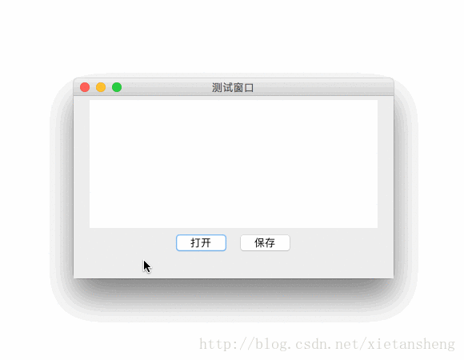

# JFileChooser（文件选择器）

教程总目录: [Java-Swing 图形界面开发（目录）](../README.md)

## 1. 概述

官方JavaDocsApi: [javax.swing.JFileChooser](https://docs.oracle.com/javase/8/docs/api/javax/swing/JFileChooser.html)

`JFileChooser`，文件选取器。JFileChooser为用户选择文件提供了一种简单的机制，包括 **打开文件** 和 **保存文件**。

**JFileChooser 常用构造方法**:

```java
/**
 * 参数说明:
 *     currentDirectory: 打开文件选取器时默认显示的文件夹（默认为用户文件夹）
 *     currentDirectoryPath: 打开文件选取器时默认显示的文件夹（默认为用户文件夹）
 */
JFileChooser()

JFileChooser(File currentDirectory)

JFileChooser(String currentDirectoryPath)
```

**JFileChooser 常用方法**:

```java
// 设置默认显示的文件夹
void setCurrentDirectory(File dir)

// 设置文件选择模式, 可选值如下:
//     JFileChooser.FILES_ONLY: 只能选文件
//     JFileChooser.DIRECTORIES_ONLY: 只能选文件夹
//     JFileChooser.FILES_AND_DIRECTORIES: 文件和文件夹都可以选
void setFileSelectionMode(int mode)

// 设置是否允许同时选择多个（默认为不允许）
void setMultiSelectionEnabled(boolean b)

// 添加可供用户选择的文件过滤器
void addChoosableFileFilter(FileFilter filter)

// 设置默认使用的文件过滤器
void setFileFilter(FileFilter filter)

// 设置默认被选中的文件
void setSelectedFile(File file)
void setSelectedFiles(File[] selectedFiles)

/*
 * 显示 打开文件 或 保存文件 的对话框（线程将被阻塞, 直到选择框被关闭）。
 *
 * 参数: 
 *     parent: 文件选取器对话框的父组件, 对话框将会尽量显示在靠近 parent 的中心; 如果传 null, 则显示在屏幕中心。
 * 
 * 返回值:
 *     JFileChooser.CANCEL_OPTION: 点击了取消或关闭
 *     JFileChooser.APPROVE_OPTION: 点击了确认或保存
 *     JFileChooser.ERROR_OPTION: 出现错误
 */
int showOpenDialog(Component parent)
int showSaveDialog(Component parent)

// 获取选择的文件（一般在用户选择完文件点击了确认或保存后通过该方法获取选中的文件）
File getSelectedFile()
File[] getSelectedFiles()
```

## 2. 代码示例

```java
package com.xiets.swing;

import javax.swing.*;
import javax.swing.filechooser.FileNameExtensionFilter;
import java.awt.*;
import java.awt.event.ActionEvent;
import java.awt.event.ActionListener;
import java.io.File;

public class Main {

    public static void main(String[] args) throws Exception {
        final JFrame jf = new JFrame("测试窗口");
        jf.setSize(400, 250);
        jf.setLocationRelativeTo(null);
        jf.setDefaultCloseOperation(WindowConstants.EXIT_ON_CLOSE);

        JPanel panel = new JPanel();

        // 创建文本区域, 用于显示相关信息
        final JTextArea msgTextArea = new JTextArea(10, 30);
        msgTextArea.setLineWrap(true);
        panel.add(msgTextArea);

        JButton openBtn = new JButton("打开");
        openBtn.addActionListener(new ActionListener() {
            @Override
            public void actionPerformed(ActionEvent e) {
                showFileOpenDialog(jf, msgTextArea);
            }
        });
        panel.add(openBtn);

        JButton saveBtn = new JButton("保存");
        saveBtn.addActionListener(new ActionListener() {
            @Override
            public void actionPerformed(ActionEvent e) {
                showFileSaveDialog(jf, msgTextArea);
            }
        });
        panel.add(saveBtn);

        jf.setContentPane(panel);
        jf.setVisible(true);
    }

    /*
     * 打开文件
     */
    private static void showFileOpenDialog(Component parent, JTextArea msgTextArea) {
        // 创建一个默认的文件选取器
        JFileChooser fileChooser = new JFileChooser();

        // 设置默认显示的文件夹为当前文件夹
        fileChooser.setCurrentDirectory(new File("."));

        // 设置文件选择的模式（只选文件、只选文件夹、文件和文件均可选）
        fileChooser.setFileSelectionMode(JFileChooser.FILES_AND_DIRECTORIES);
        // 设置是否允许多选
        fileChooser.setMultiSelectionEnabled(true);

        // 添加可用的文件过滤器（FileNameExtensionFilter 的第一个参数是描述, 后面是需要过滤的文件扩展名 可变参数）
        fileChooser.addChoosableFileFilter(new FileNameExtensionFilter("zip(*.zip, *.rar)", "zip", "rar"));
        // 设置默认使用的文件过滤器
        fileChooser.setFileFilter(new FileNameExtensionFilter("image(*.jpg, *.png, *.gif)", "jpg", "png", "gif"));

        // 打开文件选择框（线程将被阻塞, 直到选择框被关闭）
        int result = fileChooser.showOpenDialog(parent);

        if (result == JFileChooser.APPROVE_OPTION) {
            // 如果点击了"确定", 则获取选择的文件路径
            File file = fileChooser.getSelectedFile();

            // 如果允许选择多个文件, 则通过下面方法获取选择的所有文件
            // File[] files = fileChooser.getSelectedFiles();

            msgTextArea.append("打开文件: " + file.getAbsolutePath() + "\n\n");
        }
    }

    /*
     * 选择文件保存路径
     */
    private static void showFileSaveDialog(Component parent, JTextArea msgTextArea) {
        // 创建一个默认的文件选取器
        JFileChooser fileChooser = new JFileChooser();

        // 设置打开文件选择框后默认输入的文件名
        fileChooser.setSelectedFile(new File("测试文件.zip"));

        // 打开文件选择框（线程将被阻塞, 直到选择框被关闭）
        int result = fileChooser.showSaveDialog(parent);

        if (result == JFileChooser.APPROVE_OPTION) {
            // 如果点击了"保存", 则获取选择的保存路径
            File file = fileChooser.getSelectedFile();
            msgTextArea.append("保存到文件: " + file.getAbsolutePath() + "\n\n");
        }
    }

}
```

结果展示：

