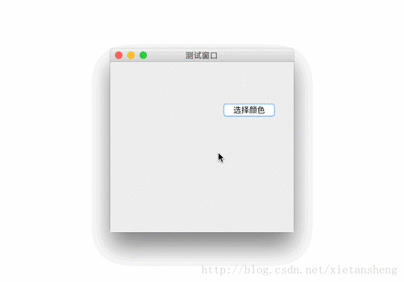

# JColorChooser（颜色选择器）

教程总目录: [Java-Swing 图形界面开发（目录）](../README.md)

## 1. 概述

官方JavaDocsApi: [javax.swing.JColorChooser](https://docs.oracle.com/javase/8/docs/api/javax/swing/JColorChooser.html)

`JColorChooser`，颜色选取器。JColorChooser提供一个用于允许用户操作和选择颜色的控制器对话框。

使用方法非常简单，就调用 JColorChooser 的一个静态方法便可:

```java
/**
 * 显示一个颜色选取器对话框（线程将被阻塞, 直到对话框被关闭）
 * 
 * 参数说明:
 *     component: 对话框的父组件, 对话框将紧靠 component 的中心显示; 如果传 null, 则对话框显示在屏幕中心。
 *     title: 对话框标题。
 *     initialColor: 初始选中的颜色; 如果传 null, 则默认为非透明白色。
 *
 * 返回:
 *     返回选择的颜色; 如果点击了取消或关闭, 则返回 null。
 */
public static Color showDialog(Component component, String title, Color initialColor)
```

## 2. 代码示例

```java
package com.xiets.swing;

import javax.swing.*;
import java.awt.*;
import java.awt.event.ActionEvent;
import java.awt.event.ActionListener;

public class Main {

    public static void main(String[] args) throws Exception {
        final JFrame jf = new JFrame("测试窗口");
        jf.setSize(300, 300);
        jf.setLocationRelativeTo(null);
        jf.setDefaultCloseOperation(WindowConstants.EXIT_ON_CLOSE);

        JPanel panel = new JPanel();

        // 创建一个标签, 用于显示选择的原色
        final JLabel label = new JLabel();
        label.setPreferredSize(new Dimension(150, 150));
        label.setOpaque(true);
        panel.add(label);

        JButton btn = new JButton("选择颜色");
        btn.addActionListener(new ActionListener() {
            @Override
            public void actionPerformed(ActionEvent e) {
                // 显示颜色选取器对话框, 返回选取的颜色（线程将被阻塞, 直到对话框被关闭）
                Color color = JColorChooser.showDialog(jf, "选取颜色", null);

                // 如果用户取消或关闭窗口, 则返回的 color 为 null
                if (color == null) {
                    return;
                }

                // 把选取的颜色设置为标签的背景
                label.setBackground(color);

                // 获取颜色的 ARGB 各个分量值
                int alpha = color.getAlpha();
                int red = color.getRed();
                int green = color.getGreen();
                int blue = color.getBlue();

                label.setText("A=" + String.format("%02x", alpha) + ", " +
                        String.format("#%02x%02x%02x", red, green, blue));
            }
        });
        panel.add(btn);

        jf.setContentPane(panel);
        jf.setVisible(true);
    }

}
```

结果展示：

