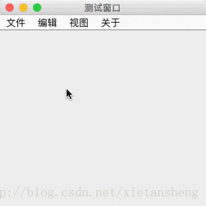

# JMenuBar（菜单栏）

教程总目录: [Java-Swing 图形界面开发（目录）](../README.md)

## 1. 概述

官方JavaDocsApi:

- [javax.swing.JMenuBar](https://docs.oracle.com/javase/8/docs/api/javax/swing/JMenuBar.html)
- [javax.swing.JMenu](https://docs.oracle.com/javase/8/docs/api/javax/swing/JMenu.html)
- [javax.swing.JMenuItem](https://docs.oracle.com/javase/8/docs/api/javax/swing/JMenuItem.html)，[javax.swing.JCheckBoxMenuItem](https://docs.oracle.com/javase/8/docs/api/javax/swing/JCheckBoxMenuItem.html)，[javax.swing.JRadioButtonMenuItem](https://docs.oracle.com/javase/8/docs/api/javax/swing/JRadioButtonMenuItem.html)

`JMenuBar`，菜单栏。菜单栏组件添加到 JFrame 窗口后，在窗口的内容显示区域的顶部出现。实现一个菜单栏主要涉及三种类:

（1）**JMenuBar**

表示一个菜单栏。

（2）**JMenu**

表示菜单栏上的一个一级菜单。

（3）**JMenuItem**, **JCheckBoxMenuItem**, **JRadioButtonMenuItem**

表示一级菜单下的一个子菜单项，三者分别表示 普通的子菜单、带复选框的子菜单、带单选按钮的子菜单。

PS: JMenu 继承自 JMenuItem，所以一个 JMenu 也可以当做是一个二级子菜单项，通过 JMenu 和 JMenuItem 之间的嵌套，可实现多级子菜单效果。

JMenu、JCheckBoxMenuItem、JRadioButtonMenuItem 均继承自 JMenuItem，下面介绍其中较常用的方法:

**JMenuItem 常用构造方法**:

```java
/**
 * 参数说明:
 *     text: 菜单显示的文本
 *     icon: 菜单显示的图标
 */
JMenuItem()

JMenuItem(String text)

JMenuItem(Icon icon)

JMenuItem(String text, Icon icon)
```

**JMenuItem 常用方法**:

```java
// 设置菜单显示的文本
void setText(String text)

// 设置菜单显示的图标
void setIcon(Icon defaultIcon)

// 设置菜单的键盘助记符
void setMnemonic(int mnemonic)
// 设置修改键，使用键盘快捷键直接触发菜单项的动作
void setAccelerator(KeyStroke keyStroke)
/*
 * 例如按下 ALT+N 键触发菜单项动作:
 *     menuItem.setMnemonic(KeyEvent.VK_N);
 *     menuItem.setAccelerator(KeyStroke.getKeyStroke(KeyEvent.VK_N, ActionEvent.ALT_MASK));
 */

// 添加菜单被点击的监听器
void addActionListener(ActionListener l)

// 绑定菜单项的动作命令名称，如果所有菜单项使用同一个监听器，
// 可以再监听器回调时通过命令名称区别是哪个菜单项触发的动作。
void setActionCommand(String actionCommand)
```

**JCheckBoxMenuItem、JRadioButtonMenuItem 常用方法**:

```java
// 设置 复选框/单选按钮 是否选中
void setSelected(boolean b)

// 判断 复选框/单选按钮 是否选中
boolean isSelected()

// 添加 复选框/单选按钮 状态被改变的监听器
void addChangeListener(ChangeListener l)
```

**JMenu 常用方法**:

```java
// 添加 子菜单 到 JMenu 中
JMenuItem add(JMenuItem menuItem)

// 添加一个子菜单分割线
void addSeparator()
```

## 2. 代码实例

```java
package com.xiets.swing;

import javax.swing.*;
import javax.swing.event.ChangeEvent;
import javax.swing.event.ChangeListener;
import java.awt.event.ActionEvent;
import java.awt.event.ActionListener;
import java.awt.event.KeyEvent;

public class Main {

    public static void main(String[] args) throws Exception {
        final JFrame jf = new JFrame("测试窗口");
        jf.setSize(300, 300);
        jf.setLocationRelativeTo(null);
        jf.setDefaultCloseOperation(WindowConstants.EXIT_ON_CLOSE);

        /*
         * 创建一个菜单栏
         */
        JMenuBar menuBar = new JMenuBar();

        /*
         * 创建一级菜单
         */
        JMenu fileMenu = new JMenu("文件");
        JMenu editMenu = new JMenu("编辑");
        JMenu viewMenu = new JMenu("视图");
        JMenu aboutMenu = new JMenu("关于");
        // 一级菜单添加到菜单栏
        menuBar.add(fileMenu);
        menuBar.add(editMenu);
        menuBar.add(viewMenu);
        menuBar.add(aboutMenu);

        /*
         * 创建 "文件" 一级菜单的子菜单
         */
        JMenuItem newMenuItem = new JMenuItem("新建");
        JMenuItem openMenuItem = new JMenuItem("打开");
        JMenuItem exitMenuItem = new JMenuItem("退出");
        // 子菜单添加到一级菜单
        fileMenu.add(newMenuItem);
        fileMenu.add(openMenuItem);
        fileMenu.addSeparator();       // 添加一条分割线
        fileMenu.add(exitMenuItem);

        /*
         * 创建 "编辑" 一级菜单的子菜单
         */
        JMenuItem copyMenuItem = new JMenuItem("复制");
        JMenuItem pasteMenuItem = new JMenuItem("粘贴");
        // 子菜单添加到一级菜单
        editMenu.add(copyMenuItem);
        editMenu.add(pasteMenuItem);

        /*
         * 创建 "视图" 一级菜单的子菜单
         */
        final JCheckBoxMenuItem checkBoxMenuItem = new JCheckBoxMenuItem("复选框子菜单");
        final JRadioButtonMenuItem radioButtonMenuItem01 = new JRadioButtonMenuItem("单选按钮子菜单01");
        final JRadioButtonMenuItem radioButtonMenuItem02 = new JRadioButtonMenuItem("单选按钮子菜单02");
        // 子菜单添加到一级菜单
        viewMenu.add(checkBoxMenuItem);
        viewMenu.addSeparator();                // 添加一个分割线
        viewMenu.add(radioButtonMenuItem01);
        viewMenu.add(radioButtonMenuItem02);

        // 其中两个 单选按钮子菜单，要实现单选按钮的效果，需要将它们放到一个按钮组中
        ButtonGroup btnGroup = new ButtonGroup();
        btnGroup.add(radioButtonMenuItem01);
        btnGroup.add(radioButtonMenuItem02);

        // 默认第一个单选按钮子菜单选中
        radioButtonMenuItem01.setSelected(true);

        /*
         * 菜单项的点击/状态改变事件监听，事件监听可以直接设置在具体的子菜单上（这里只设置其中几个）
         */
        // 设置 "新建" 子菜单被点击的监听器
        newMenuItem.addActionListener(new ActionListener() {
            @Override
            public void actionPerformed(ActionEvent e) {
                System.out.println("新建  被点击");
            }
        });
        // 设置 "打开" 子菜单被点击的监听器
        openMenuItem.addActionListener(new ActionListener() {
            @Override
            public void actionPerformed(ActionEvent e) {
                System.out.println("打开  被点击");
            }
        });
        // 设置 "退出" 子菜单被点击的监听器
        exitMenuItem.addActionListener(new ActionListener() {
            @Override
            public void actionPerformed(ActionEvent e) {
                System.out.println("退出  被点击");
            }
        });

        // 设置 复选框子菜单 状态改变 监听器
        checkBoxMenuItem.addChangeListener(new ChangeListener() {
            @Override
            public void stateChanged(ChangeEvent e) {
                System.out.println("复选框是否被选中: " + checkBoxMenuItem.isSelected());
            }
        });

        // 设置 单选按钮子菜单 状态改变 监听器
        radioButtonMenuItem01.addChangeListener(new ChangeListener() {
            @Override
            public void stateChanged(ChangeEvent e) {
                System.out.println("单选按钮01 是否被选中: " + radioButtonMenuItem01.isSelected());
            }
        });

        /*
         * 最后 把菜单栏设置到窗口
         */
        jf.setJMenuBar(menuBar);

        jf.setVisible(true);
    }

}
```

结果展示：

