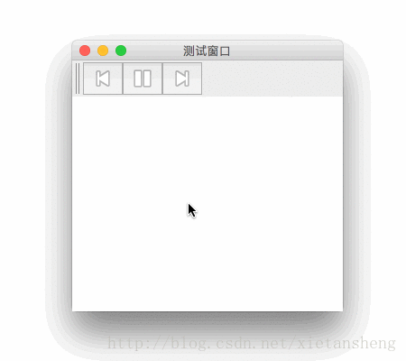

# JToolBar（工具栏）

教程总目录: [Java-Swing 图形界面开发（目录）](../README.md)

## 1. 概述

官方JavaDocsApi: [javax.swing.JToolBar](https://docs.oracle.com/javase/8/docs/api/javax/swing/JToolBar.html)

`JToolBar`，工具栏。

JToolBar 提供了一个用来显示常用控件的容器组件。

对于大多数的外观，用户可以将工具栏拖到其父容器四“边”中的一边，并支持在单独的窗口中浮动显示。为了正确执行拖动，建议将 JToolBar 实例添加到容器四“边”中的一边（其中容器的布局管理器为 BorderLayout），并且不在其他四“边”中添加任何子级。

**JToolBar 常用构造方法**:

```java
/**
 * 参数说明:
 *     name: 
 *         工具栏名称，悬浮显示时为悬浮窗口的标题。
 *
 *     orientation: 
 *         工具栏的方向，值为 SwingConstants.HORIZONTAL 或 SwingConstants.VERTICAL，
 *         默认为 HORIZONTAL。
 */
JToolBar()

JToolBar(String name)

JToolBar(int orientation)

JToolBar(String name, int orientation
```

**JToolBar 常用方法**:

```java
// 添加 工具组件 到 工具栏
Component add(Component comp)

// 添加 分隔符组件 到 工具栏
void addSeparator()
void addSeparator(Dimension size)

// 获取工具栏中指定位置的组件（包括分隔符）
Component getComponentAtIndex(int index)

// 设置工具栏是否可拖动
void setFloatable(boolean b)

// 设置工具栏方向，值为 wingConstants.HORIZONTAL 或 SwingConstants.VERTICAL
void setOrientation(int o)

// 设置工具栏边缘和其内部工具组件之间的边距（内边距）
void setMargin(Insets m)

// 是否需要绘制边框
void setBorderPainted(boolean b)
```

## 2. 代码示例

本实例需要用到 3 张小图片作为按钮的图标，如下:


分别命名为: previous.png、pause.png、next.png

```java
package com.xiets.swing;

import javax.swing.*;
import java.awt.*;
import java.awt.event.ActionEvent;
import java.awt.event.ActionListener;

public class Main {

    public static void main(String[] args) {
        JFrame jf = new JFrame("测试窗口");
        jf.setSize(300, 300);
        jf.setLocationRelativeTo(null);
        jf.setDefaultCloseOperation(WindowConstants.EXIT_ON_CLOSE);

        // 创建 内容面板，使用 边界布局
        JPanel panel = new JPanel(new BorderLayout());

        // 创建 一个工具栏实例
        JToolBar toolBar = new JToolBar("测试工具栏");

        // 创建 工具栏按钮
        JButton previousBtn = new JButton(new ImageIcon("previous.png"));
        JButton pauseBtn = new JButton(new ImageIcon("pause.png"));
        JButton nextBtn = new JButton(new ImageIcon("next.png"));

        // 添加 按钮 到 工具栏
        toolBar.add(previousBtn);
        toolBar.add(pauseBtn);
        toolBar.add(nextBtn);

        // 创建一个文本区域，用于输出相关信息
        final JTextArea textArea = new JTextArea();
        textArea.setLineWrap(true);

        // 添加 按钮 的点击动作监听器，并把相关信息输入到 文本区域
        previousBtn.addActionListener(new ActionListener() {
            @Override
            public void actionPerformed(ActionEvent e) {
                textArea.append("上一曲\n");
            }
        });
        pauseBtn.addActionListener(new ActionListener() {
            @Override
            public void actionPerformed(ActionEvent e) {
                textArea.append("暂停\n");
            }
        });
        nextBtn.addActionListener(new ActionListener() {
            @Override
            public void actionPerformed(ActionEvent e) {
                textArea.append("下一曲\n");
            }
        });

        // 添加 工具栏 到 内容面板 的 顶部
        panel.add(toolBar, BorderLayout.PAGE_START);
        // 添加 文本区域 到 内容面板 的 中间
        panel.add(textArea, BorderLayout.CENTER);

        jf.setContentPane(panel);
        jf.setVisible(true);
     }

}
```

结果展示:

