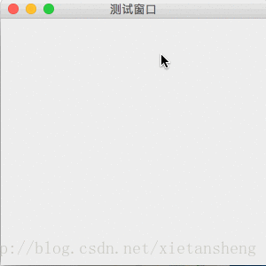

# JPopupMenu（弹出菜单）

教程总目录: [Java-Swing 图形界面开发（目录）](../README.md)

## 1. 概述

官方JavaDocsApi: [javax.swing.JPopupMenu](https://docs.oracle.com/javase/8/docs/api/javax/swing/JPopupMenu.html)

`JPopupMenu`，弹出式菜单、右键菜单。

弹出菜单是一个可弹出并显示一系列选项的悬浮小窗口。在实际应用中通常通过单击鼠标右键触发弹出显示。

JPopupMenu 的使用和 JMenuBar 类似。

## 2. 代码示例

```java
package com.xiets.swing;

import javax.swing.*;
import java.awt.*;
import java.awt.event.ActionEvent;
import java.awt.event.ActionListener;
import java.awt.event.MouseEvent;
import java.awt.event.MouseListener;

public class Main {

    public static void main(String[] args) {
        JFrame jf = new JFrame("测试窗口");
        jf.setSize(300, 300);
        jf.setLocationRelativeTo(null);
        jf.setDefaultCloseOperation(WindowConstants.EXIT_ON_CLOSE);

        JPanel panel = new JPanel();

        // 直接在内容面板上添加鼠标监听器
        panel.addMouseListener(new MouseListener() {
            @Override
            public void mouseClicked(MouseEvent e) {
                // 鼠标点击（按下并抬起）
            }
            @Override
            public void mousePressed(MouseEvent e) {
                // 鼠标按下
            }
            @Override
            public void mouseReleased(MouseEvent e) {
                // 鼠标释放

                // 如果是鼠标右键，则显示弹出菜单
                if (e.isMetaDown()) {
                    showPopupMenu(e.getComponent(), e.getX(), e.getY());
                }
            }
            @Override
            public void mouseEntered(MouseEvent e) {
                // 鼠标进入组件区域
            }
            @Override
            public void mouseExited(MouseEvent e) {
                // 鼠标离开组件区域
            }
        });

        jf.setContentPane(panel);
        jf.setVisible(true);
    }

    public static void showPopupMenu(Component invoker, int x, int y) {
        // 创建 弹出菜单 对象
        JPopupMenu popupMenu = new JPopupMenu();

        // 创建 一级菜单
        JMenuItem copyMenuItem = new JMenuItem("复制");
        JMenuItem pasteMenuItem = new JMenuItem("粘贴");
        JMenu editMenu = new JMenu("编辑");   // 需要 添加 二级子菜单 的 菜单，使用 JMenu
        JMenuItem fileMenu = new JMenuItem("文件");

        // 创建 二级菜单
        JMenuItem findMenuItem = new JMenuItem("查找");
        JMenuItem replaceMenuItem = new JMenuItem("替换");
        // 添加 二级菜单 到 "编辑"一级菜单
        editMenu.add(findMenuItem);
        editMenu.add(replaceMenuItem);

        // 添加 一级菜单 到 弹出菜单
        popupMenu.add(copyMenuItem);
        popupMenu.add(pasteMenuItem);
        popupMenu.addSeparator();       // 添加一条分隔符
        popupMenu.add(editMenu);
        popupMenu.add(fileMenu);

        // 添加菜单项的点击监听器
        copyMenuItem.addActionListener(new ActionListener() {
            @Override
            public void actionPerformed(ActionEvent e) {
                System.out.println("复制 被点击");
            }
        });
        findMenuItem.addActionListener(new ActionListener() {
            @Override
            public void actionPerformed(ActionEvent e) {
                System.out.println("查找 被点击");
            }
        });
        // ......

        // 在指定位置显示弹出菜单
        popupMenu.show(invoker, x, y);
    }

}
```

结果展示：

