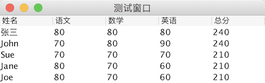
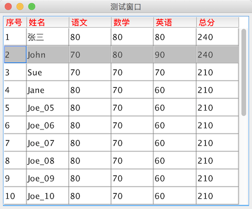
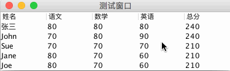
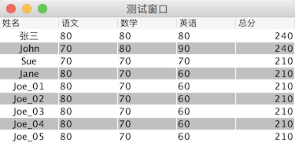
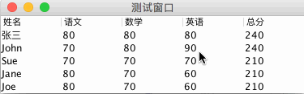
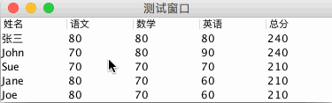

# JTable（表格）

教程总目录: [Java-Swing 图形界面开发（目录）](../README.md)

## 1. 概述

官方JavaDocsApi: [javax.swing.JTable](https://docs.oracle.com/javase/8/docs/api/javax/swing/JTable.html)

`JTable`，表格。JTable 是用来显示和编辑常规二维单元表。

## 2. 创建简单的表格

```java
package com.xiets.swing;

import javax.swing.*;
import java.awt.*;

public class Main {

    public static void main(String[] args) {
        JFrame jf = new JFrame("测试窗口");
        jf.setDefaultCloseOperation(WindowConstants.EXIT_ON_CLOSE);

        // 创建内容面板，使用边界布局
        JPanel panel = new JPanel(new BorderLayout());

        // 表头（列名）
        Object[] columnNames = {"姓名", "语文", "数学", "英语", "总分"};

        // 表格所有行数据
        Object[][] rowData = {
                {"张三", 80, 80, 80, 240},
                {"John", 70, 80, 90, 240},
                {"Sue", 70, 70, 70, 210},
                {"Jane", 80, 70, 60, 210},
                {"Joe", 80, 70, 60, 210}
        };

        // 创建一个表格，指定 所有行数据 和 表头
        JTable table = new JTable(rowData, columnNames);

        // 把 表头 添加到容器顶部（使用普通的中间容器添加表格时，表头 和 内容 需要分开添加）
        panel.add(table.getTableHeader(), BorderLayout.NORTH);
        // 把 表格内容 添加到容器中心
        panel.add(table, BorderLayout.CENTER);

        jf.setContentPane(panel);
        jf.pack();
        jf.setLocationRelativeTo(null);
        jf.setVisible(true);
    }

}
```

结果展示：



表格组件和其他普通组件一样，需要添加到中间容器中才能显示，**添加表格到容器中有两种方式**:

1. 添加到普通的中间容器中（如上面代码实例所示的添加到`JPanel`），此时添加的`jTable`只是表格的行内容，表头(`jTable.getTableHeader()`)需要额外单独添加。此添加方式适合表格行数确定，数据量较小，能一次性显示完的表格；
2. 添加到`JScrollPane`滚动容器中，此添加方式不需要额外添加表头，`jTable`添加到`jScrollPane`中后，表头自动添加到滚动容器的顶部，并支持行内容的滚动（滚动行内容时，表头会始终在顶部显示）。

## 3. JTable 常用的操作方法

JTable常用构造方法:

```java
// 创建空表格，后续再添加相应数据
JTable() 

// 创建指定行列数的空表格，表头名称默认使用大写字母（A, B, C ...）依次表示
JTable(int numRows, int numColumns) 

// 创建表格，指定 表格行数据 和 表头名称
JTable(Object[][] rowData, Object[] columnNames)

// 使用表格模型创建表格
JTable(TableModel dm)
```

JTable **字体** 和 **网格** 颜色设置:

```java
// 设置内容字体
void setFont(Font font)

// 设置字体颜色
void setForeground(Color fg)

// 设置被选中的行前景（被选中时字体的颜色）
void setSelectionForeground(Color selectionForeground)

// 设置被选中的行背景
void setSelectionBackground(Color selectionBackground)

// 设置网格颜色
void setGridColor(Color gridColor)

// 设置是否显示网格
void setShowGrid(boolean showGrid)

// 水平方向网格线是否显示
void setShowHorizontalLines(boolean showHorizontalLines)

// 竖直方向网格线是否显示
void setShowVerticalLines(boolean showVerticalLines)
```

JTable **表头** 设置:

```java
// 获取表头
JTableHeader jTableHeader = jTable.getTableHeader();

// 设置表头名称字体样式
jTableHeader.setFont(Font font);

// 设置表头名称字体颜色
jTableHeader.setForeground(Color fg);

// 设置用户是否可以通过在头间拖动来调整各列的大小。
jTableHeader.setResizingAllowed(boolean resizingAllowed);

// 设置用户是否可以拖动列头，以重新排序各列。
jTableHeader.setReorderingAllowed(boolean reorderingAllowed);
```

JTable **行列** 相关设置:

```java
// 设置所有行的行高
void setRowHeight(int rowHeight)

// 设置指定行的行高
void setRowHeight(int row, int rowHeight)

/**
 * 设置当手动改变某列列宽时，其他列的列宽自动调整模式，可选值:
 *     JTable.AUTO_RESIZE_ALL_COLUMNS 在所有的调整大小操作中，按比例调整所有的列。
 *     JTable.AUTO_RESIZE_LAST_COLUMN 在所有的调整大小操作中，只对最后一列进行调整。
 *     JTable.AUTO_RESIZE_NEXT_COLUMN 在 UI 中调整了一个列时，对其下一列进行相反方向的调整。
 *     JTable.AUTO_RESIZE_OFF 不自动调整列的宽度；使用滚动条。
 *     JTable.AUTO_RESIZE_SUBSEQUENT_COLUMNS 在 UI 调整中，更改后续列以保持总宽度不变；此为默认行为。
 */
void setAutoResizeMode(int mode)

/*
 * 调整列宽
 */
// 先获取到某列
TableColumn tableColumn = jTable.getColumnModel().getColumn(int columnIndex);

// 设置列的宽度、首选宽度、最小宽度、最大宽度
tableColumn.setWidth(int width);
tableColumn.setPreferredWidth(int preferredWidth);
tableColumn.setMinWidth(int minWidth);
tableColumn.setMaxWidth(int maxWidth);

// 调整该列的列宽，以适合其标题单元格的宽度。
tableColumn.sizeWidthToFit();

// 是否允许手动改变该列的列宽
tableColumn.setResizable(boolean isResizable);

// 设置该列的表头名称
tableColumn.setHeaderValue(Object headerValue);
```

JTable **数据** 相关操作:

```java
/*
 * 表格数据的简单设置和获取
 */
// 设置表格中指定单元格的数据
jTable.getModel().setValueAt(Object aValue, int rowIndex, int columnIndex);

// 获取表格中指定单元格的数据
Object value = jTable.getModel().getValueAt(int rowIndex, int columnIndex);
```

## 4. 创建带滚动条的表格

创建带滚动条的表格基本步骤:

```java
// 创建表格
JTable table = new JTable(...);

/* 设置表格相关数据 */

// 设置滚动面板视口大小（超过该大小的行数据，需要拖动滚动条才能看到）
table.setPreferredScrollableViewportSize(new Dimension(int width, int height));

// 创建滚动面板，把 表格 放到 滚动面板 中（表头将自动添加到滚动面板顶部）
JScrollPane scrollPane = new JScrollPane(table);

/* 再把滚动面板 scrollPane 添加到其他容器中显示 */
```

完整实例代码:

```java
package com.xiets.swing;

import javax.swing.*;
import java.awt.*;

public class Main {

    public static void main(String[] args) {
        JFrame jf = new JFrame("测试窗口");
        jf.setDefaultCloseOperation(WindowConstants.EXIT_ON_CLOSE);

        // 创建内容面板
        JPanel panel = new JPanel();

        // 表头（列名）
        String[] columnNames = {"序号", "姓名", "语文", "数学", "英语", "总分"};

        // 表格所有行数据
        Object[][] rowData = {
                {1, "张三", 80, 80, 80, 240},
                {2, "John", 70, 80, 90, 240},
                {3, "Sue", 70, 70, 70, 210},
                {4, "Jane", 80, 70, 60, 210},
                {5, "Joe_05", 80, 70, 60, 210},
                {6, "Joe_06", 80, 70, 60, 210},
                {7, "Joe_07", 80, 70, 60, 210},
                {8, "Joe_08", 80, 70, 60, 210},
                {9, "Joe_09", 80, 70, 60, 210},
                {10, "Joe_10", 80, 70, 60, 210},
                {11, "Joe_11", 80, 70, 60, 210},
                {12, "Joe_12", 80, 70, 60, 210},
                {13, "Joe_13", 80, 70, 60, 210},
                {14, "Joe_14", 80, 70, 60, 210},
                {15, "Joe_15", 80, 70, 60, 210},
                {16, "Joe_16", 80, 70, 60, 210},
                {17, "Joe_17", 80, 70, 60, 210},
                {18, "Joe_18", 80, 70, 60, 210},
                {19, "Joe_19", 80, 70, 60, 210},
                {20, "Joe_20", 80, 70, 60, 210}
        };

        // 创建一个表格，指定 表头 和 所有行数据
        JTable table = new JTable(rowData, columnNames);

        // 设置表格内容颜色
        table.setForeground(Color.BLACK);                   // 字体颜色
        table.setFont(new Font(null, Font.PLAIN, 14));      // 字体样式
        table.setSelectionForeground(Color.DARK_GRAY);      // 选中后字体颜色
        table.setSelectionBackground(Color.LIGHT_GRAY);     // 选中后字体背景
        table.setGridColor(Color.GRAY);                     // 网格颜色

        // 设置表头
        table.getTableHeader().setFont(new Font(null, Font.BOLD, 14));  // 设置表头名称字体样式
        table.getTableHeader().setForeground(Color.RED);                // 设置表头名称字体颜色
        table.getTableHeader().setResizingAllowed(false);               // 设置不允许手动改变列宽
        table.getTableHeader().setReorderingAllowed(false);             // 设置不允许拖动重新排序各列

        // 设置行高
        table.setRowHeight(30);

        // 第一列列宽设置为40
        table.getColumnModel().getColumn(0).setPreferredWidth(40);

        // 设置滚动面板视口大小（超过该大小的行数据，需要拖动滚动条才能看到）
        table.setPreferredScrollableViewportSize(new Dimension(400, 300));

        // 把 表格 放到 滚动面板 中（表头将自动添加到滚动面板顶部）
        JScrollPane scrollPane = new JScrollPane(table);

        // 添加 滚动面板 到 内容面板
        panel.add(scrollPane);

        // 设置 内容面板 到 窗口
        jf.setContentPane(panel);

        jf.pack();
        jf.setLocationRelativeTo(null);
        jf.setVisible(true);
    }

}
```

结果展示:



## 5. 表格模型（TableModel）

TableModel 接口指定了 JTable 用于询问表格式数据模型的方法。TableModel 封装了表格中的各种数据，为表格显示提供数据。上面案例中直接使用行数据和表头创建表格，实际上JTable 内部自动将传入的行数据和表头封装成了 TableModel。

只要数据模型实现了 TableModel 接口，就可以通过以下两行代码设置 JTable 显示该模型:

```java
TableModel myData = new MyTableModel(); 
JTable table = new JTable(myData);
```

TableModel 接口中的方法:

```java
package javax.swing.table;

import javax.swing.*;
import javax.swing.event.*;

public interface TableModel {
    /** 返回总行数 */
    public int getRowCount();

    /** 返回总列数 */
    public int getColumnCount();

    /** 返回指定列的名称（表头名称） */
    public String getColumnName(int columnIndex);

    /** 针对列中所有的单元格值，返回最具体的超类。JTable 使用此方法来设置列的默认渲染器和编辑器。 */
    public Class<?> getColumnClass(int columnIndex);

    /** 判断指定单元格是否可编辑 */
    public boolean isCellEditable(int rowIndex, int columnIndex);

    /** 获取指定单元格的值 */
    public Object getValueAt(int rowIndex, int columnIndex);

    /** 设置指定单元格的值 */
    public void setValueAt(Object aValue, int rowIndex, int columnIndex);

    /** 添加表格模型监听器 */
    public void addTableModelListener(TableModelListener l);

    /** 移除表格模型监听器 */
    public void removeTableModelListener(TableModelListener l);
}
```

JRE 中常用的已实现 TableModel 接口的类有两个:

（1）[javax.swing.table.AbstractTableModel](https://docs.oracle.com/javase/8/docs/api/javax/swing/table/AbstractTableModel.html)

此抽象类为 TableModel 接口中的大多数方法提供默认实现。它负责管理侦听器，并为生成 TableModelEvents 以及将其调度到侦听器提供方便。要创建一个具体的 TableModel 作为 AbstractTableModel 的子类，只需提供对以下三个方法的实现：

```java
public int getRowCount();
public int getColumnCount();
public Object getValueAt(int row, int column);
```

（2）[javax.swing.table.DefaultTableModel](https://docs.oracle.com/javase/8/docs/api/javax/swing/table/DefaultTableModel.html)

这是 TableModel 的一个实现，它使用一个 Vector 来存储单元格的值对象，该 Vector 由多个 Vector 组成。DefaultTableModel 还增加了许多方便操作表格数据的方法，例如 **支持 添加 和 删除 行列 等操作**。

下面使用 AbstractTableModel 创建一个表格:

```java
package com.xiets.swing;

import javax.swing.*;
import javax.swing.table.AbstractTableModel;
import java.awt.*;

public class Main {

    public static void main(String[] args) {
        JFrame jf = new JFrame("测试窗口");
        jf.setDefaultCloseOperation(WindowConstants.EXIT_ON_CLOSE);

        // 创建内容面板，使用边界布局
        JPanel panel = new JPanel(new BorderLayout());

        // 使用表格模型创建一个表格
        JTable table = new JTable(new MyTableModel());

        // 把 表头 添加到容器顶部（使用普通的中间容器添加表格时，表头 和 内容 需要分开添加）
        panel.add(table.getTableHeader(), BorderLayout.NORTH);
        // 把 表格内容 添加到容器中心
        panel.add(table, BorderLayout.CENTER);

        jf.setContentPane(panel);
        jf.pack();
        jf.setLocationRelativeTo(null);
        jf.setVisible(true);
    }

    /**
     * 表格模型实现，表格显示数据时将调用模型中的相应方法获取数据进行表格内容的显示
     */
    public static class MyTableModel extends AbstractTableModel {
        /**
         * 表头（列名）
         */
        private Object[] columnNames = {"姓名", "语文", "数学", "英语", "总分"};

        /**
         * 表格所有行数据
         */
        private Object[][] rowData = {
                {"张三", 80, 80, 80, 240},
                {"John", 70, 80, 90, 240},
                {"Sue", 70, 70, 70, 210},
                {"Jane", 80, 70, 60, 210},
                {"Joe", 80, 70, 60, 210}
        };

        /**
         * 返回总行数
         */
        @Override
        public int getRowCount() {
            return rowData.length;
        }

        /**
         * 返回总列数
         */
        @Override
        public int getColumnCount() {
            return columnNames.length;
        }

        /**
         * 返回列名称（表头名称），AbstractTableModel 中对该方法的实现默认是以
         * 大写字母 A 开始作为列名显示，所以这里需要重写该方法返回我们需要的列名。
         */
        @Override
        public String getColumnName(int column) {
            return columnNames[column].toString();
        }

        /**
         * 返回指定单元格的显示的值
         */
        @Override
        public Object getValueAt(int rowIndex, int columnIndex) {
            return rowData[rowIndex][columnIndex];
        }
    }

}
```

结果展示:


用鼠标点击相应的单元格，会发现单元格不可编辑，因为 AbstractTableModel 中对 isCellEditable(…) 方法的实现是返回 false，即单元格不可编辑。如果某些单元格需要支持编辑，可以重写 isCellEditable(…) 方法针对相应的单元格返回 true 即可。

## 6. 表格数据改变的监听（TableModelListener）

表格的数据维护，对数据的监听，都是由 表格模型（**TableModel**）来维护，通过设置表格模型监听器（**TableModelListener**），可以监听表格单元格数据的更改，表格行列的增加和移除。

设置表格模型监听器主要代码:

```java
// 先获取 表格模型 对象
TableModel tableModel = table.getModel();

// 在 表格模型上 添加 数据改变监听器
tableModel.addTableModelListener(new TableModelListener() {
    @Override
    public void tableChanged(TableModelEvent e) {
        // 第一个 和 最后一个 被改变的行（只改变了一行，则两者相同）
        int firstRow = e.getFirstRow();
        int lastRow = e.getLastRow();

        // 被改变的列
        int column = e.getColumn();

        // 事件的类型，可能的值有:
        //     TableModelEvent.INSERT   新行或新列的添加
        //     TableModelEvent.UPDATE   现有数据的更改
        //     TableModelEvent.DELETE   有行或列被移除
        int type = e.getType();
    }
});
```

代码实例:

```java
package com.xiets.swing;

import javax.swing.*;
import javax.swing.event.TableModelEvent;
import javax.swing.event.TableModelListener;
import javax.swing.table.AbstractTableModel;
import javax.swing.table.TableModel;
import java.awt.*;

public class Main {

    public static void main(String[] args) {
        JFrame jf = new JFrame("测试窗口");
        jf.setDefaultCloseOperation(WindowConstants.EXIT_ON_CLOSE);

        // 创建内容面板，使用边界布局
        JPanel panel = new JPanel(new BorderLayout());

        // 表头（列名）
        final Object[] columnNames = {"姓名", "语文", "数学", "英语", "总分"};

        // 表格所有行数据
        final Object[][] rowData = {
                {"张三", 80, 80, 80, 240},
                {"John", 70, 80, 90, 240},
                {"Sue", 70, 70, 70, 210},
                {"Jane", 80, 70, 60, 210},
                {"Joe", 80, 70, 60, 210}
        };

        // 自定义表格模型，创建一个表格
        JTable table = new JTable(new AbstractTableModel() {
            @Override
            public int getRowCount() {
                return rowData.length;
            }

            @Override
            public int getColumnCount() {
                return rowData[0].length;
            }

            @Override
            public String getColumnName(int column) {
                return columnNames[column].toString();
            }

            @Override
            public boolean isCellEditable(int rowIndex, int columnIndex) {
                // 总分列的索引为 4，总分列不允许编辑，其他列允许编辑，
                // 总分列的数值由 语文、数学、英语 这三列的值相加得出，并同步更新
                return columnIndex != 4;
            }

            @Override
            public Object getValueAt(int rowIndex, int columnIndex) {
                return rowData[rowIndex][columnIndex];
            }

            @Override
            public void setValueAt(Object newValue, int rowIndex, int columnIndex) {
                // 设置新的单元格数据时，必须把新值设置到原数据数值中，
                // 待更新UI重新调用 getValueAt(...) 获取单元格值时才能获取到最新值
                rowData[rowIndex][columnIndex] = newValue;
                // 设置完数据后，必须通知表格去更新UI（重绘单元格），否则显示的数据不会改变
                fireTableCellUpdated(rowIndex, columnIndex);
            }
        });

        /*
         * 上面的继承 AbstractTableModel 实现自定义表格模型，功能并不完整，还有很多需要自己
         * 去实现（例如更新数据，通知UI更新，列名称获取等），建议使用 DefaultTableModel 类，
         * 该类对 TableModel 做了较为完善的实现，支持自动更新数据处理，支持UI自动更新，列名称
         * 处理，添加/移除行列等。无特殊要求不需要重写方法，直接使用即可，如下两行代码即可:
         */
        // DefaultTableModel tableModel = new DefaultTableModel(rowData, columnNames);
        // JTable table = new JTable(tableModel);

        // 获取 表格模型
        final TableModel tableModel = table.getModel();
        // 在 表格模型上 添加 数据改变监听器
        tableModel.addTableModelListener(new TableModelListener() {
            @Override
            public void tableChanged(TableModelEvent e) {
                // 获取 第一个 和 最后一个 被改变的行（只改变了一行，则两者相同）
                int firstRow = e.getFirstRow();
                int lastRow = e.getLastRow();

                // 获取被改变的列
                int column = e.getColumn();

                // 事件的类型，可能的值有:
                //     TableModelEvent.INSERT   新行或新列的添加
                //     TableModelEvent.UPDATE   现有数据的更改
                //     TableModelEvent.DELETE   有行或列被移除
                int type = e.getType();

                // 针对 现有数据的更改 更新其他单元格数据
                if (type == TableModelEvent.UPDATE) {
                    // 只处理 语文、数学、英语 这三列（索引分别为1、2、3）的分数的更改
                    if (column < 1 || column > 3) {
                        return;
                    }
                    // 遍历每一个修改的行，单个学科分数更改后同时更新总分数
                    for (int row = firstRow; row <= lastRow; row++) {
                        // 获取当前行的 语文、数学、英语 的值
                        Object chineseObj = tableModel.getValueAt(row, 1);
                        Object mathObj = tableModel.getValueAt(row, 2);
                        Object englishObj = tableModel.getValueAt(row, 3);

                        // 把对象值转换为数值
                        int chinese = 0;
                        try {
                            chinese = Integer.parseInt("" + chineseObj);
                        } catch (Exception ex) {
                            ex.printStackTrace();
                        }
                        int math = 0;
                        try {
                            math = Integer.parseInt("" + mathObj);
                        } catch (Exception ex) {
                            ex.printStackTrace();
                        }
                        int english = 0;
                        try {
                            english = Integer.parseInt("" + englishObj);
                        } catch (Exception ex) {
                            ex.printStackTrace();
                        }

                        // 重新计算新的总分数
                        int totalScore = chinese + math + english;
                        // 将新的分数值设置到总分单元格（总分数的列索引为4）
                        tableModel.setValueAt(totalScore, row, 4);
                    }
                }
            }
        });

        // 把 表头 添加到容器顶部（使用普通的中间容器添加表格时，表头 和 内容 需要分开添加）
        panel.add(table.getTableHeader(), BorderLayout.NORTH);
        // 把 表格内容 添加到容器中心
        panel.add(table, BorderLayout.CENTER);

        jf.setContentPane(panel);
        jf.pack();
        jf.setLocationRelativeTo(null);
        jf.setVisible(true);
    }

}
```

结果展示，修改单科分数，按回车，看总分变化:



## 7. 表格选择器（ListSelectionModel）

表格数据的选择使用 **ListSelectionModel** 选择器模型维护，允许用户以不同的模式选中表格中的数据。

ListSelectionModel 的使用:

```java
// 创建表格
final JTable table = new JTable(...);

// 设置是否允许单元格单个选中，默认为 false
table.setCellSelectionEnabled(boolean cellSelectionEnabled);

// 首先通过表格对象 table 获取选择器模型
ListSelectionModel selectionModel = table.getSelectionModel();

// 设置选择器模式，参数可能的值为:
//     ListSelectionModel.MULTIPLE_INTERVAL_SELECTION   一次选择一个或多个连续的索引范围（默认）
//     ListSelectionModel.SINGLE_INTERVAL_SELECTION     一次选择一个连续的索引范围
//     ListSelectionModel.SINGLE_SELECTION              一次只能选择一个列表索引
selectionModel.setSelectionMode(int selectionMode);

// 添加选择模型监听器（选中状态改变时回调）
selectionModel.addListSelectionListener(new ListSelectionListener() {
    @Override
    public void valueChanged(ListSelectionEvent e) {
        // 获取选中的第一行
        int selectedRow = table.getSelectedRow();
        
        // 获取选中的第一列
        int selectedRow = table.getSelectedColumn();        
        
        // 获取选中的所有行
        int[] selectedRows = table.getSelectedRows();
        
        // 获取选中的所有列
        int[] selectedColumns = table.getSelectedColumns();
    }
});
```

## 8. 单元格的渲染器（TableCellRenderer）

单元格渲染器用于指定每一个单元格的显示样式。

下面代码实例实现表格的 偶数行背景设置为白色，奇数行背景设置为灰色，第一列的内容水平居中对齐，最后一列的内容水平右对齐，其他列的内容水平左对齐。

```java
package com.xiets.swing;

import javax.swing.*;
import javax.swing.table.DefaultTableCellRenderer;
import javax.swing.table.TableColumn;
import java.awt.*;

public class Main {

    public static void main(String[] args) {
        JFrame jf = new JFrame("测试窗口");
        jf.setDefaultCloseOperation(WindowConstants.EXIT_ON_CLOSE);

        // 创建内容面板，使用边界布局
        JPanel panel = new JPanel(new BorderLayout());

        // 表头（列名）
        Object[] columnNames = {"姓名", "语文", "数学", "英语", "总分"};

        // 表格所有行数据
        Object[][] rowData = {
                {"张三", 80, 80, 80, 240},
                {"John", 70, 80, 90, 240},
                {"Sue", 70, 70, 70, 210},
                {"Jane", 80, 70, 60, 210},
                {"Joe_01", 80, 70, 60, 210},
                {"Joe_02", 80, 70, 60, 210},
                {"Joe_03", 80, 70, 60, 210},
                {"Joe_04", 80, 70, 60, 210},
                {"Joe_05", 80, 70, 60, 210}
        };

        // 创建一个表格，指定 所有行数据 和 表头
        JTable table = new JTable(rowData, columnNames);

        // 创建单元格渲染器
        MyTableCellRenderer renderer = new MyTableCellRenderer();

        // 遍历表格的每一列，分别给每一列设置单元格渲染器
        for (int i = 0; i < columnNames.length; i++) {
            // 根据 列名 获取 表格列
            TableColumn tableColumn = table.getColumn(columnNames[i]);
            // 设置 表格列 的 单元格渲染器
            tableColumn.setCellRenderer(renderer);
        }

        // 如果需要自定义表头样式，也可以给表头设置一个自定义渲染器
        // table.getTableHeader().setDefaultRenderer(headerRenderer);

        // 把 表头 添加到容器顶部（使用普通的中间容器添加表格时，表头 和 内容 需要分开添加）
        panel.add(table.getTableHeader(), BorderLayout.NORTH);
        // 把 表格内容 添加到容器中心
        panel.add(table, BorderLayout.CENTER);

        jf.setContentPane(panel);
        jf.pack();
        jf.setLocationRelativeTo(null);
        jf.setVisible(true);
    }

    /**
     * 单元格渲染器，继承已实现渲染器接口的默认渲染器 DefaultTableCellRenderer
     */
    public static class MyTableCellRenderer extends DefaultTableCellRenderer {
        /**
         * 返回默认的表单元格渲染器，此方法在父类中已实现，直接调用父类方法返回，在返回前做相关参数的设置即可
         */
        @Override
        public Component getTableCellRendererComponent(JTable table, Object value, boolean isSelected, boolean hasFocus, int row, int column) {
            // 偶数行背景设置为白色，奇数行背景设置为灰色
            if (row % 2 == 0) {
                setBackground(Color.WHITE);
            } else {
                setBackground(Color.LIGHT_GRAY);
            }

            // 第一列的内容水平居中对齐，最后一列的内容水平右对齐，其他列的内容水平左对齐
            if (column == 0) {
                setHorizontalAlignment(SwingConstants.CENTER);
            } else if (column == (table.getColumnCount() - 1)) {
                setHorizontalAlignment(SwingConstants.RIGHT);
            } else {
                setHorizontalAlignment(SwingConstants.LEFT);
            }
            
            // 设置提示文本，当鼠标移动到当前(row, column)所在单元格时显示的提示文本
            setToolTipText("提示的内容: " + row + ", " + column);

            // PS: 多个单元格使用同一渲染器时，需要自定义的属性，必须每次都设置，否则将自动沿用上一次的设置。

            /*
             * 单元格渲染器为表格单元格提供具体的显示，实现了单元格渲染器的 DefaultTableCellRenderer 继承自
             * 一个标准的组件类 JLabel，因此 JLabel 中相应的 API 在该渲染器实现类中都可以使用。
             *
             * super.getTableCellRendererComponent(...) 返回的实际上是当前对象（this），即 JLabel 实例，
             * 也就是以 JLabel 的形式显示单元格。
             *
             * 如果需要自定义单元格的显示形式（比如显示成按钮、复选框、内嵌表格等），可以在此自己创建一个标准组件
             * 实例返回。
             */

            // 调用父类的该方法完成渲染器的其他设置
            return super.getTableCellRendererComponent(table, value, isSelected, hasFocus, row, column);
        }
    }

}
```

结果展示：



## 9. 单元格数据的编辑器（TableCellEditor）

渲染器是用于正常显示单元格数据时提供显示组件，**编辑器**则是用于编辑单元格数据时显示(使用)的组件。

使用编辑器，可控制单元格内输入的内容格式，监听输入的内容变化等。

常用的编辑组件为 JTextField(文本框)，也可使用 JCheckBox(复选框)、JComboBox(文本框) 等组件作为编辑组件。

编辑器接口为`TableCellEditor`，只有一个方法，即为指定的单元格提供一个编辑组件。实际使用时通常使用已实现了该接口的默认编辑器`DefaultCellEditor`。

下面代码使用 DefaultCellEditor 作为基类自定义一个只能输入数字的编辑器:

```java
package com.xiets.swing;

import javax.swing.*;
import javax.swing.table.TableColumn;
import java.awt.*;

public class Main {

    public static void main(String[] args) {
        JFrame jf = new JFrame("测试窗口");
        jf.setDefaultCloseOperation(WindowConstants.EXIT_ON_CLOSE);

        // 创建内容面板，使用边界布局
        JPanel panel = new JPanel(new BorderLayout());

        // 表头（列名）
        Object[] columnNames = {"姓名", "语文", "数学", "英语", "总分"};

        // 表格所有行数据
        Object[][] rowData = {
                {"张三", 80, 80, 80, 240},
                {"John", 70, 80, 90, 240},
                {"Sue", 70, 70, 70, 210},
                {"Jane", 80, 70, 60, 210},
                {"Joe", 80, 70, 60, 210}
        };

        // 创建一个表格，指定 所有行数据 和 表头
        JTable table = new JTable(rowData, columnNames);

        // 创建单元格编辑器，使用文本框作为编辑组件
        MyCellEditor cellEditor = new MyCellEditor(new JTextField());

        // 遍历表格中所有数字列，并设置列单元格的编辑器
        for (int i = 1; i < columnNames.length; i++) {
            // 根据 列名 获取 表格列
            TableColumn tableColumn = table.getColumn(columnNames[i]);
            // 设置 表格列 的 单元格编辑器
            tableColumn.setCellEditor(cellEditor);
        }

        // 把 表头 添加到容器顶部（使用普通的中间容器添加表格时，表头 和 内容 需要分开添加）
        panel.add(table.getTableHeader(), BorderLayout.NORTH);
        // 把 表格内容 添加到容器中心
        panel.add(table, BorderLayout.CENTER);

        jf.setContentPane(panel);
        jf.pack();
        jf.setLocationRelativeTo(null);
        jf.setVisible(true);
    }

    /**
     * 只允许输入数字的单元格编辑器
     */
    public static class MyCellEditor extends DefaultCellEditor {

        public MyCellEditor(JTextField textField) {
            super(textField);
        }

        public MyCellEditor(JCheckBox checkBox) {
            super(checkBox);
        }

        public MyCellEditor(JComboBox comboBox) {
            super(comboBox);
        }

        @Override
        public boolean stopCellEditing() {
            // 获取当前单元格的编辑器组件
            Component comp = getComponent();

            // 获取当前单元格编辑器输入的值
            Object obj = getCellEditorValue();

            // 如果当前单元格编辑器输入的值不是数字，则返回 false（表示数据非法，不允许设置，无法保存）
            if (obj == null || !obj.toString().matches("[0-9]*")) {
                // 数据非法时，设置编辑器组件内的内容颜色为红色
                comp.setForeground(Color.RED);
                return false;
            }

            // 数据合法时，设置编辑器组件内的内容颜色为黑色
            comp.setForeground(Color.BLACK);

            // 合法数据交给父类处理
            return super.stopCellEditing();
        }
    }

}
```

结果展示：



## 10. 表格数据的排序（RowSorter）

JTable 还支持单击表头按该列进行升序或降序的排序，只需要给表格设置一个表格行排序器`TableRowSorter`（按字典顺序排序）。

代码实例:

```java
package com.xiets.swing;

import javax.swing.*;
import javax.swing.table.DefaultTableModel;
import javax.swing.table.TableModel;
import javax.swing.table.TableRowSorter;
import java.awt.*;

public class Main {

    public static void main(String[] args) {
        JFrame jf = new JFrame("测试窗口");
        jf.setDefaultCloseOperation(WindowConstants.EXIT_ON_CLOSE);

        // 创建内容面板，使用边界布局
        JPanel panel = new JPanel(new BorderLayout());

        // 表头（列名）
        Object[] columnNames = {"姓名", "语文", "数学", "英语", "总分"};

        // 表格所有行数据
        Object[][] rowData = {
                {"张三", 80, 80, 80, 240},
                {"John", 70, 80, 90, 240},
                {"Sue", 70, 70, 70, 210},
                {"Jane", 80, 70, 60, 210},
                {"Joe", 80, 70, 60, 210}
        };

        // 创建 表格模型，指定 所有行数据 和 表头
        TableModel tableModel = new DefaultTableModel(rowData, columnNames);

        // 使用 表格模型 创建 表格
        JTable table = new JTable(tableModel);

        // 使用 表格模型 创建 行排序器（TableRowSorter 实现了 RowSorter）
        RowSorter<TableModel> rowSorter = new TableRowSorter<TableModel>(tableModel);

        // 给 表格 设置 行排序器
        table.setRowSorter(rowSorter);

        // 把 表头 添加到容器顶部（使用普通的中间容器添加表格时，表头 和 内容 需要分开添加）
        panel.add(table.getTableHeader(), BorderLayout.NORTH);
        // 把 表格内容 添加到容器中心
        panel.add(table, BorderLayout.CENTER);

        jf.setContentPane(panel);
        jf.pack();
        jf.setLocationRelativeTo(null);
        jf.setVisible(true);
    }

}
```

结果展示：

