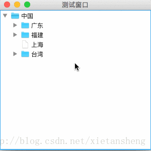

# JTree（树）

教程总目录: [Java-Swing 图形界面开发（目录）](../README.md)

## 1. 概述

官方JavaDocsApi: [javax.swing.JTree](https://docs.oracle.com/javase/8/docs/api/javax/swing/JTree.html)

`JTree`，树。将分层数据显示为树状轮廓的组件。

一颗树由若干节点，通过层级关系组成，一个节点由`TreeNode`实例来表示，节点在树中的位置（路径）由`TreePath`实例来表示（定位）。

创建树时，首先要创建一个根节点，然后创建第二层节点添加到根节点，继续创建节点添加到其父节点，最终形成由根节点所引领的一棵树，再由 JTree 数组件显示出来。所有拥有子节点的节点可以自由展开或折叠子节点。

TreeNode 是一个接口，创建节点对象时，通常使用已实现该接口的的 DefaultMutableTreeNode 类。

## 2. 节点: DefaultMutableTreeNode

`DefaultMutableTreeNode`表示一个节点，拥有对节点增删改查等操作的丰富方法。DefaultMutableTreeNode 实现了 MutableTreeNode 接口，而 MutableTreeNode 接口继承自 TreeNode 接口。

**DefaultMutableTreeNode 构造方法**:

```java
/**
 * 参数说明:
 *     userObject: 节点的用户对象（节点显示的名称）
 *     allowsChildren: 是否允许有子节点
 */
DefaultMutableTreeNode()

DefaultMutableTreeNode(Object userObject)

DefaultMutableTreeNode(Object userObject, boolean allowsChildren)
```

**DefaultMutableTreeNode 常用方法**:

```java
// 添加一个子节点在末尾
void add(MutableTreeNode newChild);

// 在指定位置插入一个子节点
void insert(MutableTreeNode newChild, int childIndex) 

// 移除子节点
void remove(int childIndex);
void remove(MutableTreeNode aChild);
void removeAllChildren();

// 获取子节点数量
int getChildCount();
// 获取叶子节点的数量
int getLeafCount();

// 获取指定索引位置的子节点
TreeNode getChildAt(int index);
// 获取指定子节点之后的子节点
TreeNode getChildAfter(TreeNode aChild);
// 获取指定子节点之前的子节点
TreeNode getChildBefore(TreeNode aChild);

// 判断某节点是否为此节点的子节点
boolean isNodeChild(TreeNode aNode);

// 获取此节点的父节点，没有父节点则返回 null
TreeNode getParent();

// 判断此节点是否为根节点
boolean isRoot();

// 判断是否为叶节点（没有子节点即为叶节点，则返回 true）
boolean isLeaf();

// 返回此节点上的级数，从根到此节点的距离。如果此节点为根，则返回 0。
int getLevel();

// 返回从根到此节点的路径。该路径中第一个元素是根节点，最后一个元素是此节点。
TreeNode[] getPath();

// 遍历子节点（只包括直接子节点，不包括孙节点）
Enumeration children();
// 按广度优先的顺序遍历以此节点为根的子树（包含此节点下的所有节点）
Enumeration breadthFirstEnumeration();
// 按深度优先的顺序遍历以此节点为根的子树（包含此节点下的所有节点）
Enumeration depthFirstEnumeration();

// 设置节点的用户对象（节点显示的名称）
void setUserObject(Object userObject);
// 获取节点的用户对象（节点显示的名称）
Object getUserObject();
```

## 3. 路径: TreePath

`TreePath`表示某节点的路径（从根节点到此节点），一般使用方式:

```java
// 一个节点
DefaultMutableTreeNode node = ...;

// 获取节点的路径（从根节点到此节点沿路径的所有节点集）
TreeNode[] pathNodes = node.getPath();

// 使用节点路径集创建树路径
TreePath treePath = new TreePath(pathNodes);

/* 
 * 这里得到的 treePath 表示的是树中的一个路径，可以定位到具体的节点，
 * 从而对该节点进行相关操作（展开/折叠子节点等），详见后面 JTree 的介绍。
 */

/* 树路径的其他常用方法 */

// 获取此树路径上的所有节点，返回数组的元素为节点对象
Object[] paths = treePath.getPath();

// 获取此树路径上的节点数量
int nodeCount = treePath.getPathCount();

// 获取此树路径表示的节点的父节点的树路径
TreePath parentPath = treePath.getParentPath();

// 判断指定树路径是否为此树路径的“子孙”树路径
boolean isDescendant = treePath.isDescendant(TreePath aTreePath);
```

## 4. 树: JTree

`JTree`表示一个树组件，负责把内存中构造的整颗结构树显示出来。因为对于树结构，只需要得到一个根节点，就相当于获取到了整棵树的应用，因此只需要把一颗树的根节点传递给 JTree 便可显示整棵树。

**JTree 实例的创建**:

```java
// 方式一: 指定一个根节点创建树
JTree tree = JTree(TreeNode root);

// 方式二: 先创建一个树模型（自定义树模型或使用已实现的默认树模型），再用指定树模型创建树
TreeModel treeModel = new DefaultTreeModel(TreeNode root);
JTree tree = JTree(treeModel);

// 方式三: 先创建一个空树，在设置树模型
JTree tree = JTree();
tree.setModel(TreeModel newModel);
```

**JTree 对节点的操作**:

```java
// 通过行索引获取指定行的树路径（这里的行表示的是在 JTree 组件
// 内可以直接看到的行，即不包括已折叠的，根节点行索引为 0，如果
// 根节点展开，则根节点的直接第一个子节点行索引为 1）。
TreePath getPathForRow(int row);
// 根据树路径获取指定节点所在行索引
int getRowForPath(TreePath path);

// 根据在 JTree 组件内的坐标获取指定坐标处所在的节点定位，
// 通过监听鼠标点击事件获取到点击坐标，从而可利用此方法实现
// 监听对节点的单击或双击事件。
int getRowForLocation(int x, int y);
TreePath getPathForLocation(int x, int y);

// 展开指定节点（通过可视行索引或树路径定位目标节点）
void expandRow(int row);
void expandPath(TreePath path);

// 折叠指定节点
void collapseRow(int row);
void collapsePath(TreePath path);

// 判断指定节点是否处于展开状态
boolean isExpanded(int row);
boolean isExpanded(TreePath path);

// 设置当前默认选中的节点（可多选）
void setSelectionRow(int row);
void setSelectionRows(int[] rows);
void setSelectionPath(TreePath path);
void setSelectionPaths(TreePath[] paths);

// 获取当前选中的节点
int[] getSelectionRows();
TreePath getSelectionPath();
TreePath[] getSelectionPaths();

// 是否显示根节点（默认显示）
void setRootVisible(boolean rootVisible);

// 是否显示根节点的句柄（默认不显示）
void setShowsRootHandles(boolean newValue);

// 是否允许编辑节点
void setEditable(boolean flag);
```

**JTree 自定义节点样式（字体、图标等）**:

```java
// 首先，创建一个树节点的渲染器
DefaultTreeCellRenderer render = new DefaultTreeCellRenderer();

// 设置节点 展开 和 折叠 状态显示的图标
render.setOpenIcon(Icon newIcon);
render.setClosedIcon(Icon newIcon);

// 设置叶子节点显示的图标
render.setLeafIcon(Icon newIcon);

// 设置节点字体，以及 选中 和 未选中 时的颜色
render.setFont(Font font);
render.setTextSelectionColor(Color newColor);
render.setTextNonSelectionColor(Color newColor);

// 设置节点 选中 和 未选中 时的背景颜色
render.setBackgroundSelectionColor(Color newColor);
render.setBackgroundNonSelectionColor(Color newColor);

// 最后，设置树组件的节点渲染器
jTree.setCellRenderer(render);
```

**JTree 对节点变化的监听**:

```java
JTree tree = new JTree(rootNode);

/*
 * 节点展开/折叠监听器
 */
tree.addTreeExpansionListener(new TreeExpansionListener() {
    @Override
    public void treeExpanded(TreeExpansionEvent event) {
        System.out.println("展开的节点: " + event.getPath());
    }
    @Override
    public void treeCollapsed(TreeExpansionEvent event) {
        System.out.println("折叠的节点: " + event.getPath());
    }
});

/*
 * 节点展开/折叠监听器（比上一个监听器先执行）
 */
tree.addTreeWillExpandListener(new TreeWillExpandListener() {
    @Override
    public void treeWillExpand(TreeExpansionEvent event) throws ExpandVetoException {
        System.out.println("展开的节点: " + event.getPath());
    }
    @Override
    public void treeWillCollapse(TreeExpansionEvent event) throws ExpandVetoException {
        System.out.println("折叠的节点: " + event.getPath());
    }
});

/*
 * 节点被选中的监听器
 */
tree.addTreeSelectionListener(new TreeSelectionListener() {
    @Override
    public void valueChanged(TreeSelectionEvent e) {
        // 获取被选中的相关节点
        TreePath path = e.getPath();
        TreePath[] paths = e.getPaths();
        TreePath newLeadPath = e.getNewLeadSelectionPath();
        TreePath oldLeadPath = e.getOldLeadSelectionPath();
    }
});

// 节点增删改监听器
tree.getModel().addTreeModelListener(new TreeModelListener() {
    @Override
    public void treeNodesChanged(TreeModelEvent e) {
        System.out.println("节点改变: " + e.getTreePath());
    }
    @Override
    public void treeNodesInserted(TreeModelEvent e) {
        System.out.println("节点插入: " + e.getTreePath());
    }
    @Override
    public void treeNodesRemoved(TreeModelEvent e) {
        System.out.println("节点移除: " + e.getTreePath());
    }
    @Override
    public void treeStructureChanged(TreeModelEvent e) {
        System.out.println("结构改变: " + e.getTreePath());
    }
});
```

## 5. 代码实例

```java
package com.xiets.swing;

import javax.swing.*;
import javax.swing.event.TreeSelectionEvent;
import javax.swing.event.TreeSelectionListener;
import javax.swing.tree.DefaultMutableTreeNode;
import java.awt.*;

public class Main {

    public static void main(String[] args) {
        JFrame jf = new JFrame("测试窗口");
        jf.setSize(300, 300);
        jf.setLocationRelativeTo(null);
        jf.setDefaultCloseOperation(WindowConstants.EXIT_ON_CLOSE);

        JPanel panel = new JPanel(new BorderLayout());

        // 创建根节点
        DefaultMutableTreeNode rootNode = new DefaultMutableTreeNode("中国");

        // 创建二级节点
        DefaultMutableTreeNode gdNode = new DefaultMutableTreeNode("广东");
        DefaultMutableTreeNode fjNode = new DefaultMutableTreeNode("福建");
        DefaultMutableTreeNode shNode = new DefaultMutableTreeNode("上海");
        DefaultMutableTreeNode twNode = new DefaultMutableTreeNode("台湾");

        // 把二级节点作为子节点添加到根节点
        rootNode.add(gdNode);
        rootNode.add(fjNode);
        rootNode.add(shNode);
        rootNode.add(twNode);

        // 创建三级节点
        DefaultMutableTreeNode gzNode = new DefaultMutableTreeNode("广州");
        DefaultMutableTreeNode szNode = new DefaultMutableTreeNode("深圳");

        DefaultMutableTreeNode fzNode = new DefaultMutableTreeNode("福州");
        DefaultMutableTreeNode xmNode = new DefaultMutableTreeNode("厦门");

        DefaultMutableTreeNode tbNode = new DefaultMutableTreeNode("台北");
        DefaultMutableTreeNode gxNode = new DefaultMutableTreeNode("高雄");
        DefaultMutableTreeNode jlNode = new DefaultMutableTreeNode("基隆");

        // 把三级节点作为子节点添加到相应的二级节点
        gdNode.add(gzNode);
        gdNode.add(szNode);

        fjNode.add(fzNode);
        fjNode.add(xmNode);

        twNode.add(tbNode);
        twNode.add(gxNode);
        twNode.add(jlNode);

        // 使用根节点创建树组件
        JTree tree = new JTree(rootNode);

        // 设置树显示根节点句柄
        tree.setShowsRootHandles(true);

        // 设置树节点可编辑
        tree.setEditable(true);

        // 设置节点选中监听器
        tree.addTreeSelectionListener(new TreeSelectionListener() {
            @Override
            public void valueChanged(TreeSelectionEvent e) {
                System.out.println("当前被选中的节点: " + e.getPath());
            }
        });

        // 创建滚动面板，包裹树（因为树节点展开后可能需要很大的空间来显示，所以需要用一个滚动面板来包裹）
        JScrollPane scrollPane = new JScrollPane(tree);

        // 添加滚动面板到那内容面板
        panel.add(scrollPane, BorderLayout.CENTER);

        // 设置窗口内容面板并显示
        jf.setContentPane(panel);
        jf.setVisible(true);
    }

}
```

结果展示：

