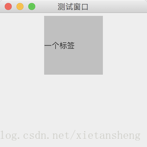
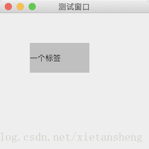

# 组件的位置和尺寸

教程总目录: [Java-Swing 图形界面开发（目录）](../README.md)

## 1. 组件的位置和尺寸的设置

关于设置组件（`Component`）位置（坐标） 和 尺寸（宽高）的方法有好几个:

```java
// 设置坐标
void setLocation(int x, int y);
void setLocation(Point p)

// 设置尺寸
void setSize(int width, int height);
void setSize(Dimension d);

// 设置坐标和尺寸
void setBounds(int x, int y, int width, int height);
void setBounds(Rectangle r);

// 设置首选尺寸
void setPreferredSize(Dimension preferredSize);
// 设置最小尺寸
void setMinimumSize(Dimension minimumSize);
// 设置最大尺寸
void setMaximumSize(Dimension maximumSize);
```

组件坐标和宽高的最终确定，和其所在父容器的布局管理器有关（除此之外还和其他因素有关）。布局管理器布局时对于某些需要子组件撑满指定边界的布局管理器（例如 BorderLayout、GridLayout 等），直接设置子组件的坐标和宽高，可能无效。

下面在使用 **FlowLayout** 布局的容器内设置子组件的宽高:

```java
package com.xiets.swing;

import javax.swing.*;
import java.awt.*;

public class Main {

    public static void main(String[] args) {
        JFrame jf = new JFrame("测试窗口");
        jf.setSize(250, 250);
        jf.setLocationRelativeTo(null);
        jf.setDefaultCloseOperation(WindowConstants.EXIT_ON_CLOSE);

        // 创建内容面板，使用浮动布局
        JPanel panel = new JPanel(new FlowLayout());

        // 创建一个标签，设置其背景为灰色（方便查看组件边界）
        JLabel label = new JLabel("一个标签");
        label.setOpaque(true);
        label.setBackground(Color.LIGHT_GRAY);

        /*
         * 设置标签的宽高，对于浮动布局，这里需要使用 首选尺寸，设置其他尺寸无效
         */
        label.setPreferredSize(new Dimension(100, 100));

        // 里设置坐标将无效，因为对于浮动布局设置其子组件的坐标无意义，坐标将在绘制显示后自动确定
        // label.setLocation(...);

        panel.add(label);

        jf.setContentPane(panel);

        // 绘制组件显示
        jf.setVisible(true);

        /* 到了这里，组件已绘制显示完成，坐标和尺寸才真正确定 */
    }

}
```

结果展示：



对于大多数布局管理器，其管理的组件一般都不需要明确指定坐标和宽高，只有绝对布局除外。

使用 **绝对布局** 只需要设置容器的布局管理器为 null，也就是相当于没有布局管理器，在绘制组件时不知道该如何安排组件的位置和大小，因此需要明确指定容器内每一个组件的坐标和宽高。使用绝对布局是对组件的坐标和宽高设置如下:

```java
package com.xiets.swing;

import javax.swing.*;
import java.awt.*;

public class Main {

    public static void main(String[] args) {
        JFrame jf = new JFrame("测试窗口");
        jf.setSize(250, 250);
        jf.setLocationRelativeTo(null);
        jf.setDefaultCloseOperation(WindowConstants.EXIT_ON_CLOSE);

        JPanel panel = new JPanel(null);

        // 创建一个标签，设置其背景为灰色（方便查看组件边界）
        JLabel label = new JLabel("一个标签");
        label.setOpaque(true);
        label.setBackground(Color.LIGHT_GRAY);

        // 设置标签的坐标和宽高
        label.setLocation(50, 50);  // 坐标指的是相对于父容器左上角的坐标
        label.setSize(100, 50);     // 绝对布局的宽高设置，使用 setSize(...)

        // 也可以使用下面一句代码一次性设置坐标和宽高
        // label.setBounds(50, 50, 100, 50);

        panel.add(label);

        jf.setContentPane(panel);
        jf.setVisible(true);
    }

}
```

结果展示：



窗口（JFrame）和 内容面板 的宽高设置。设置了窗口的尺寸，该尺寸包含了标题栏，其内部内容面板的尺寸会比窗口尺寸小，在不同操作系统中，标题栏高度不同，设置了窗口的尺寸，内容面板的尺寸无法明确确定。实际开发中确定内容面板的尺寸更有意义，如果需要固定内容面板的尺寸，可以设置内容面板的首选尺寸，然后让窗口包裹（pack）内容。如下:

```java
package com.xiets.swing;

import javax.swing.*;
import java.awt.*;

public class Main {

    public static void main(String[] args) {
        JFrame jf = new JFrame("测试窗口");
        jf.setDefaultCloseOperation(WindowConstants.EXIT_ON_CLOSE);

        JPanel panel = new JPanel();

        // 设置内容面板的首选尺寸
        panel.setPreferredSize(new Dimension(300, 300));

        // 设置内容面板到窗口
        jf.setContentPane(panel);

        // 包裹内容
        jf.pack();

        // 必须在尺寸确定后（pack之后），再设置窗口位置
        jf.setLocationRelativeTo(null);

        /* 如此设置，在任何操作系统上，内容面板的尺寸都固定为 300*300，并且在屏幕居中显示*/

        jf.setVisible(true);
    }

}
```

**窗口（JFrame）的坐标设置**:

```java
package com.xiets.swing;

import javax.swing.*;

public class Main {

    public static void main(String[] args) {
        JFrame jf = new JFrame("测试窗口");
        jf.setDefaultCloseOperation(WindowConstants.EXIT_ON_CLOSE);

        // 设置窗口的宽高（包括标题栏）
        jf.setSize(250, 250);

        // 设置窗口坐标（相对于父容器，对于窗口而言，父容器就是屏幕左上角）
        jf.setLocation(0, 0);

        // 设置窗口坐标，此方法是间接设置窗口坐标，把窗口设置到指定组件的中心，null 表示屏幕
        jf.setLocationRelativeTo(null);
        
        // 如果需要把窗口设置到屏幕左边或右边，可以通过下面方法获取屏幕的宽高
        Dimension screenSize = Toolkit.getDefaultToolkit().getScreenSize();

        JPanel panel = new JPanel();

        jf.setContentPane(panel);

        // 包裹内容，此方法会根据内容重新计算窗口的宽高（之前设置的宽高将无效），
        // 此方法会改变窗口宽高，坐标却不会改变，如果需要将窗口设置到屏幕中心，
        // 需要重新调用 jf.setLocationRelativeTo(null) 方法计算窗口的坐标。
        jf.pack();

        jf.setVisible(true);
    }

}
```

## 2. 组件位置和尺寸的获取

除了绝对布局外，使用其他布局的容器内的组件，由于需要在布局绘制后才能确定其位置和尺寸，所以必须在`jFrame.setVisible(true)`之后才能通过组件的相关方法（`component.getLocation()、component.getSize()）`获取位置和宽高。

代码实例，获取组件以及窗口的位置与尺寸:

```java
package com.xiets.swing;

import javax.swing.*;
import java.awt.*;

public class Main {

    public static void main(String[] args) {
        JFrame jf = new JFrame("测试窗口");
        jf.setSize(250, 250);
        jf.setLocationRelativeTo(null);
        jf.setDefaultCloseOperation(WindowConstants.EXIT_ON_CLOSE);

        // 创建内容面板，使用浮动布局
        JPanel panel = new JPanel(new FlowLayout());

        // 创建标签组件
        JLabel label = new JLabel("一个标签");

        // 添加标签到内容面板
        panel.add(label);

        jf.setContentPane(panel);

        /*
         * 布局绘制并显示，组件的坐标和宽高在这里确定，并设置回组件，在这句代码之后才能获取到组件的坐标和宽高
         */
        jf.setVisible(true);

        // 获取标签的坐标（相对于父容器）
        Point labelLocation = label.getLocation();
        // 获取标签的坐标（相对于屏幕左上角）
        Point labelLocationOnScreen = label.getLocationOnScreen();
        // 获取标签的宽高
        Dimension labelSize = label.getSize();

        System.out.println("标签: Location = " + labelLocation
                + ", LocationOnScreen = " + labelLocationOnScreen
                + ", Size = " + labelSize);

        /*
         * 对于 JFrame（窗口）的 坐标 和 宽高 获取
         */
        // 获取窗口的坐标（相对于父容器，对于窗口而言，父容器就是屏幕，所以此坐标实际上就是相对于屏幕左上角的坐标）
        Point jfLocation = jf.getLocation();
        // 获取窗口的坐标（相对于屏幕左上角）
        Point jfLocationOnScreen = jf.getLocationOnScreen();
        // 获取窗口的宽高（包含标题栏）
        Dimension jfSize = jf.getSize();

        System.out.println("窗口: Location = " + jfLocation
                + ", LocationOnScreen = " + jfLocationOnScreen
                + ", Size = " + jfSize);
    }

}
```

