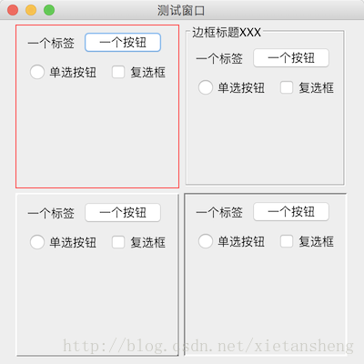

# 组件边框（Border）

教程总目录: [Java-Swing 图形界面开发（目录）](../README.md)

## 1. 概述

官方JavaDocsApi:

- [javax.swing.BorderFactory](https://docs.oracle.com/javase/8/docs/api/javax/swing/BorderFactory.html)
- [javax.swing.border.Border](https://docs.oracle.com/javase/8/docs/api/javax/swing/border/Border.html)

Border，边框。边框是对组件边界的装饰，例如为组件增加矩形有色边框，为透明的容器增加带标题的边框，增加组件的内边距，为组件增加浮雕化/凹凸斜面/阴影外观等，让组件看起来更美观。

**组件边框的设置**:

```java
// 创建边框
Border border = BorderFactory.createXxxxBorder(...);
// 设置组件的边框
jComponent.setBorder(border);
```

创建组件边框，使用 BorderFactory 工厂类中的静态方法窗口，支持许多各种不同形式的边框。

## 2. 边框的创建

常用边框的创建（`BorderFactory`中的静态方法）:

（1）**空边框**

```java
// 创建一个不占用空间的空边控（边界宽度均为0）
static Border createEmptyBorder();

// 创建一个占用空间但不绘制的空边框，指定四条边占用的宽度（内边距效果）
static Border createEmptyBorder(int top, int left, int bottom, int right);
```

（2）**线边框**

```java
/**
 * 参数说明:
 *     color: 线条颜色
 *     thickness: 线宽（默认为1px）
 *     rounded: 是否有圆角
 */
static Border createLineBorder(Color color);

static Border createLineBorder(Color color, int thickness);

static Border createLineBorder(Color color, int thickness, boolean rounded);
```

（3）**标题边框**

```java
/**
 * 参数说明:
 *     border: 在此边框基础上添加标题，可以传 null
 *     
 *     title: 需要添加的标题
 *     
 *     titleJustification: 标题对齐方式，该值为一下之一:
 *         TitledBorder.LEFT
 *         TitledBorder.CENTER
 *         TitledBorder.RIGHT
 *         TitledBorder.LEADING
 *         TitledBorder.TRAILING
 *         TitledBorder.DEFAULT_JUSTIFICATION (leading)
 *         
 *     titlePosition: 标题显示的位置（相对于边框的纵向位置），该值为一下之一:
 *         TitledBorder.ABOVE_TOP
 *         TitledBorder.TOP（位于顶线上）
 *         TitledBorder.BELOW_TOP
 *         TitledBorder.ABOVE_BOTTOM
 *         TitledBorder.BOTTOM（位于底线上）
 *         TitledBorder.BELOW_BOTTOM
 *         TitledBorder.DEFAULT_POSITION（顶部）
 *         
 *     titleFont: 标题的字体
 *     
 *     titleColor: 标题的颜色
 */
static TitledBorder createTitledBorder(String title);

static TitledBorder createTitledBorder(Border border);

static TitledBorder createTitledBorder(Border border, String title);

static TitledBorder createTitledBorder(Border border, String title, int titleJustification, int titlePosition);

static TitledBorder createTitledBorder(Border border, String title, int titleJustification, int titlePosition, Font titleFont);

static TitledBorder createTitledBorder(Border border, String title, int titleJustification, int titlePosition, Font titleFont, Color titleColor);
```

（4）其他边框（具体参数列表见 DocsApi）

```java
// 斜面边框
static Border createBevelBorder(...);
// 虚线边框
static Border createDashedBorder(...);
// “浮雕化”边框
static Border createEtchedBorder(...);
// 凹入斜面边缘的边框
static Border createLoweredBevelBorder(...);
// 具有凸出斜面边缘的边框
static Border createRaisedBevelBorder(...);
// 凸起软斜面
static Border createRaisedSoftBevelBorder(...);
// 合成边框
static CompoundBorder createCompoundBorder(...);
// 类似衬边的边框
static MatteBorder createMatteBorder(...);
// 共享斜面边框
static Border createSharedBevel(...)
// 软斜面边框
static Border createSoftBevelBorder(...);
// 画笔边框
static Border createStrokeBorder(...);
```

## 3. 代码实例

```java
package com.xiets.swing;

import javax.swing.*;
import java.awt.*;

public class Main {

    public static void main(String[] args) {
        JFrame jf = new JFrame("测试窗口");
        jf.setDefaultCloseOperation(WindowConstants.EXIT_ON_CLOSE);
        jf.setSize(400, 400);
        jf.setLocationRelativeTo(null);

        JPanel panel = new JPanel();

        JPanel panel01 = createPanel();
        panel01.setBorder(BorderFactory.createLineBorder(Color.RED));       // 线边框

        JPanel panel02 = createPanel();
        panel02.setBorder(BorderFactory.createTitledBorder("边框标题XXX"));  // 标题边框

        JPanel panel03 = createPanel();
        panel03.setBorder(BorderFactory.createRaisedSoftBevelBorder());     // 凸起软斜面

        JPanel panel04 = createPanel();
        panel04.setBorder(BorderFactory.createLoweredBevelBorder());        // 凹入斜面

        panel.add(panel01);
        panel.add(panel02);
        panel.add(panel03);
        panel.add(panel04);

        jf.setContentPane(panel);
        jf.setVisible(true);
    }

    private static JPanel createPanel() {
        JPanel panel = new JPanel();
        panel.setPreferredSize(new Dimension(180, 180));

        panel.add(new JLabel("一个标签"));
        panel.add(new JButton("一个按钮"));
        panel.add(new JRadioButton("单选按钮"));
        panel.add(new JCheckBox("复选框"));

        return panel;
    }

}
```

结果展示：

