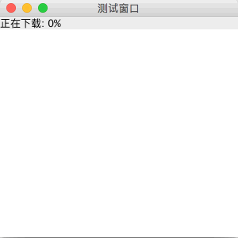

# 多线程并发与线程安全

教程总目录: [Java-Swing 图形界面开发（目录）](../README.md)

## 1. 概述

官方JavaDocsApi: [Swing’s Threading Policy](https://docs.oracle.com/javase/8/docs/api/javax/swing/package-summary.html#threading)

前面的所有 Swing 组件案例代码，为了简单重点介绍组件，都直接在主线程中直接创建并显示，实际开发中这将会存在线程安全隐患。

通常 Swing 不是线程安全的。除非另行说明，否则所有 Swing 组件及其相关类都必须保证在同一个线程（事件调度线程）中进行访问。

## 2. 事件调度线程（Event Dispatching Thread）

AWT 中有一个先进先出（FIFO）的事件队列（EventQueue）单例，添加到该队列中的任务（Runnable）将按顺序逐一在同一线程中被执行，该线程被称为 事件调度线程。Swing 组件也延用了该队列实例，所有 Swing 组件的创建、修改、绘制、响应输入都必须要添加到该事件队列中执行。组件注册的各种监听器，回调方法也是被添加到事件队列中执行，即所有监听器的回调方法中就处于事件调度线程，可以直接操作UI。

添加任务到事件调度线程:

```java
EventQueue.invokeLater(Runnable doRun);
// 或者
SwingUtilities.invokeLater(Runnable doRun);

// 上面两者的区别: EventQueue 在 AWT 包中， SwingUtilities 在 Swing 包中，
// 后者内部实际上是直接又调用了前者。
```

创建窗口的正确方式:

```java
package com.xiets.swing;

import javax.swing.*;
import java.awt.event.ActionEvent;
import java.awt.event.ActionListener;

public class Main {

    public static void main(String[] args) {
        // 此处处于 主线程，提交任务到 事件调度线程 创建窗口
        SwingUtilities.invokeLater(
                new Runnable() {
                    @Override
                    public void run() {
                        // 此处处于 事件调度线程
                        createGUI();
                    }
                }
        );
    }

    public static void createGUI() {
        // 此处处于 事件调度线程
        JFrame jf = new JFrame("测试窗口");
        jf.setSize(300, 300);
        jf.setLocationRelativeTo(null);
        jf.setDefaultCloseOperation(WindowConstants.EXIT_ON_CLOSE);

        JPanel panel = new JPanel();

        JButton btn = new JButton("Btn");
        btn.addActionListener(new ActionListener() {
            @Override
            public void actionPerformed(ActionEvent e) {
                // 此处处于 事件调度线程（所有监听器的回调都在 事件调度线程 中回调）
            }
        });

        jf.setContentPane(panel);
        jf.setVisible(true);
    }

}
```

## 3. 工作线程（SwingWorker）

上面所说的事件调度线程负责 UI 的创建、修改、绘制 和 响应输入等，因此在该线程中不能执行耗时的操作（网络IO、密集计算处理），否则将阻塞事件调度线程调度任何其他任务，造成应用程序对用户输入无反应。

对于耗时的任务，可以创建子线程在子线程中执行耗时操作，执行完后再提交任务到事件调度线程操作UI。为此，Swing 提供了 SwingWorker 来处理耗时任务，并更好的支持了与事件调度线程之间的通信。

SwingWorker 是一个抽象类，设计用于需要在后台线程中运行长时间运行任务的情况，并可在完成后或者在处理过程中向 UI 提供数据并更新。SwingWorker 的子类必须实现 doInBackground() 方法，在该方法中执行后台耗时计算。

SwingWorker 抽象类:

```java
/**
 * 类型参数：
 *     T - 后台耗时计算结果的类型，即此 SwingWorker 的 doInBackground() 和 get() 方法返回的结果类型
 *     V - 用于保存此 SwingWorker 的 publish() 和 process() 方法的中间结果的类型
 */
public abstract class SwingWorker<T, V> implements RunnableFuture<T> {
    ...
    public SwingWorker() {
        ...
    }
    ...
    protected abstract T doInBackground() throws Exception;
    ...
}
```

SwingWorker 任务执行相关方法:

```java
// 此方法将在一个线程池中被执行，在此方法中执行耗时操作，并把结果返回，之后通过 get() 方法可获取返回的结果
protected abstract T doInBackground()

// 开始启动执行该任务，调用后将在线程池中执行 doInBackground 方法，此方法只能被调用一次。
void execute()

// 被回调的方法: doInBackground 方法完成后，在事件指派线程 上执行此方法。
protected void done() 

// 如有必要，等待计算完成，然后获取 doInBackground 返回的结果。
T get()

// 试图取消对此任务的执行。
boolean cancel(boolean mayInterruptIfRunning)
```

SwingWorker 状态判断方法:

```java
// 如果在任务正常完成前将其取消，则返回 true。
boolean isCancelled()

// 如果任务已完成，则返回 true。
boolean isDone()

// 获取当前任务的状态，返回的是枚举，包含3个状态: 初始化(PENDING)、已启动(STARTED)、已完成(DONE)
SwingWorker.StateValue getState();
```

SwingWorker 后台任务执行中与事件调度线程通信相关方法:

```java
// 将数据块发送给 process(List<V> chunks) 方法。
protected void publish(V... chunks)

// 被回调的方法: 在事件指派线程 上异步地从 publish 方法接收数据块。
protected void process(List<V> chunks)
```

与事件调度线程通信的另一种方式，通过设置属性改变监听器:

```java
// 添加属性改变监听器（监听器方法将在事件调度线程中被回调）
void addPropertyChangeListener(PropertyChangeListener listener)

// 移除属性监听器
void removePropertyChangeListener(PropertyChangeListener listener)

//（在后台任务线程中）发布指定属性的值改变事件，通知监听器回调
void firePropertyChange(String propertyName, Object oldValue, Object newValue)

// 设置 progress 属性值，如果该值被改变，内部将自动发布 progress 属性改变事件
protected void setProgress(int progress);

// SwingWorker 生命周期过程中还会自动发布 state 属性事件，state 的属性值无法手动设置，
// 将根据事件生命周期自动改变并发布事件，也可通过 getState() 获取。
```

SwingWorker 的简单应用:

```java
package com.xiets.swing;

import javax.swing.*;

public class Main {

    public static void main(String[] args) {
        SwingUtilities.invokeLater(
                new Runnable() {
                    @Override
                    public void run() {
                        createGUI();
                    }
                }
        );
    }

    public static void createGUI() {
        JFrame jf = new JFrame("测试窗口");
        jf.setSize(300, 300);
        jf.setLocationRelativeTo(null);
        jf.setDefaultCloseOperation(WindowConstants.EXIT_ON_CLOSE);

        JPanel panel = new JPanel();

        final JLabel label = new JLabel();
        label.setText("正在计算");
        panel.add(label);

        jf.setContentPane(panel);
        jf.setVisible(true);

        // 创建后台任务
        SwingWorker<String, Object> task = new SwingWorker<String, Object>() {
            @Override
            protected String doInBackground() throws Exception {
                // 此处处于 SwingWorker 线程池中
                // 延时 5 秒，模拟耗时操作
                Thread.sleep(5000);
                // 返回计算结果
                return "Hello";
            }
            @Override
            protected void done() {
                // 此方法将在后台任务完成后在事件调度线程中被回调
                String result = null;
                try {
                    // 获取计算结果
                    result = get();
                } catch (Exception e) {
                    e.printStackTrace();
                }
                label.setText("结算结果: " + result);
            }
        };

        // 启动任务
        task.execute();
    }

}
```

SwingWorker 线程间通信的应用:

```java
package com.xiets.swing;

import javax.swing.*;
import java.awt.*;
import java.beans.PropertyChangeEvent;
import java.beans.PropertyChangeListener;
import java.util.List;

public class Main {

    public static void main(String[] args) {
        SwingUtilities.invokeLater(
                new Runnable() {
                    @Override
                    public void run() {
                        createGUI();
                    }
                }
        );
    }

    public static void createGUI() {
        JFrame jf = new JFrame("测试窗口");
        jf.setSize(300, 300);
        jf.setLocationRelativeTo(null);
        jf.setDefaultCloseOperation(WindowConstants.EXIT_ON_CLOSE);

        JPanel panel = new JPanel(new BorderLayout());

        final JLabel label = new JLabel("正在下载: 0%");
        panel.add(label, BorderLayout.NORTH);

        final JTextArea textArea = new JTextArea();
        panel.add(textArea, BorderLayout.CENTER);

        jf.setContentPane(panel);
        jf.setVisible(true);

        // 创建后台任务
        SwingWorker<String, Integer> task = new SwingWorker<String, Integer>() {
            @Override
            protected String doInBackground() throws Exception {
                for (int i = 0; i < 100; i += 10) {
                    // 延时模拟耗时操作
                    Thread.sleep(1000);

                    // 设置 progress 属性的值（通过属性改变监听器传递数据到事件调度线程）
                    setProgress(i);

                    // 通过 SwingWorker 内部机制传递数据到事件调度线程
                    publish(i);
                }
                // 返回计算结果
                return "下载完成";
            }

            @Override
            protected void process(List<Integer> chunks) {
                // 此方法在 调用 doInBackground 调用 public 方法后在事件调度线程中被回调
                Integer progressValue = chunks.get(0);
                textArea.append("已下载: " + progressValue + "%\n");
            }

            @Override
            protected void done() {
                // 此方法将在后台任务完成后在事件调度线程中被回调
                String result = null;
                try {
                    // 获取计算结果
                    result = get();
                } catch (Exception e) {
                    e.printStackTrace();
                }
                label.setText(result);
                textArea.append(result);
            }
        };

        // 添加属性改变监听器
        task.addPropertyChangeListener(new PropertyChangeListener() {
            @Override
            public void propertyChange(PropertyChangeEvent evt) {
                if ("progress".equals(evt.getPropertyName())) {
                    Object progressValue = evt.getNewValue();
                    label.setText("正在下载: " + progressValue + "%");
                }
            }
        });

        // 启动任务
        task.execute();
    }

}
```

结果展示:

