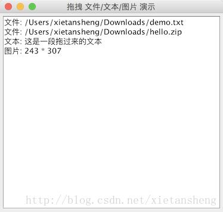

# 拖拽功能

教程总目录: [Java-Swing 图形界面开发（目录）](../README.md)

拖拽功能的使用非常普遍。例如打开U盘文件夹，把U盘的文件拖到桌面；把选中的文件拖入文件夹内等。拖拽的过程实际是数据传输的过程，Swing 组件支持拖拽功能，只需要为组件注册一个拖拽目标监听器，用于接收从外部拖拽到组件的数据。代码实例如下:

```java
package com.xiets.swing;

import javax.swing.*;
import java.awt.*;
import java.awt.datatransfer.DataFlavor;
import java.awt.dnd.*;
import java.io.File;
import java.util.List;

public class Main {

    public static void main(String[] args) {
        SwingUtilities.invokeLater(
                new Runnable() {
                    @Override
                    public void run() {
                        createGUI();
                    }
                }
        );
    }

    public static void createGUI() {
        JFrame jf = new JFrame("拖拽 文件/文本/图片 演示");
        jf.setDefaultCloseOperation(WindowConstants.EXIT_ON_CLOSE);

        JPanel panel = new JPanel();

        // 创建一个文本区域, 用于接收拖拽目标, 并在文本区域内输出相应的拖拽数据
        JTextArea textArea = new JTextArea(20, 30);
        textArea.setLineWrap(true);                 // 自动换行
        panel.add(new JScrollPane(textArea));       // 使用 JScrollPane 包裹, 方便内容过多时支持滚动

        // 创建拖拽目标监听器
        DropTargetListener listener = new DropTargetListenerImpl(textArea);

        // 在 textArea 上注册拖拽目标监听器
        DropTarget dropTarget = new DropTarget(textArea, DnDConstants.ACTION_COPY_OR_MOVE, listener, true);

        // 如果要移除监听器, 可以调用下面代码
        // dropTarget.removeDropTargetListener(listener);

        jf.setContentPane(panel);
        jf.pack();
        jf.setLocationRelativeTo(null);
        jf.setVisible(true);
    }

    /**
     * 拖拽目标监听器实现
     */
    private static class DropTargetListenerImpl implements DropTargetListener {

        /** 用于显示拖拽的数据 */
        private JTextArea textArea;

        public DropTargetListenerImpl(JTextArea textArea) {
            this.textArea = textArea;
        }

        @Override
        public void dragEnter(DropTargetDragEvent dtde) {
            System.out.println("dragEnter: 拖拽目标进入组件区域");
        }

        @Override
        public void dragOver(DropTargetDragEvent dtde) {
            System.out.println("dragOver: 拖拽目标在组件区域内移动");
        }

        @Override
        public void dragExit(DropTargetEvent dte) {
            System.out.println("dragExit: 拖拽目标离开组件区域");
        }

        @Override
        public void dropActionChanged(DropTargetDragEvent dtde) {
            System.out.println("dropActionChanged: 当前 drop 操作被修改");
        }

        @Override
        public void drop(DropTargetDropEvent dtde) {
            // 一般情况下只需要关心此方法的回调
            System.out.println("drop: 拖拽目标在组件区域内释放");

            boolean isAccept = false;

            try {
                /*
                 * 1. 文件: 判断拖拽目标是否支持文件列表数据（即拖拽的是否是文件或文件夹, 支持同时拖拽多个）
                 */
                if (dtde.isDataFlavorSupported(DataFlavor.javaFileListFlavor)) {
                    // 接收拖拽目标数据
                    dtde.acceptDrop(DnDConstants.ACTION_COPY_OR_MOVE);
                    isAccept = true;

                    // 以文件集合的形式获取数据
                    List<File> files = (List<File>) dtde.getTransferable().getTransferData(DataFlavor.javaFileListFlavor);

                    // 把文件路径输出到文本区域
                    if (files != null && files.size() > 0) {
                        StringBuilder filePaths = new StringBuilder();
                        for (File file : files) {
                            filePaths.append("文件: " + file.getAbsolutePath() + "\n");
                        }
                        textArea.append(filePaths.toString());
                    }
                }

                /*
                 * 2. 文本: 判断拖拽目标是否支持文本数据（即拖拽的是否是文本内容, 或者是否支持以文本的形式获取）
                 */
                if (dtde.isDataFlavorSupported(DataFlavor.stringFlavor)) {
                    // 接收拖拽目标数据
                    dtde.acceptDrop(DnDConstants.ACTION_COPY_OR_MOVE);
                    isAccept = true;

                    // 以文本的形式获取数据
                    String text = dtde.getTransferable().getTransferData(DataFlavor.stringFlavor).toString();
                    
                    // 输出到文本区域
                    textArea.append("文本: " + text + "\n");
                }

                /*
                 * 3. 图片: 判断拖拽目标是否支持图片数据。注意: 拖拽图片不是指以文件的形式拖拽图片文件,
                 *          而是指拖拽一个正在屏幕上显示的并且支持拖拽的图片（例如网页上显示的图片）。
                 */
                if (dtde.isDataFlavorSupported(DataFlavor.imageFlavor)) {
                    // 接收拖拽目标数据
                    dtde.acceptDrop(DnDConstants.ACTION_COPY_OR_MOVE);
                    isAccept = true;

                    // 以图片的形式获取数据
                    Image image = (Image) dtde.getTransferable().getTransferData(DataFlavor.imageFlavor);

                    // 获取到 image 对象后, 可以对该图片进行相应的操作（例如: 用组件显示、图形变换、保存到本地等）,
                    // 这里只把图片的宽高输出到文本区域
                    textArea.append("图片: " + image.getWidth(null) + " * " + image.getHeight(null) + "\n");
                }

            } catch (Exception e) {
                e.printStackTrace();
            }

            // 如果此次拖拽的数据是被接受的, 则必须设置拖拽完成（否则可能会看到拖拽目标返回原位置, 造成视觉上以为是不支持拖拽的错误效果）
            if (isAccept) {
                dtde.dropComplete(true);
            }
        }
    }

}
```

测试:

1. 从资源管理器中选中两个文件/文件夹拖动到文本区域组件内；
2. 从打开的网页中选取一段文字拖动到文本区域组件内（不同的浏览器以及不同的操作系统可能不支持）；
3. 从打开的网页中拖动一个已显示的图片到文本区域组件内（不同的浏览器以及不同的操作系统可能不支持）。

查看结果:

