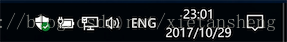
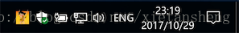

# 系统托盘（System Tray）

教程总目录: [Java-Swing 图形界面开发（目录）](../README.md)

## 1. 概述

官方JavaDocsApi:

- [java.swing.SystemTray](https://docs.oracle.com/javase/8/docs/api/java/awt/SystemTray.html)
- [java.awt.TrayIcon](https://docs.oracle.com/javase/8/docs/api/java/awt/TrayIcon.html)

系统托盘（System Tray）就是 **最小化图标**，程序以最小化图标的方式保持运行状态，Windows系统最小化到右下角的底部任务栏，MAC OS X 最小化到顶部菜单栏，如下图所示:




系统托盘开发一般步骤及相关方法:

```java
// 判断当前平台是否支持系统托盘
SystemTray.isSupported();

// 获取到当前平台的系统托盘
SystemTray tray = SystemTray.getSystemTray();

// 创建一个托盘图标（这个图标就表示最小化后的应用），其中 popup 是点击托盘图标时弹出的菜单列表
TrayIcon trayIcon = new TrayIcon(Image image, String tooltip, PopupMenu popup);

// 设置自动调整图标大小以适应当前平台的托盘图标显示
trayIcon.setImageAutoSize(true);

// 根据需要可在随时改变显示的图标
// trayIcon.setImage(Image image);

// 根据需要可随时改变点击时的弹出菜单
// trayIcon.setPopupMenu(PopupMenu popup);

// 添加托盘图标的动作监听器（鼠标右键的点击监听）
trayIcon.addActionListener(ActionListener listener);

// 添加托盘图标的鼠标监听器（包括鼠标所有按键的监听）
trayIcon.addMouseListener(MouseListener listener);

// 添加托盘图标到系统托盘（一个应用程序可添加多个托盘图标）
tray.add(trayIcon);

// 从系统托盘移除图标
// tray.remove(trayIcon);
```

## 2. 代码实例

这里使用下面这个图片作为托盘图标，放在工作目录下，命名为: tray.jpg


```java
package com.xiets.swing;

import javax.swing.*;
import java.awt.*;
import java.awt.event.ActionEvent;
import java.awt.event.ActionListener;
import java.awt.event.MouseAdapter;
import java.awt.event.MouseEvent;

public class Main {

    public static void main(String[] args) {
        SwingUtilities.invokeLater(new Runnable() {
            @Override
            public void run() {
                createGUI();
            }
        });
    }

    private static void createGUI() {
        JFrame jf = new JFrame("系统托盘测试");
        jf.setSize(300, 300);
        jf.setDefaultCloseOperation(WindowConstants.HIDE_ON_CLOSE); // 点击关闭按钮时隐藏窗口
        jf.setLocationRelativeTo(null);

        /*
         * 添加系统托盘
         */
        if (SystemTray.isSupported()) {
            // 获取当前平台的系统托盘
            SystemTray tray = SystemTray.getSystemTray();

            // 加载一个图片用于托盘图标的显示
            Image image = Toolkit.getDefaultToolkit().getImage("tray.jpg");

            // 创建点击图标时的弹出菜单
            PopupMenu popupMenu = new PopupMenu();

            MenuItem openItem = new MenuItem("打开");
            MenuItem exitItem = new MenuItem("退出");
            
            openItem.addActionListener(new ActionListener() {
                @Override
                public void actionPerformed(ActionEvent e) {
                    // 点击打开菜单时显示窗口
                    if (!jf.isShowing()) {
                        jf.setVisible(true);
                    }
                }
            });
            exitItem.addActionListener(new ActionListener() {
                @Override
                public void actionPerformed(ActionEvent e) {
                    // 点击退出菜单时退出程序
                    System.exit(0);
                }
            });

            popupMenu.add(openItem);
            popupMenu.add(exitItem);

            // 创建一个托盘图标
            TrayIcon trayIcon = new TrayIcon(image, "这是一个托盘图标", popupMenu);

            // 托盘图标自适应尺寸
            trayIcon.setImageAutoSize(true);

            trayIcon.addActionListener(new ActionListener() {
                @Override
                public void actionPerformed(ActionEvent e) {
                    System.out.println("托盘图标被右键点击");
                }
            });
            trayIcon.addMouseListener(new MouseAdapter() {
                @Override
                public void mouseClicked(MouseEvent e) {
                    switch (e.getButton()) {
                        case MouseEvent.BUTTON1: {
                            System.out.println("托盘图标被鼠标左键被点击");
                            break;
                        }
                        case MouseEvent.BUTTON2: {
                            System.out.println("托盘图标被鼠标中键被点击");
                            break;
                        }
                        case MouseEvent.BUTTON3: {
                            System.out.println("托盘图标被鼠标右键被点击");
                            break;
                        }
                        default: {
                            break;
                        }
                    }
                }
            });

            // 添加托盘图标到系统托盘
            try {
                tray.add(trayIcon);
            } catch (AWTException e) {
                e.printStackTrace();
            }

        } else {
            System.out.println("当前系统不支持系统托盘");
        }

        jf.setVisible(true);
    }

}
```

结果展示：



