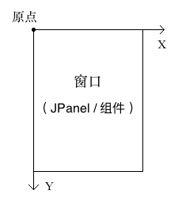
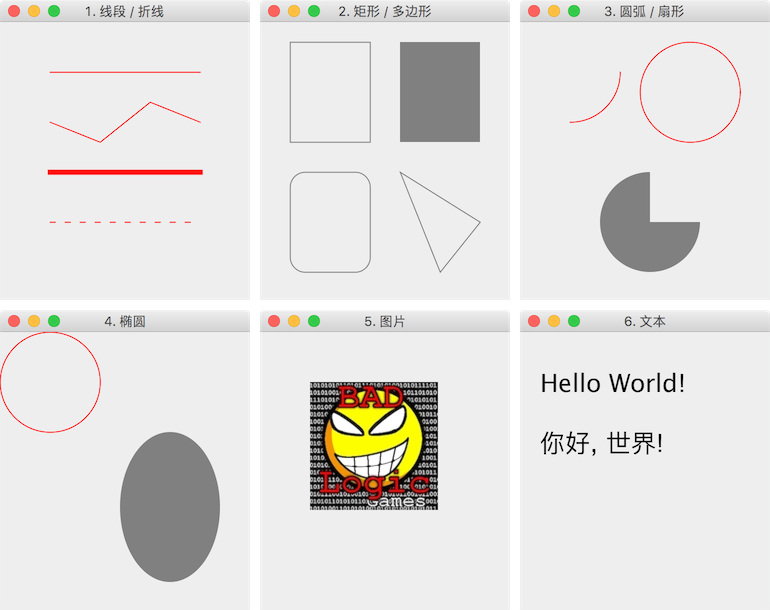

# 使用 Graphics 类绘制线段、矩形、椭圆/圆弧/扇形、图片、文本

教程总目录: [Java-Swing 图形界面开发（目录）](../README.md)

# 1. Graphics 绘图画布

Graphics 类相当于一个画布，每个 Swing 组件都通过 Graphics 对象来绘制显示。绘图的原点位于组件的左上角，如下图所示:



**`Graphics`类中常用的绘制相关方法：**

○ 参数 / 设置:

```java
// 创建 Graphics 的副本
Graphics create()
// 回收 Graphics
void dispose()

// 设置画笔颜色
void setColor(Color c)
// 擦除某一区域（擦除后显示背景色）
void clearRect(int x, int y, int width, int height)
```

1、线段 / 折线:

```java
// 绘制一条线段（如果两点为同一点，则绘制点）
void drawLine(int x1, int y1, int x2, int y2)
// 根据给定的多个点坐标绘制折线
void drawPolyline(int xPoints[], int yPoints[], int nPoints)
```

2、矩形 / 多边形:

```java
// 绘制一个矩形（空心）
void drawRect(int x, int y, int width, int height)
// 填充一个矩形（实心）
void fillRect(int x, int y, int width, int height)

// 绘制一个圆角矩形
void drawRoundRect(int x, int y, int width, int height, int arcWidth, int arcHeight)
// 填充一个圆角矩形
void fillRoundRect(int x, int y, int width, int height, int arcWidth, int arcHeight)

// 绘制一个3D矩形
void draw3DRect(int x, int y, int width, int height, boolean raised)
// 填充一个3D矩形
void fill3DRect(int x, int y, int width, int height, boolean raised)

// 根据给定的多个点坐标绘制一个多边形（首尾相连）
void drawPolygon(int xPoints[], int yPoints[], int nPoints)
// 根据给定的多个点坐标填充一个多边形（首尾相连）
void fillPolygon(int xPoints[], int yPoints[], int nPoints)
```

3、圆弧 / 扇形:

```java
// 绘制一个圆弧（弧线）
void drawArc(int x, int y, int width, int height, int startAngle, int arcAngle)
// 填充一个圆弧（扇形）
void fillArc(int x, int y, int width, int height, int startAngle, int arcAngle)
```

4、椭圆:

```java
// 绘制一个椭圆
void drawOval(int x, int y, int width, int height)
// 填充一个椭圆
void fillOval(int x, int y, int width, int height)
```

5、图片

```java
/*
 * 先读取图片
 */
// 方法一: 通过 java.awt.Toolkit 工具类来读取本地、网络 或 内存中 的 图片（支持 GIF、JPEG 或 PNG）
Image image = Toolkit.getDefaultToolkit().getImage(String filename);
Image image = Toolkit.getDefaultToolkit().getImage(URL url);
Image image = Toolkit.getDefaultToolkit().createImage(byte[] imageData);

// 方法二: 通过 javax.imageio.ImageIO 工具类读取本地、网络 或 内存中 的 图片（BufferedImage 继承自 Image）
BufferedImage bufImage = ImageIO.read(File input);
BufferedImage bufImage = ImageIO.read(URL input);
BufferedImage bufImage = ImageIO.read(InputStream input);

/*
 * PS_01: 图片宽高: BufferedImage 可以通过 bufImage.getWidth() 和 bufImage.getHeight() 方法直接获取图片的宽高;
 *                 Image 获取宽高需要另外传入一个 ImageObserver 参数。
 *
 * PS_02: 图片裁剪: BufferedImage 通过 bufImage.getSubimage(int x, int y, int w, int h) 方法可以截取图片的
 *                 任意一部分，返回一个新的 BufferedImage 实例。
 *
 * PS_03: 图片缩放: Image 通过 image.getScaledInstance(int width, int height, int hints) 方法可以对图片进行
 *                 缩放，返回新的一个 Image 实例。
 */

// 绘制一张图片（所有组件类实现了 ImageObserver 接口，即组件实例即为 ImageObserver）
boolean drawImage(Image image, int x, int y, int width, int height, ImageObserver observer)
```

6、文本

```java
// 设置字体（字体、样式、大小）
void setFont(Font font)
// 绘制一段文本，其中 (x, y) 坐标指的是文本序列的 左下角 的位置
void drawString(String str, int x, int y)
```

# 2. Graphics2D

在 Swing 组件的实际绘制中通常使用的是 Graphics 的一个子类 **`Graphics2D`**, 该类中提供了更为丰富的接口来绘制更为复杂的需求。

**`Graphics2D`类中的部分方法：**

1、参数 / 设置

```java
// 设置背景（擦除后显示该背景）
void setBackground(Color color)
// 设置笔画的轮廓特性（如画笔宽度、实线、虚线等）
void setStroke(Stroke s)
```

2、绘制结果的变换

```java
// 平移
void translate(int x, int y)
// 旋转
void rotate(double theta, double originX, double originY)
// 缩放
void scale(double sx, double sy)

// 将图片经过指定变换后绘制显示
boolean drawImage(Image image, AffineTransform xform, ImageObserver obs)
```

# 3. 自定义组件, 绘图演示

```java
package com.xiets.drawdemo;

import javax.swing.*;
import java.awt.*;

public class Main {

    public static void main(String[] args) {
        /*
         * 在 AWT 的事件队列线程中创建窗口和组件, 确保线程安全,
         * 即 组件创建、绘制、事件响应 需要处于同一线程。
         */
        EventQueue.invokeLater(new Runnable() {
            @Override
            public void run() {
                // 创建窗口对象
                MyFrame frame = new MyFrame();
                // 显示窗口
                frame.setVisible(true);
            }
        });
    }

    /**
     * 窗口
     */
    public static class MyFrame extends JFrame {

        public static final String TITLE = "Java图形绘制";

        public static final int WIDTH = 250;
        public static final int HEIGHT = 300;

        public MyFrame() {
            super();
            initFrame();
        }

        private void initFrame() {
            // 设置 窗口标题 和 窗口大小
            setTitle(TITLE);
            setSize(WIDTH, HEIGHT);

            // 设置窗口关闭按钮的默认操作(点击关闭时退出进程)
            setDefaultCloseOperation(WindowConstants.EXIT_ON_CLOSE);

            // 把窗口位置设置到屏幕的中心
            setLocationRelativeTo(null);

            // 设置窗口的内容面板
            MyPanel panel = new MyPanel(this);
            setContentPane(panel);
        }

    }

    /**
     * 内容面板
     */
    public static class MyPanel extends JPanel {

        private MyFrame frame;

        public MyPanel(MyFrame frame) {
            super();
            this.frame = frame;
        }

        /**
         * 绘制面板的内容: 创建 JPanel 后会调用一次该方法绘制内容,
         * 之后如果数据改变需要重新绘制, 可调用 updateUI() 方法触发
         * 系统再次调用该方法绘制更新 JPanel 的内容。
         */
        @Override
        protected void paintComponent(Graphics g) {
            super.paintComponent(g);

            // 重新调用 Graphics 的绘制方法绘制时将自动擦除旧的内容

            /* 自行打开下面注释查看各绘制效果 */

            // 1. 线段 / 折线
            drawLine(g);

            // 2. 矩形 / 多边形
            // drawRect(g);

            // 3. 圆弧 / 扇形
            // drawArc(g);

            // 4. 椭圆
            // drawOval(g);

            // 5. 图片
            // drawImage(g);

            // 6. 文本
            // drawString(g);
        }

        /**
         * 1. 线段 / 折线
         */
        private void drawLine(Graphics g) {
            frame.setTitle("1. 线段 / 折线");

            // 创建 Graphics 的副本, 需要改变 Graphics 的参数,
            // 这里必须使用副本, 避免影响到 Graphics 原有的设置
            Graphics2D g2d = (Graphics2D) g.create();

            // 抗锯齿
            g2d.setRenderingHint(RenderingHints.KEY_ANTIALIASING, RenderingHints.VALUE_ANTIALIAS_ON);
            // 设置画笔颜色
            g2d.setColor(Color.RED);

            // 1. 两点绘制线段: 点(20, 50), 点(200, 50)
            g2d.drawLine(50, 50, 200, 50);

            // 2. 多点绘制折线: 点(50, 100), 点(100, 130), 点(150, 70), 点(200, 100)
            int[] xPoints = new int[] { 50, 100, 150, 200 };
            int[] yPoints = new int[] { 100, 120, 80, 100 };
            int nPoints = 4;
            g2d.drawPolyline(xPoints, yPoints, nPoints);

            // 3. 两点绘制线段（设置线宽为5px）: 点(50, 150), 点(200, 150)
            BasicStroke bs1 = new BasicStroke(5);       // 笔画的轮廓（画笔宽度/线宽为5px）
            g2d.setStroke(bs1);
            g2d.drawLine(50, 150, 200, 150);

            // 4. 绘制虚线: 将虚线分为若干段（ 实线段 和 空白段 都认为是一段）, 实线段 和 空白段 交替绘制,
            //             绘制的每一段（包括 实线段 和 空白段）的 长度 从 dash 虚线模式数组中取值（从首
            //             元素开始循环取值）, 下面数组即表示每段长度分别为: 5px, 10px, 5px, 10px, ...
            float[] dash = new float[] { 5, 10 };
            BasicStroke bs2 = new BasicStroke(
                    1,                      // 画笔宽度/线宽
                    BasicStroke.CAP_SQUARE,
                    BasicStroke.JOIN_MITER,
                    10.0f,
                    dash,                   // 虚线模式数组
                    0.0f
            );
            g2d.setStroke(bs2);
            g2d.drawLine(50, 200, 200, 200);

            // 自己创建的副本用完要销毁掉
            g2d.dispose();
        }

        /**
         * 2. 矩形 / 多边形
         */
        private void drawRect(Graphics g) {
            frame.setTitle("2. 矩形 / 多边形");
            Graphics2D g2d = (Graphics2D) g.create();

            g2d.setRenderingHint(RenderingHints.KEY_ANTIALIASING, RenderingHints.VALUE_ANTIALIAS_ON);
            g2d.setColor(Color.GRAY);

            // 1. 绘制一个矩形: 起点(30, 20), 宽80, 高100
            g2d.drawRect(30, 20, 80, 100);

            // 2. 填充一个矩形
            g2d.fillRect(140, 20, 80, 100);

            // 3. 绘制一个圆角矩形: 起点(30, 150), 宽80, 高100, 圆角宽30, 圆角高30
            g2d.drawRoundRect(30, 150, 80, 100, 30, 30);

            // 4. 绘制一个多边形(收尾相连): 点(140, 150), 点(180, 250), 点(220, 200)
            int[] xPoints = new int[] { 140, 180, 220};
            int[] yPoints = new int[] { 150,  250, 200};
            int nPoints = 3;
            g2d.drawPolygon(xPoints, yPoints, nPoints);

            g2d.dispose();
        }

        /**
         * 3. 圆弧 / 扇形
         */
        private void drawArc(Graphics g) {
            frame.setTitle("3. 圆弧 / 扇形");
            Graphics2D g2d = (Graphics2D) g.create();

            g2d.setRenderingHint(RenderingHints.KEY_ANTIALIASING, RenderingHints.VALUE_ANTIALIAS_ON);
            g2d.setColor(Color.RED);

            // 1. 绘制一条圆弧: 椭圆的外切矩形 左上角坐标为(0, 0), 宽100, 高100,
            //                弧的开始角度为0度, 需要绘制的角度数为-90度,
            //                椭圆右边水平线为0度, 逆时针为正角度, 顺时针为负角度
            g2d.drawArc(0, 0, 100, 100, 0, -90);

            // 2. 绘制一个圆: 圆的外切矩形 左上角坐标为(120, 20), 宽高为100
            g2d.drawArc(120, 20, 100, 100, 0, 360);

            g2d.setColor(Color.GRAY);

            // 3. 填充一个扇形
            g2d.fillArc(80, 150, 100, 100, 90, 270);

            g2d.dispose();
        }

        /**
         * 4. 椭圆 (实际上通过绘制360度的圆弧/扇形也能达到绘制圆/椭圆的效果)
         */
        private void drawOval(Graphics g) {
            frame.setTitle("4. 椭圆");
            Graphics2D g2d = (Graphics2D) g.create();

            g2d.setRenderingHint(RenderingHints.KEY_ANTIALIASING, RenderingHints.VALUE_ANTIALIAS_ON);
            g2d.setColor(Color.RED);

            // 1. 绘制一个圆: 圆的外切矩形 左上角坐标为(0, 0), 宽高为100
            g2d.drawOval(0, 0, 100, 100);

            g2d.setColor(Color.GRAY);

            // 2. 填充一个椭圆
            g2d.fillOval(120, 100, 100, 150);

            g2d.dispose();
        }

        /**
         * 5. 图片
         */
        private void drawImage(Graphics g) {
            frame.setTitle("5. 图片");
            Graphics2D g2d = (Graphics2D) g.create();

            // 从本地读取一张图片
            String filepath = "demo.jpg";
            Image image = Toolkit.getDefaultToolkit().getImage(filepath);

            // 绘制图片（如果宽高传的不是图片原本的宽高, 则图片将会适当缩放绘制）
            g2d.drawImage(image, 50, 50, image.getWidth(this), image.getHeight(this), this);

            g2d.dispose();
        }

        /**
         * 6. 文本
         */
        private void drawString(Graphics g) {
            frame.setTitle("6. 文本");
            Graphics2D g2d = (Graphics2D) g.create();

            g2d.setRenderingHint(RenderingHints.KEY_ANTIALIASING, RenderingHints.VALUE_ANTIALIAS_ON);

            // 设置字体样式, null 表示使用默认字体, Font.PLAIN 为普通样式, 大小为 25px
            g2d.setFont(new Font(null, Font.PLAIN, 25));

            // 绘制文本, 其中坐标参数指的是文本绘制后的 左下角 的位置
            // 首次绘制需要初始化字体, 可能需要较耗时
            g2d.drawString("Hello World!", 20, 60);
            g2d.drawString("你好, 世界!", 20, 120);

            g2d.dispose();
        }

    }

}
```

结果展示：



# 4. 把组件上绘制的内容保存为图片

```java
// import javax.imageio.ImageIO;
// import java.awt.image.BufferedImage;

// 获取到需要保存内容的组件（面板）
JPanel panel = (JPanel) frame.getContentPane();

// 创建一个与面板等宽高的缓存图片
BufferedImage image = new BufferedImage(
        panel.getWidth(), 
        panel.getHeight(), 
        BufferedImage.TYPE_INT_ARGB
);

// 获取缓存图片的画布
Graphics2D g2d = image.createGraphics();

// 把面板的内容画到画布中
panel.paint(g2d);

try {
    // 把缓存图片保存到本地文件
    ImageIO.write(image, "png", new File("panel.png"));
} catch (Exception e) {
    e.printStackTrace();
}
```

