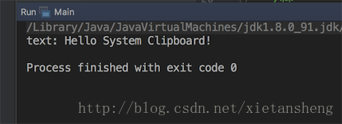

# Java操作系统剪贴板(Clipboard)实现复制和粘贴

教程总目录: [Java-Swing 图形界面开发（目录）](../README.md)

Java 操作剪贴板的类在 `java.awt.*` 包（及其子包）下，获取系统剪贴板代码:

```java
// 获取系统剪贴板
Clipboard clipboard = Toolkit.getDefaultToolkit().getSystemClipboard();
```

下面代码实现用 Java 代码获取系统剪贴板对象，实现 复制 和 粘贴 文本:

```java
package com.xiets.clipboard;

import java.awt.Toolkit;
import java.awt.datatransfer.Clipboard;
import java.awt.datatransfer.DataFlavor;
import java.awt.datatransfer.StringSelection;
import java.awt.datatransfer.Transferable;

public class Main {

    public static void main(String[] args) throws InterruptedException {
        // 把文本设置到剪贴板（复制）
        setClipboardString("Hello System Clipboard!");

        // 从剪贴板中获取文本（粘贴）
        String text = getClipboardString();
        System.out.println("text: " + text);
    }

    /**
     * 把文本设置到剪贴板（复制）
     */
    public static void setClipboardString(String text) {
        // 获取系统剪贴板
        Clipboard clipboard = Toolkit.getDefaultToolkit().getSystemClipboard();
        // 封装文本内容
        Transferable trans = new StringSelection(text);
        // 把文本内容设置到系统剪贴板
        clipboard.setContents(trans, null);
    }

    /**
     * 从剪贴板中获取文本（粘贴）
     */
    public static String getClipboardString() {
        // 获取系统剪贴板
        Clipboard clipboard = Toolkit.getDefaultToolkit().getSystemClipboard();

        // 获取剪贴板中的内容
        Transferable trans = clipboard.getContents(null);

        if (trans != null) {
            // 判断剪贴板中的内容是否支持文本
            if (trans.isDataFlavorSupported(DataFlavor.stringFlavor)) {
                try {
                    // 获取剪贴板中的文本内容
                    String text = (String) trans.getTransferData(DataFlavor.stringFlavor);
                    return text;
                } catch (Exception e) {
                    e.printStackTrace();
                }
            }
        }

        return null;
    }

}
```

控制台输出:



控制台输出:

